## CHAPTER 3 The Simplex Method and Sensitivity Analysis ^chapterthree

```markmap
---
markmap:
  height: 720
---
# [[#^chapterthree|CHAPTER 3: The Simplex Method and Sensitivity Analysis]]

## [[#^heartvalve|Real-Life Application: Heart Valve Production Optimization]]

## [[#^lpequation|LP Model in Equation Form]]
### [[#^simplexreq|Simplex-Ready Requirements]]
### [[#^slackvar|Convert (≤) Constraints: Slack Variables]]
### [[#^surplusvar|Convert (≥) Constraints: Surplus Variables]]
### [[#^rhsnonneg|Ensure Nonnegative Right-Hand Side]]
### [[#^unrestricted|Handle Unrestricted Variables]]

## [[#^transition|From Graphical to Algebraic Solution]]
### [[#^algebraicspace|Why LP Has Infinitely Many Solutions (m < n)]]
### [[#^basicsolutions|Basic Solutions = Corner Points]]
### [[#^combinations|Maximum Number of Corner Points]]
### [[#^enumeration|Why Enumeration Explodes (and Why Simplex Helps)]]

## [[#^simplexmethod|The Simplex Method]]
### [[#^iterative|Iterative Path Along Edges (One Variable at a Time)]]
### [[#^optimality|Optimality Condition: Choose Entering Variable]]
### [[#^feasibility|Feasibility Condition: Ratio Test for Leaving Variable]]
### [[#^pivot|Pivot Mechanics (Pivot Row/Column/Element)]]
### [[#^gaussjordan|Gauss–Jordan Row Operations for Tableau Updates]]
### [[#^readtableau|Reading the Solution from the Tableau]]
### [[#^resourcestatus|Interpreting Slack: Scarce vs Abundant Resources]]
### [[#^toramoment|TORA Moment: Interactive Simplex Iterations]]
### [[#^simplexsummary|Summary of the Simplex Method (Max vs Min)]]

## [[#^dantzig|Aha! Moment: Dantzig and the Birth of the Simplex Method]]

## [[#^artificialstart|Artificial Starting Solution]]
### [[#^mmethod|M-Method (Big-M Penalty)]]
### [[#^twophase|Two-Phase Method]]
### [[#^twophasesummary|Summary of the Two-Phase Method]]

## [[#^specialcases|Special Cases in the Simplex Method]]
### [[#^degeneracy|Degeneracy]]
### [[#^altoptima|Alternative Optima]]
### [[#^unbounded|Unbounded Solution]]
### [[#^infeasible|Infeasible Solution]]

## [[#^sensitivity|Sensitivity Analysis]]
### [[#^graphicalsa|Graphical Sensitivity Analysis]]
#### [[#^rhschanges|Changes in the Right-Hand Side (Dual/Shadow Price)]]
#### [[#^dualprice|Dual Price and Feasibility Range]]
#### [[#^objchanges|Changes in Objective Coefficients (Optimality Range)]]
### [[#^algebraicrhs|Algebraic Sensitivity: Right-Hand Side]]
#### [[#^toyco|TOYCO Model (Worked Example)]]
#### [[#^rhsperturb|RHS Perturbations, Dual Prices, and Feasibility Conditions]]
### [[#^algebraicobj|Algebraic Sensitivity: Objective Function]]
#### [[#^reducedcost|Reduced Cost and Coefficient Ranges]]
### [[#^software|Sensitivity Analysis with TORA, Solver, and AMPL]]

## [[#^computational|Computational Issues in Linear Programming]]
## [[#^bibliography|Bibliography]]

## [[#^casestudy|Case Study: Optimization of Heart Valves Production]]
### [[#^situation|Description of the Situation]]
### [[#^lpmodel|LP Model]]
### [[#^amplimpl|AMPL Implementation]]
### [[#^analysisresults|Analysis of the Results]]
### [[#^implementationcomments|Comments on the Implementation of the Model]]

## [[#^problems|Problems]]
```

## Summary

- Simplex requires an LP written in equation form with nonnegative right-hand sides and nonnegative variables; inequalities and unrestricted variables are transformed systematically.
- Basic solutions (obtained by setting nonbasic variables to zero) correspond to corner points; enumerating all corner points grows combinatorially, motivating the simplex method.
- Simplex moves along edges from one basic feasible solution to another using the optimality condition (entering variable) and feasibility condition (leaving variable via ratio test).
- Tableau updates are performed by pivoting with Gauss–Jordan row operations; the tableau also supports interpretation of variable values and resource slack (scarce vs abundant).
- Artificial variables provide a starting basis when an all-slack start is impossible; the two-phase method is the practical approach (Big-M is conceptually useful but numerically fragile).
- Sensitivity analysis quantifies how much LP data can change without altering the optimal basis, including dual/shadow prices with feasibility ranges and reduced costs with objective-coefficient ranges.

## Real-Life Application-Optimization of Heart Valve Production ^heartvalve

Biological heart valves are bioprostheses manufactured in different sizes from porcine hearts for human implantation. On the supply side, porcine hearts cannot be "produced" to specific sizes. On the demand side, the exact size of a manufactured valve cannot be determined until the biological component of a pig heart has been processed. As a result, some sizes may be overstocked and others understocked. A linear programming model was developed to reduce the overstocked sizes and increase the quantity of understocked sizes. The resulting savings exceeded \$1,476,000 in 1981, the year the study was made. Details of the study are presented at the end of the chapter.

### 3.1 LP MODEL IN EQUATION FORM ^lpequation

The development of the simplex method computations is facilitated by imposing two requirements on the LP model: ^simplexreq

1. All the constraints are equations with nonnegative right-hand side.

2. All the variables are nonnegative. ${}^{1}$

Converting inequalities into equations with nonnegative right-hand side. To convert a (≤)-inequality to an equation, a nonnegative slack variable is added to the left-hand side of the constraint. ^slackvar

For example, the M1-constraint of the Reddy Mikks model (Example 2.1-1) is converted into an equation as

$$
6{x}_{1} + 4{x}_{2} + {s}_{1} = {24},{s}_{1} \geq  0
$$

---

${}^{1}$ Commercial packages (and TORA) accept inequality constraints, nonnegative right-hand side, and unrestricted variables. Preconditioning of the constraints and the variables to conform with the simplex method requirements is done internally in the software prior to solving the problem.

---

The nonnegative variable ${s}_{1}$ is the slack (or unused amount) of resource ${M1}$ .

Conversion from $\left(  \geq  \right)$ to $\left(  = \right)$ is achieved by subtracting a nonnegative surplus variable from the left-hand side of the inequality. ^surplusvar

For example, in the diet model (Example 2.2-2), the surplus variable ${S}_{1}\left( { \geq  0}\right)$ converts the $\left(  \geq  \right)$ feed mix constraint to the equation

$$
{x}_{1} + {x}_{2} - {S}_{1} = {800},{S}_{1} \geq  0
$$

The amount of ${S}_{1}$ represents the excess tons of the mix over the required minimum (= 800 tons).

The only remaining requirement is for the right-hand side of the resulting equation to be nonnegative. The requirement can be satisfied simply by multiplying both sides of the equation by -1 , if necessary. ^rhsnonneg

Dealing with unrestricted variables. ^unrestricted

The use of an unrestricted variable in an LP model is demonstrated in the multiperiod production smoothing model of Example 2.4-4, where the unrestricted variable ${S}_{i}$ represents the number of workers hired or fired in period $i$ . In the same example, the unrestricted variable is replaced by two nonnegative variables by using the substitution

$$
{S}_{i} = {S}_{i}^{ - } - {S}_{i}^{ + },{S}_{i}^{ - } \geq  0,{S}_{i}^{ + } \geq  0
$$

In this case, ${S}_{i}^{ - }$ represents the number of workers hired and ${S}_{i}^{ + }$ the number of workers fired. As explained in Example 2.4-4, it is impossible (both intuitively and mathematically) that ${S}_{i}^{ - }$ and ${S}_{i}^{ + }$ assume positive values simultaneously.

### 3.2 TRANSITION FROM GRAPHICAL TO ALGEBRAIC SOLUTION ^transition

The development of the algebraic simplex method is based on ideas conveyed by the graphical LP solution in Section 2.2. Figure 3.1 compares the two methods. In the graphical method, the solution space is the intersection of the half-spaces representing the constraints, and in the simplex method, the solution space is represented by $m$ simultaneous linear equations and $n$ nonnegative variables. We can see that the graphical solution space has an infinite number of solution points, but how can we draw a similar conclusion from the algebraic representation of the solution space? The answer is that, in all nontrivial LPs, the number of equations $m$ is always less than the number of variables $n$ , thus yielding an infinite number of solutions (provided the equations are consistent). ${}^{2}$ For example, the equation $x + y = 1$ has $m = 1$ and $n = 2$ and yields an infinite number of solutions because any point on the straight line $x + y = 1$ is a solution. ^algebraicspace

---

${}^{2}$ If the number of (independent) equations $m$ equals the number of variables $n$ (and the equations are consistent), the system has exactly one solution. If $m$ is larger than $n$ , then at least $m - n$ equations must be redundant.

---

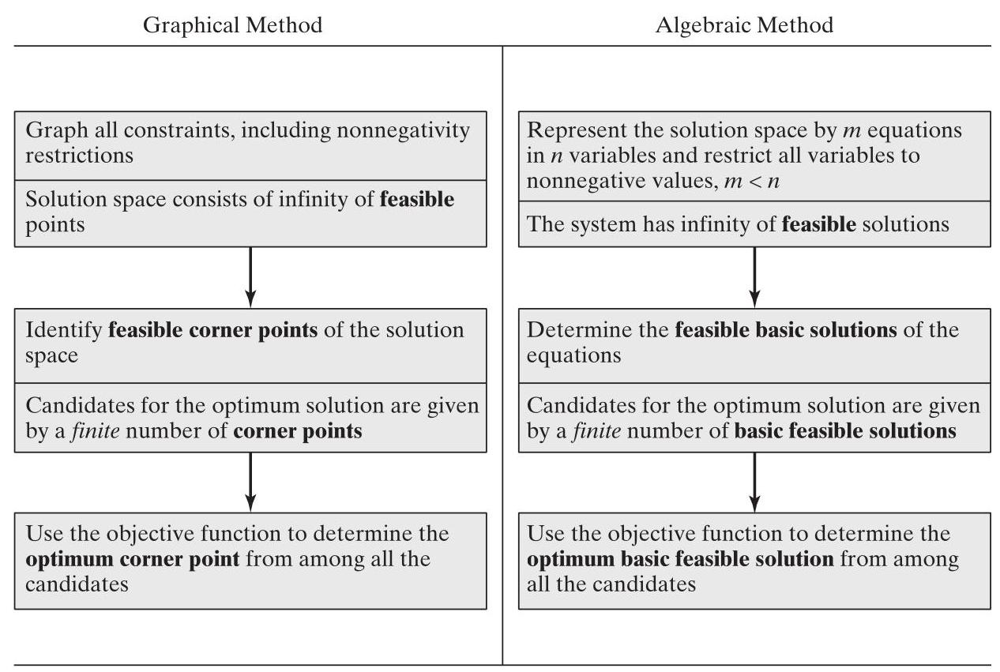

FIGURE 3.1

Transition from graphical to algebraic solution

In the algebraic solution space (defined by $m \times  n$ equations, $m < n$ ), basic solutions correspond to the corner points in the graphical solution space. ^basicsolutions

They are determined by setting $n - m$ variables equal to zero and solving the $m$ equations for the remaining $m$ variables, provided the resulting solution is unique. This means that the maximum number of corner points is ^combinations

$$
{C}_{m}^{n} = \frac{n!}{m!\left( {n - m}\right) !}
$$

As with corner points, the basic feasible solutions completely define the candidates for the optimum solution in the algebraic solutions space.

Example 3.2-1

Consider the following LP with two variables:

$$
\text{ Maximize }z = 2{x}_{1} + 3{x}_{2}
$$

subject to

$$
2{x}_{1} + {x}_{2} \leq  4
$$

$$
{x}_{1} + 2{x}_{2} \leq  5
$$

$$
{x}_{1},{x}_{2} \geq  0
$$

Figure 3.2 provides the graphical solution space for the problem.


FIGURE 3.2

LP Solution space of Example 3.2-1

Algebraically, the solution space of the LP is represented by the following $m = 2$ equations and $n = 4$ variables:

$$
2{x}_{1} + {x}_{2} + {s}_{1} = 4
$$

$$
{x}_{1} + 2{x}_{2} + {s}_{2} = 5
$$

$$
{x}_{1},{x}_{2},{s}_{1},{s}_{2} \geq  0
$$

The basic solutions are determined by setting $n - m\left( { = 4 - 2 = 2}\right)$ variables equal to zero and solving for the remaining $m\left( { = 2}\right)$ variables. For example, if we set ${x}_{1} = 0$ and ${x}_{2} = 0$ , the equations provide the unique basic solution

$$
{s}_{1} = 4,{s}_{2} = 5
$$

This solution corresponds to point $A$ in Figure 3.2 (convince yourself that ${s}_{1} = 4$ and ${s}_{2} = 5$ at point $A$ ). Another point can be determined by setting ${s}_{1} = 0$ and ${s}_{2} = 0$ and then solving the resulting two equations

$$
2{x}_{1} + {x}_{2} = 4
$$

$$
{x}_{1} + 2{x}_{2} = 5
$$

The associated basic solution is $\left( {{x}_{1} = 1,{x}_{2} = 2}\right)$ , or point $C$ in Figure 3.2.

You probably are wondering which $n - m$ variables should be set equal to zero to target a specific corner point. Without the benefit of the graphical solution space (which is available only for at most three variables), we cannot specify the $\left( {n - m}\right)$ zero variables associated with a given corner point. But that does not prevent enumerating all the corner points of the solution space. Simply consider all combinations in which $n - m$ variables equal zero and solve the resulting equations. Once done, the optimum solution is the feasible basic solution (corner point) with the best objective value.

In the present example, the (maximum) number of corner points is ${C}_{2}^{4} = \frac{4!}{2!2!} = 6$ . Looking at Figure 3.2, we can spot the four corner points $A, B, C$ , and $D$ . So, where are the remaining two? In fact, points $E$ and $F$ also are corner points. But, they are infeasible, and, hence, are not candidates for the optimum.

To complete the transition from the graphical to the algebraic solution, the zero $n - m$ variables are known as nonbasic variables. The remaining $m$ variables are called basic variables, and their solution (obtained by solving the $m$ equations) is referred to as basic solution. The following table provides all the basic and nonbasic solutions of the current example.

| Nonbasic (zero) variables | Basic variables | Basic solution | Associated corner point | Feasible? | Objective value, $z$ |
| --- | --- | --- | --- | --- | --- |
| $\left( {{x}_{1},{x}_{2}}\right)$ | $\left( {{s}_{1},{s}_{2}}\right)$ | (4,5) | $A$ | Yes | 0 |
| $\left( {{x}_{1},{s}_{1}}\right)$ | $\left( {{x}_{2},{s}_{2}}\right)$ | (4, -3) | $F$ | No | - |
| $\left( {{x}_{1},{s}_{2}}\right)$ | $\left( {{x}_{2},{s}_{1}}\right)$ | (2.5, 1.5) | $B$ | Yes | 7.5 |
| $\left( {{x}_{2},{s}_{1}}\right)$ | $\left( {{x}_{1},{s}_{2}}\right)$ | (2,3) | $D$ | Yes | 4 |
| $\left( {{x}_{2},{s}_{2}}\right)$ | $\left( {{x}_{1},{s}_{1}}\right)$ | (5, -6) | $E$ | No | - |
| $\left( {{s}_{1},{s}_{2}}\right)$ | $\left( {{x}_{1},{x}_{2}}\right)$ | (1, 2) | $\mathbf{\mathit{C}}$ | Yes | 8 (optimum) |

Remarks. We can see from the preceding illustration that, as the size of the problem increases, enumerating all the corner points becomes a prohibitive task. For example, for $m = {10}$ and $n = {20}$ , it is necessary to solve ${C}_{10}^{20}\left( { = {184},{756}}\right)$ sets of ${10} \times  {10}$ equations, a staggering task, particularly when we realize that a $\left( {{10} \times  {20}}\right)$ -LP is a very small size (real-life LPs can include thousands of variables and constraints). The simplex method alleviates this computational burden dramatically by investigating only a subset of all possible basic feasible solutions (corner points). This is what the simplex algorithm does. ^enumeration

### 3.3 THE SIMPLEX METHOD ^simplexmethod

Rather than enumerating all the basic solutions (corner points) of the LP problem (as we did in Section 3.2), the simplex method investigates only a "select few" of these solutions. Section 3.3.1 describes the iterative nature of the method, and Section 3.3.2 provides the computational details of the simplex algorithm.

#### 3.3.1 Iterative Nature of the Simplex Method ^iterative

Figure 3.3 provides the solution space of the LP of Example 3.2-1. For the sake of standardizing the algorithm, the simplex method always starts at the origin where all the decision variables, ${x}_{j}, j = 1,2,\ldots , n$ , are zero. In Figure 3.3, point $A$ is the origin $\left( {{x}_{1} = {x}_{2} = 0}\right)$ and the associated objective value, $z$ , is zero. The logical question now is whether an increase in the values of nonbasic ${x}_{1}$ and ${x}_{2}$ above their current zero values can improve (increase) the value of $z$ . We can answer this question by investigating the objective function:

$$
\text{ Maximine }z = 2{x}_{1} + 3{x}_{2}
$$

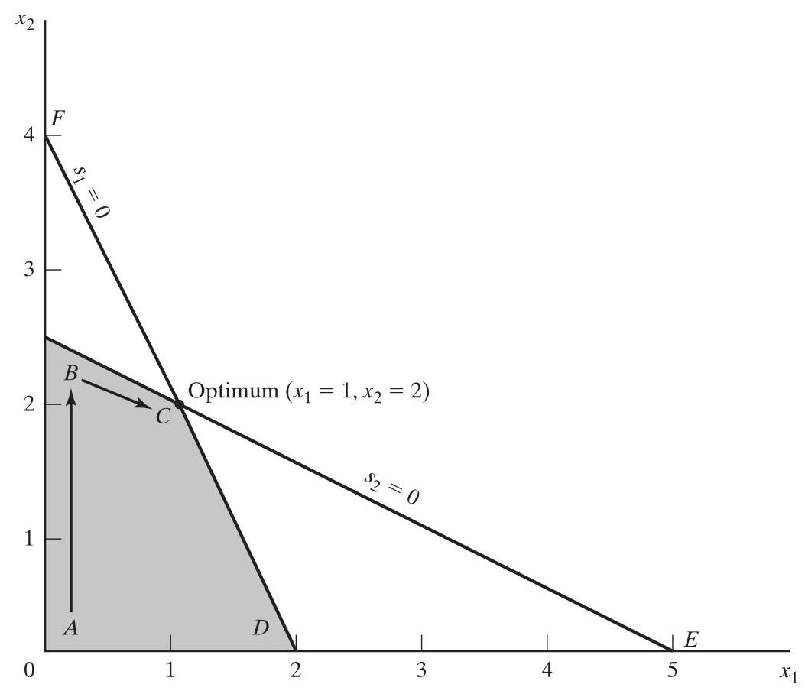

FIGURE 3.3

Iterative process of the simplex method

An increase in ${x}_{1}$ or ${x}_{2}$ (or both) above their current zero values will improve the value of $z$ . The design of the simplex method does not allow simultaneous increases in variables. Instead, it targets the variables one at a time. The variable slated for increase is the one with the largest rate of improvement in $z$ . In the present example, the rate of improvement in the value of $z$ is 2 for ${x}_{1}$ and 3 for ${x}_{2}$ . We thus elect to increase ${x}_{2}$ (the variable with the largest rate of improvement among all nonbasic variables). Figure 3.3 shows that the value of ${x}_{2}$ must be increased until corner point $B$ is reached (recall from Figure 3.1 that stopping short of corner point $B$ is not an option because a candidate for the optimum must be a corner point). At point $B$ , the simplex method, as will be explained later, will then increase the value of ${x}_{1}$ to reach the improved corner point $C$ , which is the optimum.

The path of the simplex algorithm always connects corner points. In the present example the path to the optimum is $A \rightarrow  B \rightarrow  C$ . Each corner point along the path is associated with an iteration. It is important to note that the simplex method always moves alongside the edges of the solution space, which means that the method does not cut across the solution space. For example, the simplex algorithm cannot go from $A$ to $C$ directly.

## Aha! Moment: The Birth of Optimization, or How Dantzig Developed the Simplex Method. ${}^{3}$ ^dantzig

Nobel Laureate Russian mathematician Leonid Kantorovich (1912-1986) is regarded as the founder of the theory of linear programming. But it was the simplex algorithm developed by American mathematician Goerge B. Dantzig (1914-2005) that rendered (large) LPs solvable in practice. The success of Dantzig's algorithm ushered innovative developments in previously unexplored areas of optimization.

Dantzig spent his early career during WWII as a mathematical advisor to the Pentagon where "[He] was asked to find a way to more rapidly compute time-staged deployment, training, and logistical supply program." His development was influenced by the Input-Output Economy Model developed by Nobel Laureate Wassily Leontief (1906-1999). Leontief's model utilized a matrix that quantified the one-to-one correspondence between the production processes and the items produced by these processes for the purpose of determining the effect of changes in one economic sector on other sectors. Dantzig extended this fundamental idea to include alternative activities, culminating with his Activity Analysis Model that essentially consisted of linear equations and inequalities that defined the feasible solution space. Dantzig's initial model faced two significant hurdles: (1) It was very large, making computability (in the absence of the "digital" computer) an insurmountable issue. (2) The model had no objective function because the goal of the model was usually stated in "fuzzy" ad hoc ground rules. ${}^{4}$ In the end, Dantzig devised the optimized (maximized or minimized) objective function, a concept that he asserted was largely unknown prior to 1947 because of what he called model "incomputability." Dantzig considered the concept of using an optimized function to be "revolutionary" and credited it with paving the way for the discovery of his simplex method. The new algorithm has stood the test of time and opened the door for the development of today's rich field of mathematical optimization.

Dantzig demonstrates the effectiveness of linear programming by citing the (by today's standards modest-size) example of finding the best assignment of 70 people (with different skills and hence different costs) to 70 jobs (see Section 5.4). Even with fastest current-day computers, the time needed to enumerate all ${70}!\left( { > {10}^{100}}\right)$ permutations is prohibitively staggering. By comparison, it takes but a moment to solve the resulting $\left( {{140} \times  {4900}}\right)$ linear program because the simplex method evaluates only a fraction of the feasible extreme points of the solution space.

#### 3.3.2 Computational Details of the Simplex Algorithm

This section provides the computational details of a simplex iteration. The vehicle of explanation is a numerical example.

You will shortly discover that the simplex method computations are repetitious, tedious, and voluminous. Nevertheless, it is imperative that you experience these hand computations, if only to appreciate the indispensable role of the computer in solving OR problems. And even though in practice you may never solve an LP by hand, the present experience is important because it provides you with an understanding of how and why the algorithm works. In that context, I recommend that you maintain a mental image of the graphical solution space displayed with Example 3.3-1 to gain insight into the close association between the algebraic iteration and the graphical corner point. In particular, at the end of each iteration, read the resulting solution point directly from the simplex tableau and then locate its corresponding corner point on the graphical solution space. In this manner, you will have a better understanding of the essence of the simplex method.

---

${}^{3}$ Dantzig, G. B. "Linear Programming," Operations Research, Vol. 15, No. 1,2002, pp. 42-47.

${}^{4}$ Dantzig states that when the military commanders were asked about their perception of the goal of his Activity Analysis Model, the response was "to win the war building better bombers and battleships."

---

Example 3.3-1

Consider the Reddy Mikks model (Example 2.1-1) expressed in equation form:

$$
\text{ Maximize }z = 5{x}_{1} + 4{x}_{2} + 0{s}_{1} + 0{s}_{2} + 0{s}_{3} + 0{s}_{4}
$$

subject to

$$
6{x}_{1} + 4{x}_{2} + {s}_{1}\; = {24}\;\text{ (Raw material }{M1}\text{ ) }
$$

$$
{x}_{1} + 2{x}_{2}\; + {s}_{2}\; = 6\;\text{ (Raw material }{M2}\text{ ) }
$$

$$
\begin{array}{l}  - {x}_{1} + {x}_{2}\; + {s}_{3}\; = 1 \\  \end{array}
$$

$$
{x}_{2}\; + {s}_{4} = 2\;\text{ (Demand limit) }
$$

$$
{x}_{1},{x}_{2},{s}_{1},{s}_{2},{s}_{3},{s}_{4} \geq  0
$$

The variables ${s}_{1},{s}_{2},{s}_{3}$ , and ${s}_{4}$ are the slacks associated with the respective constraints.

Next, we write the objective equation as

$$
z - 5{x}_{1} - 4{x}_{2} = 0
$$

In this manner, the starting simplex tableau can be represented as follows:

| Basic | $z$ | ${x}_{1}$ | ${x}_{2}$ | ${s}_{1}$ | ${s}_{2}$ | ${s}_{3}$ | ${s}_{4}$ | Solution | Row |
| --- | --- | --- | --- | --- | --- | --- | --- | --- | --- |
| $z$ | 1 | -5 | -4 | 0 | 0 | 0 | 0 | 0 | $z$-row |
| ${s}_{1}$ | 0 | 6 | 4 | 1 | 0 | 0 | 0 | 24 | ${s}_{1}$-row |
| ${s}_{2}$ | 0 | 1 | 2 | 0 | 1 | 0 | 0 | 6 | ${s}_{2}$-row |
| ${s}_{3}$ | 0 | -1 | 1 | 0 | 0 | 1 | 0 | 1 | ${s}_{3}$-row |
| ${s}_{4}$ | 0 | 0 | 1 | 0 | 0 | 0 | 1 | 2 | ${s}_{4}$-row |

The layout of the simplex tableau automatically provides the solution at the starting iteration. The solution starts at the origin $\left\lbrack  {\left( {{x}_{1},{x}_{2}}\right)  = \left( {0,0}\right) }\right\rbrack$ , thus defining $\left( {{x}_{1},{x}_{2}}\right)$ as the nonbasic variables and $\left( {{s}_{1},{s}_{2},{s}_{3},{s}_{4}}\right)$ as the basic variables. The associated objective $z$ and the basic variables $\left( {{s}_{1},{s}_{2},{s}_{3},{s}_{4}}\right)$ are listed in the leftmost Basic-column. Their values, $z = 0,{s}_{1} = {24},{s}_{2} = 6$ , ${s}_{3} = 1,{s}_{4} = 2$ , appearing in the rightmost Solution-column, are given directly by the right-hand sides of the model's equations (a convenient consequence of starting at the origin). The result can be seen by setting the nonbasic variables $\left( {{x}_{1},{x}_{2}}\right)$ equal to zero in all the equations, and also by noting the special identity-matrix arrangement of the constraint coefficients of the basic variables (all diagonal elements are 1, and all off-diagonal elements are 0).

Is the starting solution optimal? The objective function $z = 5{x}_{1} + 4{x}_{2}$ shows that the solution can be improved by increasing the value of nonbasic ${x}_{1}$ or ${x}_{2}$ above zero. As argued in Section 3.3.1, ${x}_{1}$ is to be increased because it has the most positive objective coefficient. Equivalently, in the simplex tableau where the objective function is written as $z - 5{x}_{1} - 4{x}_{2} = 0$ , the selected variable is the nonbasic variable with the most negative coefficient in the objective equation. This rule defines the so-called simplex optimality condition. In the terminology of the simplex algorithm, ${x}_{1}$ is known as the entering variable because it enters the basic solution. ^optimality

If ${x}_{1}$ is the entering variable, one of the current basic variables must leave - that is, it becomes nonbasic at zero level (recall that the number of nonbasic variable must always be $n - m$ ). The mechanics for determining the leaving variable calls for computing the ratios of the righthand side of the equations (Solution column) to the corresponding (strictly) positive constraint coefficients under the entering variable, ${x}_{1}$ , as the following table shows.

| Basic | Entering ${x}_{1}$ | Solution | Ratio (or intercept) |
| --- | --- | --- | --- |
| ${s}_{1}$ | 6 | 24 | ${x}_{1} = \frac{24}{6} = 4$ (minimum) |
| ${s}_{2}$ | 1 | 6 | ${x}_{1} = \frac{6}{1} = 6$ |
| ${s}_{3}$ | -1 | 1 | ${x}_{1} = \frac{1}{-1} = -1$ (negative denominator, ignore) |
| ${s}_{4}$ | 0 | 2 | ${x}_{1} = \frac{2}{0} = \infty$ (zero denominator, ignore) |

Conclusion: ${x}_{1}$ enters (at level 4) and ${s}_{1}$ leaves (at level zero).

How do the computed ratios determine the leaving variable and the value of the entering variable? Figure 3.4 shows that the computed ratios are actually the intercepts of the constraint lines with the (entering variable) ${x}_{1}$ -axis. We can see that the value of ${x}_{1}$ must be increased to the

## FIGURE 3.4

Graphical interpretation of the simplex method ratios in the Reddy Mikks model smallest nonnegative intercept with the ${x}_{1}$ -axis (=4) to reach corner point $B$ . Any increase beyond $B$ is infeasible. At point $B$ , the current basic variable ${s}_{1}$ associated with constraint 1 assumes a zero value and becomes the leaving variable. The rule associated with the ratio computations is referred to as the simplex feasibility condition because it guarantees the feasibility of the new solution. ^feasibility

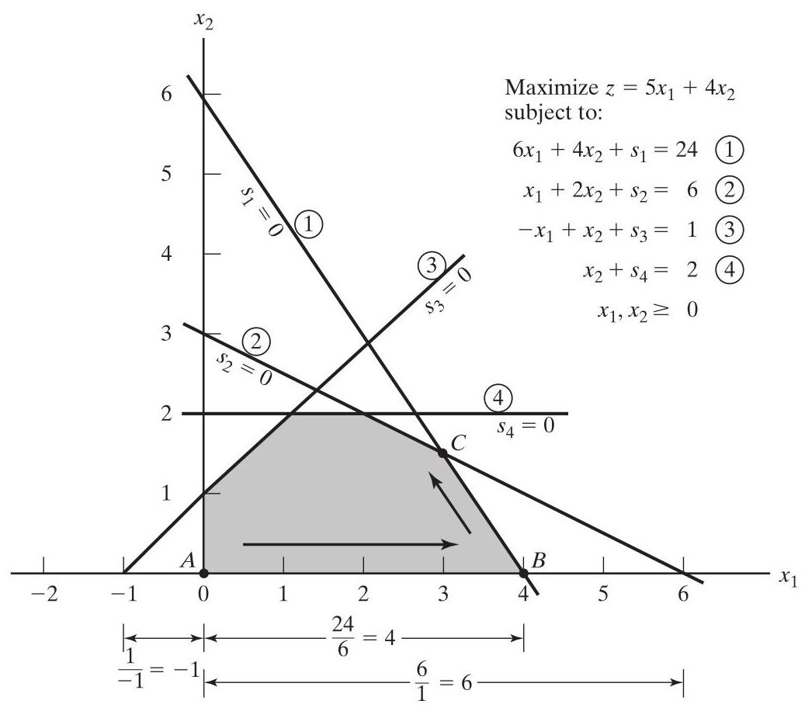

The new solution point $B$ is determined by "swapping" the entering variable ${x}_{1}$ and the leaving variable ${s}_{1}$ in the simplex tableau to yield

$$
\text{ Nonbasic (zero) variables at }B : \left( {{s}_{1},{x}_{2}}\right)
$$

$$
\text{ Basic variables at }B : \left( {{x}_{1},{s}_{2},{s}_{3},{s}_{4}}\right)
$$

The swapping process is based on the Gauss-Jordan row operations. It identifies the entering variable column as the pivot column and the leaving variable row as the pivot row with their intersection being the pivot element. The following tableau is a restatement of the starting tableau with its pivot row and column highlighted. ^pivot

| Basic | $z$ | ${x}_{1}$ | ${x}_{2}$ | ${s}_{1}$ | ${s}_{2}$ | ${s}_{3}$ | ${s}_{4}$ | Solution |
| --- | --- | --- | --- | --- | --- | --- | --- | --- |
| $z$ | 1 | -5 | -4 | 0 | 0 | 0 | 0 | 0 |
| ${s}_{1}$ (leaves) | 0 | 6 (pivot) | 4 | 1 | 0 | 0 | 0 | 24 |
| ${s}_{2}$ | 0 | 1 | 2 | 0 | 1 | 0 | 0 | 6 |
| ${s}_{3}$ | 0 | -1 | 1 | 0 | 0 | 1 | 0 | 1 |
| ${s}_{4}$ | 0 | 0 | 1 | 0 | 0 | 0 | 1 | 2 |

Pivot column: ${x}_{1}$. Pivot row: ${s}_{1}$. Pivot element: 6.

The Gauss-Jordan computations needed to produce the new basic solution include two types.

1. Pivot row

a. Replace the leaving variable in the Basic column with the entering variable.

b. New pivot row $=$ Current pivot row $\div$ Pivot element

2. All other rows, including $z$

New row $=$ (Current row) - (Pivot column coefficient) $\times$ (New pivot row)

These computations are applied to the preceding tableau in the following manner:

1. Replace ${s}_{1}$ in the Basic column with ${x}_{1}$ :

New ${x}_{1}$ -row $=$ Current ${s}_{1}$ -row ÷ 6

$= \frac{1}{6}\left( \begin{array}{llllllll} 0 & 6 & 4 & 1 & 0 & 0 & 0 & {24} \end{array}\right)$

$= \left( \begin{array}{llllllll} 0 & 1 & \frac{2}{3} & \frac{1}{6} & 0 & 0 & 0 & 4 \end{array}\right)$

2. New $z$ -row $=$ Current $z$ -row $- \left( {-5}\right)  \times$ New ${x}_{1}$ -row

$= \left( {1 - 5 - {400000}}\right)  - \left( {-5}\right)  \times  \left( {{01}\frac{2}{3}\frac{1}{6}{000}\mathrm{\;4}}\right)$

$$
= \left( {\begin{array}{lll} 1 & 0 &  - \frac{2}{3} \end{array}\frac{5}{6}\left\lbrack  \begin{matrix} 0 & 0 & 0 & {20} \end{matrix}\right\rbrack  }\right)
$$

3. New ${s}_{2}$ -row $=$ Current ${s}_{2}$ -row $- \left( 1\right)  \times$ New ${x}_{1}$ -row $= \left( \begin{array}{llllllll} 0 & 1 & 2 & 0 & 1 & 0 & 0 & 6 \end{array}\right)  - \left( 1\right)  \times  \left( \begin{array}{llllllll} 0 & 1 & \frac{2}{3} & \frac{1}{6} & 0 & 0 & 0 & 4 \end{array}\right) \; = \left( {\begin{array}{lll} 0 & 0 & \frac{4}{3} \end{array} - \frac{1}{6}\begin{array}{llll} 1 & 0 & 0 & 2 \end{array}}\right)$

4. New ${s}_{3}$ -row $=$ Current ${s}_{3}$ -row $- \left( {-1}\right)  \times$ New ${x}_{1}$ -row $= \left( \begin{array}{llllllll} 0 &  - 1 & 1 & 0 & 0 & 1 & 0 & 1 \end{array}\right)  - \left( {-1}\right)  \times  \left( \begin{array}{llllllll} 0 & 1 & \frac{2}{3} & \frac{1}{6} & 0 & 0 & 0 & 4 \end{array}\right) \; = \left( \begin{array}{llllllll} 0 & 0 & \frac{5}{3} & \frac{1}{6} & 0 & 1 & 0 & 5 \end{array}\right)$

5. New ${s}_{4}$ -row $=$ Current ${s}_{4}$ -row $- \left( 0\right)  \times$ New ${x}_{1}$ -row $= \left( \begin{array}{llllllll} 0 & 0 & 1 & 0 & 0 & 0 & 1 & 2 \end{array}\right)  - \left( 0\right) \left( \begin{array}{llllllll} 0 & 1 & \frac{2}{3} & \frac{1}{6} & 0 & 0 & 0 & 4 \end{array}\right)$

$$
= \left( \begin{array}{llllllll} 0 & 0 & 1 & 0 & 0 & 0 & 1 & 2 \end{array}\right)
$$

The new basic solution is $\left( {{x}_{1},{s}_{2},{s}_{3},{s}_{4}}\right)$ , and the new tableau becomes

| Basic | $z$ | ${x}_{1}$ | ${x}_{2}$ | ${s}_{1}$ | ${s}_{2}$ | ${s}_{3}$ | ${s}_{4}$ | Solution |
| --- | --- | --- | --- | --- | --- | --- | --- | --- |
| $z$ | 1 | 0 | $- \frac{2}{3}$ | $\frac{5}{6}$ | 0 | 0 | 0 | 20 |
| ${x}_{1}$ | 0 | 1 | $\frac{2}{3}$ | $\frac{1}{6}$ | 0 | 0 | 0 | 4 |
| ${s}_{2}$ | 0 | 0 | $\frac{4}{3}$ | $- \frac{1}{6}$ | 1 | 0 | 0 | 2 |
| ${s}_{3}$ | 0 | 0 | $\frac{5}{3}$ | $\frac{1}{6}$ | 0 | 1 | 0 | 5 |
| ${s}_{4}$ | 0 | 0 | 1 | 0 | 0 | 0 | 1 | 2 |

Observe that the structure of the new tableau is similar to that of the starting tableau, in the sense that the constraint coefficients of the basic variable form an identity matrix. As a result, when we set the new nonbasic variables ${x}_{2}$ and ${s}_{1}$ to zero, the Solution-column automatically yields the new basic solution $\left( {{x}_{1} = 4,{s}_{2} = 2,{s}_{3} = 5,{s}_{4} = 2}\right)  \cdot  {}^{5}$ This "conditioning" of the tableau is the result of the application of the Gauss-Jordan row operations. The corresponding new objective value is $z = {20}$ , which is consistent with

$$
\text{ New }z = \text{ Old }z + \text{ New }{x}_{1}\text{ -value } \times  \text{ its objective coefficient }
$$

$$
= 0 + 4 \times  5 = {20}
$$

Alternatively, $z = \left( {4 \times  {x}_{1}}\right.$ -value $+ 0 \times  {s}_{2}$ -value $+ 0 \times  {s}_{3}$ -value $+ 0 \times  {s}_{4}$ -value $) = (4 \times  5 + \; 0 \times  2 + 0 \times  5 + 0 \times  2) = {20}.$

In the last tableau, the optimality condition shows that ${x}_{2}$ (with the most negative $z$ -row coefficient) is the entering variable. The feasibility condition produces the following information:

| Basic | Entering ${x}_{2}$ | Solution | Ratio |
| --- | --- | --- | --- |
| ${x}_{1}$ | $\frac{2}{3}$ | 4 | ${x}_{2} = 4 \div \frac{2}{3} = 6$ |
| ${s}_{2}$ | $\frac{4}{3}$ | 2 | ${x}_{2} = 2 \div \frac{4}{3} = 1.5$ (minimum) |
| ${s}_{3}$ | $\frac{5}{3}$ | 5 | ${x}_{2} = 5 \div \frac{5}{3} = 3$ |
| ${s}_{4}$ | 1 | 2 | ${x}_{2} = 2 \div 1 = 2$ |

---

${}^{5}$ Throughout my teaching experience, I have noticed that while students can carry out the tedious simplex method computations, in the end some cannot tell what the solution is. To assist in overcoming this potential difficulty, stress is made on "reading" the solution of the LP from each tableau.

---

Thus, ${s}_{2}$ leaves the basic solution, and the new value of ${x}_{2}$ is 1.5 . The corresponding increase in $z$ is $\frac{2}{3}{x}_{2} = \frac{2}{3} \times  {1.5} = 1$ , which yields new $z = {20} + 1 = {21}$ , as the tableau below confirms.

Replacing ${s}_{2}$ in the Basic column with entering ${x}_{2}$ , the following Gauss-Jordan row opera tions are applied:

1. New pivot ${x}_{2}$ -row $=$ Current ${s}_{2}$ -row $\div  \frac{4}{3}$

2. New $z$ -row $=$ Current $z$ -row $- \left( {-\frac{2}{3}}\right)  \times$ New ${x}_{2}$ -row

3. New ${x}_{1}$ -row $=$ Current ${x}_{1}$ -row $- \left( \frac{2}{3}\right)  \times$ New ${x}_{2}$ -row

4. New ${s}_{3}$ -row $=$ Current ${s}_{3}$ -row $- \left( \frac{5}{3}\right)  \times$ New ${x}_{2}$ -row

5. New ${s}_{4}$ -row $=$ Current ${s}_{4}$ -row $- \left( 1\right)  \times$ New ${x}_{2}$ -row

The operations above produce the following tableau (verify!):

| Basic | $z$ | ${x}_{1}$ | ${x}_{2}$ | ${s}_{1}$ | ${s}_{2}$ | ${s}_{3}$ | ${s}_{4}$ | Solution |
| --- | --- | --- | --- | --- | --- | --- | --- | --- |
| $z$ | 1 | 0 | 0 | $\frac{3}{4}$ | $\frac{1}{2}$ | 0 | 0 | 21 |
| ${x}_{1}$ | 0 | 1 | 0 | $\frac{1}{4}$ | $- \frac{1}{2}$ | 0 | 0 | 3 |
| ${x}_{2}$ | 0 | 0 | 1 | $- \frac{1}{8}$ | $\frac{3}{4}$ | 0 | 0 | $\frac{3}{2}$ |
| ${s}_{3}$ | 0 | 0 | 0 | $\frac{3}{8}$ | $- \frac{5}{4}$ | 1 | 0 | $\frac{5}{2}$ |
| ${s}_{4}$ | 0 | 0 | 0 | $\frac{1}{8}$ | $- \frac{3}{4}$ | 0 | 1 | $\frac{1}{2}$ |

Based on the optimality condition, none of the $z$ -row coefficients are negative. Hence, the last tableau is optimal.

The optimum solution can be read from the simplex tableau in the following manner. ^readtableau

The optimal values of the variables in the Basic column are given in the right-hand-side Solution column and can be interpreted as

| Decision variable | Optimum value | Recommendation |
| --- | --- | --- |
| ${x}_{1}$ | 3 | Produce 3 tons of exterior paint daily |
| ${x}_{2}$ | $\frac{3}{2}$ | Produce 1.5 tons of interior paint daily |
| $z$ | 21 | Daily profit is \$21,000 |

The solution also gives the status of the resources. A resource is designated as scarce if its associated slack variable is zero-that is, the activities (variables) of the model have used the resource completely. Otherwise, if the slack is positive, then the resource is abundant. ^resourcestatus

The following table classifies the constraints of the model:

| Resource | Slack value | Status |
| --- | --- | --- |
| Raw material, M1 | ${s}_{1} = 0$ | Scarce |
| Raw material, M2 | ${s}_{2} = 0$ | Scarce |
| Market limit | ${s}_{3} = \frac{5}{2}$ | Abundant |
| Demand limit | ${s}_{4} = \frac{1}{2}$ | Abundant |

Remarks. The simplex tableau offers a wealth of additional information that include the following:

1. Sensitivity analysis, which deals with determining the conditions that will keep the current solution unchanged.

2. Post-optimal analysis, which deals with finding a new optimal solution when the data of the model are changed.

Section 3.6 deals with sensitivity analysis. Post-optimal analysis is covered in Chapter 4.

## TORA Moment ^toramoment

The Gauss-Jordan computations are tedious, voluminous, and, above all, boring. In addition, they are the least important, because in practice these computations are carried out by the computer. What is important is that you understand how the simplex method works. TORA's interactive user-guided option (with instant feedback) can be of help because it allows you to specify the course of the simplex computations (i.e., determination of the entering and leaving variables) without the need to carry out the burdensome Gauss-Jordan calculations. To use TORA with the Reddy Mikks problem, enter the model and then, from the SOLVE/MODIFY menu, select Solve $\Rightarrow$ Algebraic $\Rightarrow$ Iterations $\Rightarrow$ All-Slack. (The All-Slack selection indicates that the starting basic solution consists of slack variables only. The remaining options will be presented in Sections 3.4, 4.3, and 7.4.2.) Next, click Go To Output Screen. You can generate one or all iterations by clicking Next Iteration or All Iterations. If you opt to generate the iterations one at a time, you can interactively specify the entering and leaving variables by clicking the headings of their respective column and row. If your selections are correct, the column turns green and the row turns red. Else, an error message is posted.

#### 3.3.3 Summary of the Simplex Method ^simplexsummary

So far, we have dealt with the maximization case. In minimization problems, the optimality condition calls for selecting the entering variable as the nonbasic variable with the most positive objective coefficient in the $z$ -row, the exact opposite rule of the maximization case. This follows because max $z$ is equivalent to $\min \left( {-z}\right)$ . As for the feasibility condition for selecting the leaving variable, the rule remains unchanged.

Optimality condition. The entering variable in a maximization (minimization) problem is the nonbasic variable with the most negative (positive) coefficient in the $z$ -row. Ties are broken arbitrarily. The optimum is reached at the iteration where all the $z$ -row coefficients are nonnegative (nonpositive).

Feasibility condition. For both the maximization and the minimization problems, the leaving variable is the basic variable associated with the smallest nonnegative ratio with strictly positive denominator. Ties are broken arbitrarily.

## Gauss-Jordan row operations. ^gaussjordan

1. Pivot row

a. Replace the leaving variable in the Basic column with the entering variable.

b. New pivot row $=$ Current pivot row $\div$ Pivot element

2. All other rows, including $z$

New row $=$ (Current row) - (Its pivot column coefficient) $\times$ (New pivot row).

### 3.4 ARTIFICIAL STARTING SOLUTION ^artificialstart

As demonstrated in Example 3.3-1, LPs in which all the constraints are $\left(  \leq  \right)$ with nonnegative right-hand sides offer a convenient all-slack starting basic feasible solution. Models involving $\left(  = \right)$ and/or $\left(  \geq  \right)$ constraints do not.

The procedure for starting "ill-behaved" LPs with $\left(  = \right)$ and $\left(  \geq  \right)$ constraints is to use artificial variables that play the role of slacks at the first iteration. The artificial variables are then disposed of at a later iteration. Two closely related methods are introduced here: the $M$ -method and the two-phase method.

#### 3.4.1 M-Method ${}^{6}$ ^mmethod

The $M$ -method starts with the LP in equation form (Section 3.1). If equation $i$ does not have a slack (or a variable that can play the role of a slack), an artificial variable, ${R}_{i}$ , is added to form a starting solution similar to the all-slack basic solution. However, because the artificial variables are not part of the original problem, a modeling "trick" is needed to force them to zero value by the time the optimum iteration is reached (assuming the problem has a feasible solution). The desired goal is achieved by assigning a penalty defined as:

Artificial variable objective function coefficient $= \left\{  \begin{array}{r}  - M,\text{ in maximization problems } \\  M,\text{ in minimization problems } \end{array}\right.$

$M$ is a sufficiently large positive value (mathematically, $M \rightarrow  \infty$ ).

Example 3.4-1

$$
\text{ Minimize }z = 4{x}_{1} + {x}_{2}
$$

subject to

$$
3{x}_{1} + {x}_{2} = 3
$$

$$
4{x}_{1} + 3{x}_{2} \geq  6
$$

$$
{x}_{1} + 2{x}_{2} \leq  4
$$

$$
{x}_{1},{x}_{2} \geq  0
$$

To convert the constraint to equations, use ${x}_{3}$ as a surplus in the second constraint and ${x}_{4}$ as a slack in the third constraint. Thus

$$
\text{ Minimize }z = 4{x}_{1} + {x}_{2}
$$

---

${}^{6}$ The $M$ -method, one of the oldest LP techniques, is never used in commercial codes because of its inherent machine roundoff error problem. Instead, the two-phase method (Section 3.4.2), or a variation thereof, is the preferred technique. Nevertheless, the use of the penalty $M$ to force a variable to assume a zero value is an important concept in OR modeling.

---

subject to

$$
3{x}_{1} + {x}_{2}\; = 3
$$

$$
4{x}_{1} + 3{x}_{2} - {x}_{3}\; = 6
$$

$$
{x}_{1} + 2{x}_{2}\; + {x}_{4} = 4
$$

$$
{x}_{1},{x}_{2},{x}_{3},{x}_{4} \geq  0
$$

The third equation has its slack variable, ${x}_{4}$ , but the first and second equations do not. Thus, we add the artificial variables ${R}_{1}$ and ${R}_{2}$ in the first two equations and penalize them in the objective function with $M{R}_{1} + M{R}_{2}$ (because we are minimizing). The resulting LP becomes

$$
\text{ Minimize }z = 4{x}_{1} + {x}_{2} + M{R}_{1} + M{R}_{2}
$$

subject to

$$
3{x}_{1} + {x}_{2}\; + {R}_{1}\; = 3
$$

$$
4{x}_{1} + 3{x}_{2} - {x}_{3}\; + {R}_{2}\; = 6
$$

$$
{x}_{1} + 2{x}_{2}\; + {x}_{4} = 4
$$

$$
{x}_{1},{x}_{2},{x}_{3},{x}_{4},{R}_{1},{R}_{2} \geq  0
$$

The starting basic solution is $\left( {{R}_{1},{R}_{2},{x}_{4}}\right)  = \left( {3,6,4}\right)$ .

From a computational standpoint, solving the problem on the computer requires replacing $M$ with a (sufficiently large) numeric value. Yet, in all textbook treatments, including the first seven editions of this book, $M$ is manipulated algebraically in the simplex tableau. The result is an unnecessary layer of computational difficulty that can be avoided by substituting an appropriate numeric value for $M$ (which is what we would do anyway if we use the computer). We break away from the long tradition of manipulating $M$ algebraically and use a numerical substitution instead. The intent, of course, is to simplify the presentation without losing substance.

What value of $M$ should we use? The answer depends on the data of the original LP. Recall that the penalty $M$ must be sufficiently large relative to the original objective coefficients to force the artificial variables to be zero (which happens only if a feasible solution exists). At the same time, since computers are the main tool for solving LPs, $M$ should not be unnecessarily too large, as this may lead to serious roundoff error. In the present example, the objective coefficients of ${x}_{1}$ and ${x}_{2}$ are 4 and 1, respectively, and it appears reasonable to set $M = {100.}^{7}$

Using $M = {100}$ , the starting simplex tableau is given as follows (for convenience, from now on the $z$ -column will be eliminated from the tableau because it does not change in all the iterations):

| Basic | ${x}_{1}$ | ${x}_{2}$ | ${x}_{3}$ | ${R}_{1}$ | ${R}_{2}$ | ${x}_{4}$ | Solution |
| --- | --- | --- | --- | --- | --- | --- | --- |
| $z$ | -4 | -1 | 0 | -100 | -100 | 0 | 0 |
| ${R}_{1}$ | 3 | 1 | 0 | 1 | 0 | 0 | 3 |
| ${R}_{2}$ | 4 | 3 | -1 | 0 | 1 | 0 | 6 |
| ${x}_{4}$ | 1 | 2 | 0 | 0 | 0 | 1 | 4 |

---

${}^{7}$ Technically, the $M$ -method need not involve substituting out $M$ numerically. Instead, the $i$ th objective row coefficient in a simplex tableau reduces to computing the constants ${a}_{i}$ and ${b}_{i}$ in the algebraic expression ${a}_{i}M + {b}_{i}$ . Comparison of two algebraic expressions will then be based on comparing the constants ${a}_{i}$ and ${b}_{i}$ only. The reason this procedure is not used in practice is the potentially tremendous computational overhead associated with computing and comparing the constants ${a}_{i}$ and ${b}_{i}$ .

---

Before proceeding with the simplex method computations, the $z$ -row must be made consistent with the rest of the tableau. The right-hand side of the $z$ -row in the tableau currently shows $z = 0$ . However, given the nonbasic solution ${x}_{1} = {x}_{2} = {x}_{3} = 0$ , the current basic solution is ${R}_{1} = 3,{R}_{2} = 6$ , and ${x}_{4} = 4$ yields $z = \left( {{100} \times  3}\right)  + \left( {{100} \times  6}\right)  + \left( {4 \times  0}\right)  = {900}$ . The inconsistency stems from the fact that ${R}_{1}$ and ${R}_{2}$ have nonzero coefficients $\left( {-{100}, - {100}}\right)$ in the $z$ -row (compare with the all-slack starting solution in Example 3.3-1, where the $z$ -row coefficients of the slacks are zero).

To eliminate the inconsistency, we need to substitute out ${R}_{1}$ and ${R}_{2}$ in the $z$ -row using the following row operation:

$$
\text{ New }z\text{ -row } = \text{ Old }z\text{ -row } + \left( {{100} \times  {R}_{1}\text{ -row } + {100} \times  {R}_{2}\text{ -row }}\right)
$$

(Convince yourself that this operation is the same as substituting out ${R}_{1} = 3 - 3{x}_{1} - {x}_{2}$ and ${R}_{2} = 6 - 4{x}_{1} - 3{x}_{2} + {x}_{3}$ in the $z$ -row.)

The modified tableau thus becomes (verify!):

| Basic | ${x}_{1}$ | ${x}_{2}$ | ${x}_{3}$ | ${R}_{1}$ | ${R}_{2}$ | ${x}_{4}$ | Solution |
| --- | --- | --- | --- | --- | --- | --- | --- |
| $z$ | 696 | 399 | -100 | 0 | 0 | 0 | 900 |
| ${R}_{1}$ | 3 | 1 | 0 | 1 | 0 | 0 | 3 |
| ${R}_{2}$ | 4 | 3 | -1 | 0 | 1 | 0 | 6 |
| ${x}_{4}$ | 1 | 2 | 0 | 0 | 0 | 1 | 4 |

The result is that ${R}_{1}$ and ${R}_{2}$ are now substituted out (have zero coefficients) in the $z$ -row with $z = {900}$ as desired.

The last tableau is ready for the application of the simplex optimality and the feasibility conditions, exactly as explained in Section 3.3.2. Because the objective function is minimized, the variable ${x}_{1}$ having the most positive coefficient in the $z$ -row $\left( { = {696}}\right)$ enters the solution. The minimum ratio of the feasibility condition specifies ${R}_{1}$ as the leaving variable (verify!).

Once the entering and the leaving variables have been determined, the new tableau can be computed by using the familiar Gauss-Jordan operations.

| Basic | ${x}_{1}$ | ${x}_{2}$ | ${x}_{3}$ | ${R}_{1}$ | ${R}_{2}$ | ${x}_{4}$ | Solution |
| --- | --- | --- | --- | --- | --- | --- | --- |
| $z$ | 0 | 167 | -100 | -232 | 0 | 0 | 204 |
| ${x}_{1}$ | 1 | $\frac{1}{3}$ | 0 | $\frac{1}{3}$ | 0 | 0 | 1 |
| ${R}_{2}$ | 0 | $\frac{5}{3}$ | -1 | $- \frac{4}{3}$ | 1 | 0 | 2 |
| ${x}_{4}$ | 0 | 5 | 0 | $- \frac{1}{3}$ | 0 | 1 | 3 |

The last tableau shows that ${x}_{2}$ and ${R}_{2}$ are the entering and leaving variables, respectively. Continuing with the simplex computations, two more iterations are needed to reach the optimum: ${x}_{1} = \frac{2}{5},{x}_{2} = \frac{9}{5}, z = \frac{17}{5}$ (verify with TORA!).

Note that the artificial variables ${R}_{1}$ and ${R}_{2}$ leave the basic solution (i.e., become equal to zero) promptly in the first and second iterations, a result that is consistent with the concept of penalizing them in the objective function.

Remarks. The use of the penalty $M$ will not force an artificial variable to zero in the final simplex iteration if the LP does not have a feasible solution (i.e., the constraints cannot be satisfied simultaneously). In this case, the final simplex iteration will include at least one artificial variable with a positive value. Section 3.5.4 explains this situation.

#### 3.4.2 Two-Phase Method ^twophase

In the $M$ -method, the use of the penalty, $M$ , can result in computer roundoff error. The two-phase method eliminates the use of the constant $M$ altogether. As the name suggests, the method solves the LP in two phases: Phase I attempts to find a starting basic feasible solution, and, if one is found, Phase II is invoked to solve the original problem.

## Summary of the Two-Phase Method ^twophasesummary

---

Phase I. Put the problem in equation form, and add the necessary artificial vari-

	ables to the constraints (exactly as in the $M$ -method) to secure a start-

	ing basic solution. Next, find a basic solution of the resulting equations

	that always minimizes the sum of the artificial variables, regardless of

	whether the LP is maximization or minimization. If the minimum value

	of the sum is positive, the LP problem has no feasible solution. Otherwise,

	proceed to Phase II.

Phase II. Use the feasible solution from Phase I as a starting basic feasible

	solution for the original problem.

---

Example 3.4-2

---

We use the same problem in Example 3.4-1.

			Phase I

$$
\text{ Minimize }r = {R}_{1} + {R}_{2}
$$

subject to

$$
3{x}_{1} + {x}_{2}\; + {R}_{1}\; = 3
$$

$$
4{x}_{1} + 3{x}_{2} - {x}_{3}\; + {R}_{2}\; = 6
$$

$$
{x}_{1} + 2{x}_{2}\; + {x}_{4} = 4
$$

$$
{x}_{1},{x}_{2},{x}_{3},{x}_{4},{R}_{1},{R}_{2} \geq  0
$$

				The associated tableau is

---

| Basic | ${x}_{1}$ | ${x}_{2}$ | ${x}_{3}$ | ${R}_{1}$ | ${R}_{2}$ | ${x}_{4}$ | Solution |
| --- | --- | --- | --- | --- | --- | --- | --- |
| $r$ | 0 | 0 | 0 | -1 | -1 | 0 | 0 |
| ${R}_{1}$ | 3 | 1 | 0 | 1 | 0 | 0 | 3 |
| ${R}_{2}$ | 4 | 3 | -1 | 0 | 1 | 0 | 6 |
| ${x}_{4}$ | 1 | 2 | 0 | 0 | 0 | 1 | 4 |

As in the $M$ -method, ${R}_{1}$ and ${R}_{2}$ are substituted out in the $r$ -row by using the following row operations:

$$
\text{ New }r\text{ -row } = \text{ Old }r\text{ -row } + \left( {1 \times  {R}_{1}\text{ -row } + 1 \times  {R}_{2}\text{ -row }}\right)
$$

The new $r$ -row is used to solve Phase I of the problem, which yields the following optimum tableau (verify with TORA's Iterations $\Rightarrow$ Two-phase Method ):

| Basic | ${x}_{1}$ | ${x}_{2}$ | ${x}_{3}$ | ${R}_{1}$ | ${R}_{2}$ | ${x}_{4}$ | Solution |
| --- | --- | --- | --- | --- | --- | --- | --- |
| $r$ | 0 | 0 | 0 | -1 | -1 | 0 | 0 |
| ${x}_{1}$ | 1 | 0 | $\frac{1}{5}$ | $\frac{3}{5}$ | $- \frac{1}{5}$ | 0 | $\frac{3}{5}$ |
| ${x}_{2}$ | 0 | 1 | $- \frac{3}{5}$ | $- \frac{4}{5}$ | $\frac{3}{5}$ | 0 | $\frac{6}{5}$ |
| ${x}_{4}$ | 0 | 0 | 1 | 1 | -1 | 1 | 1 |

Because minimum $r = 0$ , Phase I produces the basic feasible solution ${x}_{1} = \frac{3}{5},{x}_{2} = \frac{6}{5}$ , and ${x}_{4} = 1$ . At this point, the artificial variables have completed their mission, and we can eliminate their columns altogether from the tableau and move on to Phase II.

Phase II

After deleting the artificial columns, we write the original problem as

$$
\text{ Minimize }z = 4{x}_{1} + {x}_{2}
$$

subject to

$$
{x}_{1} + \frac{1}{5}{x}_{3}\; = \frac{3}{5}
$$

$$
{x}_{2} - \frac{3}{5}{x}_{3}\; = \frac{6}{5}
$$

$$
{x}_{3} + {x}_{4} = 1
$$

$$
{x}_{1},{x}_{2},{x}_{3},{x}_{4} \geq  0
$$

Essentially, Phase I has transformed the original constraint equations in a manner that provides a starting basic feasible solution for the problem, if one exists. The tableau associated with Phase II problem is thus given as

| Basic | ${x}_{1}$ | ${x}_{2}$ | ${x}_{3}$ | ${x}_{4}$ | Solution |
| --- | --- | --- | --- | --- | --- |
| $z$ | -4 | -1 | 0 | 0 | 0 |
| ${x}_{1}$ | 1 | 0 | $\frac{1}{5}$ | 0 | $\frac{3}{5}$ |
| ${x}_{2}$ | 0 | 1 | $- \frac{3}{5}$ | 0 | $\frac{6}{5}$ |
| ${x}_{4}$ | 0 | 0 | 1 | 1 | 1 |

Again, because the basic variables ${x}_{1}$ and ${x}_{2}$ have nonzero coefficients in the $z$ -row, they must be substituted out, using the following operations.

$$
\text{ New }z\text{ -row } = \text{ Old }z\text{ -row } + \left( {4 \times  {x}_{1}\text{ -row } + 1 \times  {x}_{2}\text{ -row }}\right)
$$

The initial tableau of Phase II is thus given as

| Basic | ${x}_{1}$ | ${x}_{2}$ | ${x}_{3}$ | ${x}_{4}$ | Solution |
| --- | --- | --- | --- | --- | --- |
| $z$ | 0 | 0 | $\frac{1}{5}$ | 0 | $\frac{18}{5}$ |
| ${x}_{1}$ | 1 | 0 | $\frac{1}{5}$ | 0 | 3 |
| ${x}_{2}$ | 0 | 1 | $- \frac{3}{5}$ | 0 | $\frac{6}{5}$ |
| ${x}_{4}$ | 0 | 0 | 1 | 1 | 1 |

Because we are minimizing, ${x}_{3}$ must enter the solution. Application of the simplex method will produce the optimum in one iteration (verify with TORA).

Remarks. The removal of the artificial variables and their columns at the end of Phase I can take place only when they are all nonbasic (as Example 3.4-2 illustrates). If one or more artificial variables are basic (at zero level) at the end of Phase I, then their removal requires the following additional steps:

Step 1. Select a zero artificial variable to leave the basic solution and designate its row as the pivot row. The entering variable can be any nonbasic nonartificial variable with a nonzero (positive or negative) coefficient in the pivot row. Perform the associated simplex iteration.

Step 2. Remove the column of the (just-leaving) artificial variable from the tableau. If all the zero artificial variables have been removed, go to Phase II. Otherwise, go back to Step 1.

The logic behind step 1 is that the feasibility of the remaining basic variables will not be affected when a zero artificial variable is made nonbasic regardless of whether the pivot element is positive or negative. Problems 3-47 and 3-48 illustrate this situation. Problem 3-49 provides an additional detail about Phase I calculations.

### 3.5 SPECIAL CASES IN THE SIMPLEX METHOD ^specialcases

This section considers four special cases that arise in the use of the simplex method.

1. Degeneracy

2. Alternative optima

3. Unbounded solutions

4. Nonexisting (or infeasible) solutions

The remainder of this section presents a theoretical explanation of these situations. It also provides an interpretation of what these special results mean in a real-life problem.

#### 3.5.1 Degeneracy ^degeneracy

In the application of the feasibility condition of the simplex method, a tie for the minimum ratio may occur and can be broken arbitrarily. When this happens, at least one basic variable will be zero in the next iteration, and the new solution is said to be degenerate. Degeneracy can cause the simplex iterations to cycle indefinitely, thus never terminating the algorithm. The condition also reveals the possibility of at least one redundant constraint.

The following example explains the practical and theoretical impacts of degeneracy.

Example 3.5-1 (Degenerate Optimal Solution)

$$
\text{ Maximize }z = 3{x}_{1} + 9{x}_{2}
$$

subject to

$$
{x}_{1} + 4{x}_{2} \leq  8
$$

$$
{x}_{1} + 2{x}_{2} \leq  4
$$

$$
{x}_{1},{x}_{2} \geq  0
$$

Using the slack variables ${x}_{3}$ and ${x}_{4}$ , the solution tableaus are

| Iteration | Basic | ${x}_{1}$ | ${x}_{2}$ | ${x}_{3}$ | ${x}_{4}$ | Solution |
| --- | --- | --- | --- | --- | --- | --- |
| 0 | $z$ | -3 | -9 | 0 | 0 | 0 |
| ${x}_{2}$ enters | ${x}_{3}$ | 1 | 4 | 1 | 0 | 8 |
| ${x}_{3}$ leaves | ${x}_{4}$ | 1 | 2 | 0 | 1 | 4 |
| 1 | $z$ | $- \frac{3}{4}$ | 0 | $\frac{9}{4}$ | 0 | 18 |
| ${x}_{1}$ enters | ${x}_{2}$ | $\frac{1}{4}$ | 1 | $\frac{1}{4}$ | 0 | 2 |
| ${x}_{4}$ leaves | ${x}_{4}$ | $\frac{1}{2}$ | 0 | $- \frac{1}{2}$ | 1 | 0 |
| 2 (optimum) | $z$ | 0 | 0 | $\frac{3}{2}$ | $\frac{3}{2}$ | 18 |
| 2 (optimum) | ${x}_{2}$ | 0 | 1 | $\frac{1}{2}$ | $- \frac{1}{2}$ | 2 |
| 2 (optimum) | ${x}_{1}$ | 1 | 0 | -1 | 2 | 0 |

In iteration $0,{x}_{3}$ and ${x}_{4}$ tie for the leaving variable, leading to degeneracy in iteration 1 because the basic variable ${x}_{4}$ assumes a zero value. The optimum is reached in one additional iteration.

## Remarks.

1. What is the practical implication of degeneracy? Look at the graphical solution in Figure 3.5. Three lines pass through the optimum point $\left( {{x}_{1} = 0,{x}_{2} = 2}\right)$ . Because this is a two-dimensional problem, the point is overdetermined, and one of the constraints is redundant. Redundancy means that an associated constraint can be removed without changing the solution space. Thus, in Figure 3.5, ${x}_{1} + 4{x}_{2} \leq  8$ is redundant but ${x}_{1} + 2{x}_{2} \leq  4$ is not. The mere knowledge that some resources are superfluous can be important during the implementation phase of the solution. The information may also lead to discovering irregularities in the modeling phase of the solution. Unfortunately, there are no efficient computational techniques for identifying redundant constraints.

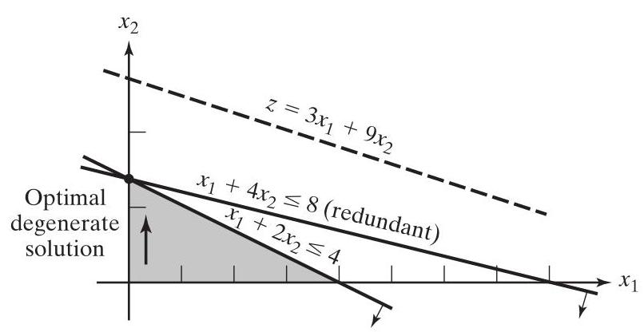

FIGURE 3.5

LP degeneracy in Example 3.5-1

2. From the theoretical standpoint, degeneracy can lead to cycling. In simplex iterations 1 and 2, the objective value does not improve $\left( {z = {18}}\right)$ , and it is thus possible for the simplex method to enter a repetitive sequence of iterations, never improving the objective value and never satisfying the optimality condition (see Problem 3-54). Cycling may not be a common occurrence, but there have been reports of it being encountered in practice. ${}^{8}$ Though algorithms have been developed for eliminating cycling, their use can lead to drastic slowdown in computations and hence they should not be implemented unless there is evidence that cycling is actually taking place. ${}^{9}$

3. Although an LP model may not start with redundant constraints (in the direct sense shown in Figure 3.5), computer roundoff error may actually create degeneracy-like conditions during the course of solving a real-life LP. In such cases, the iterations will "stall" at a solution point, thus mimicking cycling. Commercial codes attempt to alleviate the problem by periodically perturbing the values of the basic variables (see Section 3.7 for more details about how commercial codes are developed).

#### 3.5.2 Alternative Optima ^altoptima

An LP problem may have an infinite number of alternative optima when the objective function is parallel to a nonredundant binding constraint (i.e., a constraint that is satisfied as an equation at the optimal solution). The next example demonstrates the practical significance of such solutions.

---

${}^{8}$ See T. C. Kotiah and D. I. Steinberg,"Letter to the Editor-On the Possibility of Cycling with the Simplex Method," Operations Research, Vol. 26, No. 2, pp. 374-376, 1978.

${}^{9}$ See R. Bland,"New Finite Pivoting Rules for the Simplex Method," Mathematics of Operations Research, Vol. 2, No. 2, pp. 103-107, 1977.

---

Example 3.5-2 (Infinite Number of solutions)

$$
\text{ Maximize }z = 2{x}_{1} + 4{x}_{2}
$$

subject to

$$
{x}_{1} + 2{x}_{2} \leq  5
$$

$$
{x}_{1} + {x}_{2} \leq  4
$$

$$
{x}_{1},{x}_{2} \geq  0
$$

Figure 3.6 demonstrates how alternative optima can arise in the LP model when the objective function is parallel to a binding constraint. Any point on the line segment ${BC}$ represents an alternative optimum with the same objective value $z = {10}$ .

The iterations of the model are given by the following tableaus.

| Iteration | Basic | ${x}_{1}$ | ${x}_{2}$ | ${x}_{3}$ | ${x}_{4}$ | Solution |
| --- | --- | --- | --- | --- | --- | --- |
| 0 | $z$ | -2 | -4 | 0 | 0 | 0 |
| ${x}_{2}$ enters | ${x}_{3}$ | 1 | 2 | 1 | 0 | 5 |
| ${x}_{3}$ leaves | ${x}_{4}$ | 1 | 1 | 0 | 1 | 4 |
| 1 (optimum) | $z$ | 0 | 0 | 2 | 0 | 10 |
| ${x}_{1}$ enters | ${x}_{2}$ | $\frac{1}{2}$ | 1 | $\frac{1}{2}$ | 0 | 5 |
| ${x}_{4}$ leaves | ${x}_{4}$ | $\frac{1}{2}$ | 0 | $- \frac{1}{2}$ | 1 | $\frac{3}{2}$ |
| 2 | $z$ | 0 | 0 | 2 | 0 | 10 |
| 2 (alternative optimum) | ${x}_{2}$ | 0 | 1 | 1 | -1 | 1 |
| 2 (alternative optimum) | ${x}_{1}$ | 1 | 0 | -1 | 2 | 3 |

Iteration 1 gives the optimum solution ${x}_{1} = 0,{x}_{2} = \frac{5}{2}$ , and $z = {10}$ (point $B$ in Figure 3.6). The existence of alternative can be detected in the optimal tableau by examining the $z$ -equation coefficients of the nonbasic variables. The zero coefficient of nonbasic ${x}_{1}$ indicates that ${x}_{1}$ can be made basic, altering the values of the basic variables without changing the value of $z$ . Iteration 2 does just that, using ${x}_{1}$ and ${x}_{4}$ as the entering and leaving variables, respectively. The new solution point occurs at $C\left( {{x}_{1} = 3,{x}_{2} = 1, z = {10}}\right)$ . (TORA’s Iterations option allows determining one alternative optimum.)

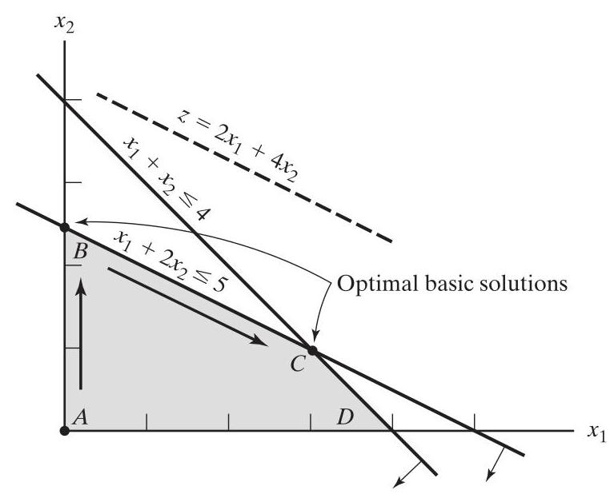

FIGURE 3.6

LP alternative optima in Example 3.5-2

The simplex method deals with corner point optima only - namely points $B$ and $C$ in the present example. Mathematically, we can determine all the points $\left( {{x}_{1},{x}_{2}}\right)$ on the line segment ${BC}$ as a nonnegative weighted average of points $B\left( {{x}_{1} = 0,{x}_{2} = \frac{5}{2}}\right)$ and $C\left( {{x}_{1} = 3,{x}_{2} = 1}\right)  -$ that is,

$$
\left. \begin{array}{l} {\widehat{x}}_{1} = \alpha \left( 0\right)  + \left( {1 - \alpha }\right) \left( 3\right)  = 3 - {3\alpha } \\  {\widehat{x}}_{2} = \alpha \left( \frac{5}{2}\right)  + \left( {1 - \alpha }\right) \left( 1\right)  = 1 + \frac{3}{2}\alpha  \end{array}\right\}  ,0 \leq  \alpha  \leq  1
$$

Remarks. In practice, alternative optima are useful because we can choose from many solutions without experiencing deterioration in the objective value. For instance, in the present example, the solution at $B$ shows that activity 2 only is at a positive level. At $C$ , both activities are at a positive level. If the example represents a product-mix situation, it may be advantageous to market two products instead of one.

#### 3.5.3 Unbounded Solution ^unbounded

In some LP models, the solution space is unbounded in at least one variable - meaning that variables may be increased indefinitely without violating any of the constraints. The associated objective value may also be unbounded in this case.

An unbounded solution space may signal that the model is poorly constructed. The most likely irregularity in such models is that some key constraints have not been accounted for. Another possibility is that estimates of the constraint coefficients may not be accurate.

Example 3.5-3 (Unbounded Objective Value)

$$
\text{ Maximize }z = 2{x}_{1} + {x}_{2}
$$

subject to

$$
{x}_{1} - {x}_{2} \leq  {10}
$$

$$
2{x}_{1} \leq  {40}
$$

$$
{x}_{1},{x}_{2} \geq  0
$$

Starting Iteration

| Basic | ${x}_{1}$ | ${x}_{2}$ | ${x}_{3}$ | ${x}_{4}$ | Solution |
| --- | --- | --- | --- | --- | --- |
| $z$ | -2 | -1 | 0 | 0 | 0 |
| ${x}_{3}$ | 1 | -1 | 1 | 0 | 10 |
| ${x}_{4}$ | 2 | 0 | 0 | 1 | 40 |

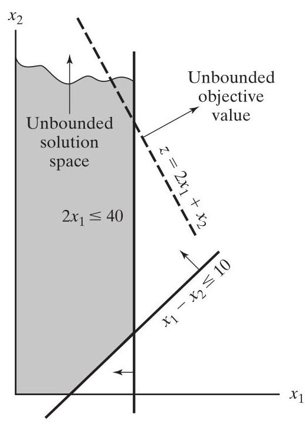

FIGURE 3.7

LP unbounded solution in Example 3.5-3

In the starting tableau, both ${x}_{1}$ and ${x}_{2}$ have negative $z$ -equation coefficients -meaning that an increase in their values will increase the objective value. Although ${x}_{1}$ should be the entering variable (it has the most negative $z$ -coefficient), we note that all the constraint coefficients under ${x}_{2}$ are $\leq  0$ -meaning that ${x}_{2}$ can be increased indefinitely without violating any of the constraints (compare with the graphical interpretation of the minimum ratio in Figure 3.4). The result is that $z$ can be increased indefinitely. Figure 3.7 shows the unbounded solution space and also that ${x}_{2}$ and $z$ can be increased indefinitely.

Remarks. Had ${x}_{1}$ been selected as the entering variable in the starting iteration (per the optimality condition), a later iteration would eventually have produced an entering variable with the same properties as ${x}_{2}$ . See Problem 3-58.

#### 3.5.4 Infeasible Solution ^infeasible

LP models with inconsistent constraints have no feasible solution. This situation does not occur if all the constraints are of the type $\leq$ with nonnegative right-hand sides because the slacks provide an obvious feasible solution. For other types of constraints, penalized artificial variables are used to start the solution. If at least one artificial variable is positive in the optimum iteration, then the LP has no feasible solution. From the practical standpoint, an infeasible space points to the possibility that the model is not formulated correctly.

## Example 3.5-4 (Infeasible Solution Space)

Consider the following LP:

$$
\text{ Maximize }z = 3{x}_{1} + 2{x}_{2}
$$

subject to

$$
2{x}_{1} + {x}_{2} \leq  2
$$

$$
3{x}_{1} + 4{x}_{2} \geq  {12}
$$

$$
{x}_{1},{x}_{2} \geq  0
$$

Using the penalty $M = {100}$ for the artificial variable $R$ , the following tableau provide the simplex iterations of the model.

| Iteration | Basic | ${x}_{1}$ | ${x}_{2}$ | ${x}_{4}$ | ${x}_{3}$ | $R$ | Solution |
| --- | --- | --- | --- | --- | --- | --- | --- |
| 0 | $z$ | -303 | -402 | 100 | 0 | 0 | -1200 |
| ${x}_{2}$ enters | ${x}_{3}$ | 2 | 1 | 0 | 1 | 0 | 2 |
| ${x}_{3}$ leaves | $R$ | 3 | 4 | -1 | 0 | 1 | 12 |
| 1 | $z$ | 501 | 0 | 100 | 402 | 0 | -396 |
| 1 (pseudo-optimum) | ${x}_{2}$ | 2 | 1 | 0 | 1 | 0 | 2 |
| 1 (pseudo-optimum) | $R$ | -5 | 0 | -1 | -4 | 1 | 4 |

Optimum iteration 1 shows that the artificial variable $R$ is positive $\left( { = 4}\right)$ -meaning that the LP is infeasible. Figure 3.8 depicts the infeasible solution space. By allowing the artificial variable to be positive, the simplex method has in essence reversed the direction of the inequality from $3{x}_{1} + 4{x}_{2} \geq  {12}$ to $3{x}_{1} + 4{x}_{2} \leq  {12}$ (can you explain how?). The result is what we may call a pseudo-optimal solution.

### 3.6 SENSITIVITY ANALYSIS ^sensitivity

In LP, the parameters (input data) of the model can change within certain limits without causing changes in the optimum. This is referred to as sensitivity analysis and will be the subject matter of this section. Later, Chapter 4 will study post-optimal analysis, which deals with determining the new optimum solution when targeted input data are changed.

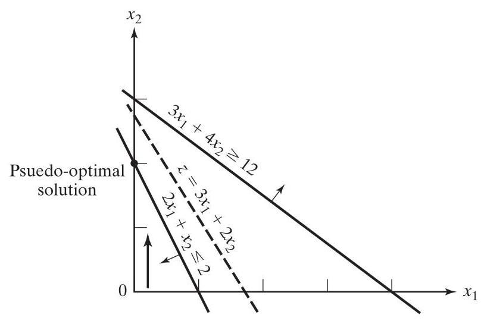

Infeasible solution of Example 3.5-4

The presentation explains the basic ideas of sensitivity analysis using the more concrete graphical solution. These ideas are then extended to the general LP problem using the simplex tableau results.

#### 3.6.1 Graphical Sensitivity Analysis ^graphicalsa

This section demonstrates the general idea of sensitivity analysis. Two cases will be considered:

1. Sensitivity of the optimum solution to changes in the availability of the resources (right-hand side of the constraints).

2. Sensitivity of the optimum solution to changes in unit profit or unit cost (coefficients of the objective function).

We will use individual examples to explain the two cases.

## Example 3.6-1 (Changes in the Right-Hand Side) ^rhschanges

JOBCO manufactures two products on two machines. A unit of product 1 requires 2 hrs on machine 1 and $1\mathrm{{hr}}$ on machine 2. For product 2, one unit requires $1\mathrm{{hr}}$ on machine 1 and $3\mathrm{{hrs}}$ on machine 2. The revenues per unit of products 1 and 2 are \$30 and \$20, respectively. The total daily processing time available for each machine is $8\mathrm{{hrs}}$ .

Letting ${x}_{1}$ and ${x}_{2}$ represent the daily number of units of products 1 and 2, respectively, the LP model is given as

$$
\text{ Maximize }z = {30}{x}_{1} + {20}{x}_{2}
$$

subject to

$$
2{x}_{1} + {x}_{2} \leq  8\;\text{ (Machine 1) }
$$

$$
{x}_{1} + 3{x}_{2} \leq  8\;\text{ (Machine 2) }
$$

$$
{x}_{1},{x}_{2} \geq  0
$$

Figure 3.9 illustrates the change in the optimum solution when changes are made in the capacity of machine 1. If the daily capacity is increased from 8 to 9 hrs, the new optimum will move to point $G$ . The rate of change in optimum $z$ resulting from changing machine 1 capacity from 8 to 9 hrs can be computed as:

$$
\left( \begin{matrix} \text{ Rate of revenue change } \\  \text{ resulting from increasing } \\  \text{ machine }1\text{ capacity by }{11}\mathrm{\;{hr}} \\  \text{ (point }C\text{ to point }G\text{ ) } \end{matrix}\right)  = \frac{{z}_{G} - {z}_{C}}{\left( \text{ Capacity change }\right) } = \frac{{142} - {128}}{9 - 8} = \$ {14}/\mathrm{{hr}}
$$

The computed rate provides a direct link between the model input (resources) and its output (total revenue). It says that a unit increase (decrease) in machine 1 capacity will increase (decrease) revenue by \$14.

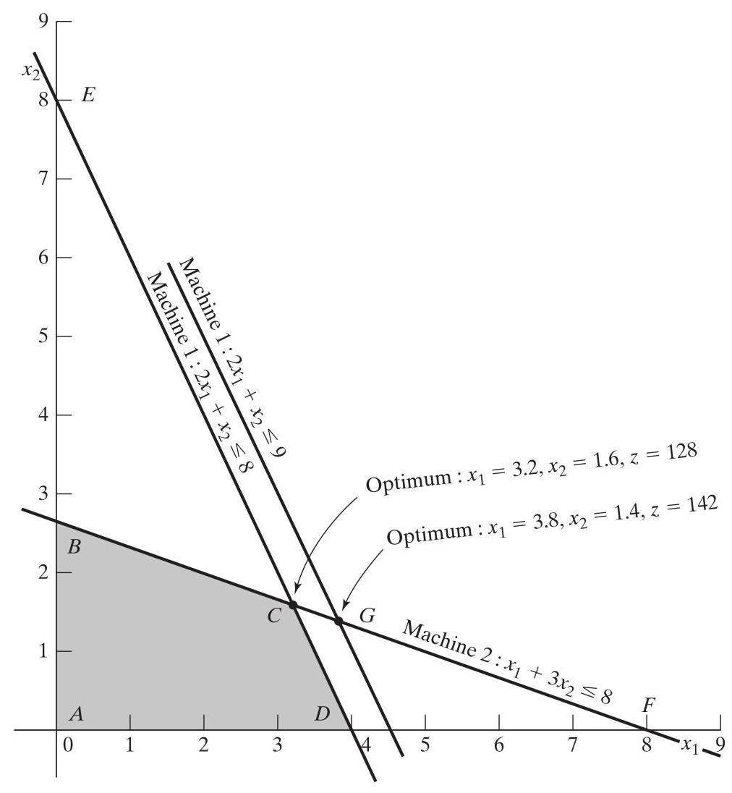

FIGURE 3.9

Graphical sensitivity of optimal solution to changes in the availability of resources (right-hand side of the constraints)

The name unit worth of a resource is an apt description of the rate of change of the objective function per unit change of a resource. Nevertheless, early LP developments have coined the abstract name dual (or shadow) price and this name is now standard in all the LP literature and software packages. The presentation in this book conforms to this standard. Nevertheless, think "unit worth of resource" whenever you come across standard names "dual or shadow price." ^dualprice

Looking at Figure 3.9, we can see that the dual price of \$14/hr remains valid for changes (increases or decreases) in machine 1 capacity that move its constraint parallel to itself to any point on the line segment ${BF}$ . We compute machine 1 capacities at points $B$ and $F$ as follows:

$$
\text{ Minimum machine 1 capacity [at }B = \left( {0,{2.67}}\right) \rbrack  = 2 \times  0 + 1 \times  {2.67} = {2.67}\mathrm{{hr}}
$$

Minimum machine 1 capacity [at $F = \left( {8,0}\right) \rbrack  = 2 \times  8 + 1 \times  0 = {16}\mathrm{{hr}}$

The conclusion is that the dual price of \$14.00/hr remains valid only in the range

$$
{2.67}\mathrm{{hr}} \leq  \text{ Machine 1 capacity } \leq  {16}\mathrm{{hr}}
$$

Changes outside this range produce a different dual price (worth per unit).

Using similar computations, you can verify that the dual price for machine 2 capacity is \$2/hr, and it remains valid for changes in machine 2 capacity within the line segment ${DE}$ . Now,

$$
\text{ Minimum machine 2 capacity }\left\lbrack  {\text{ at }D = \left( {4,0}\right) }\right\rbrack   = 1 \times  4 + 3 \times  0 = 4\mathrm{{hr}}
$$

$$
\text{ Minimum machine 2 capacity }\left\lbrack  {\text{ at }E = \left( {0,8}\right) }\right\rbrack   = 1 \times  0 + 3 \times  8 = {24}\mathrm{{hr}}
$$

Thus, the dual price of $\$ 2/\mathrm{{hr}}$ for machine 2 remains applicable for the range

$$
4\mathrm{{hr}} \leq  \text{ Machine 2 capacity } \leq  {24}\mathrm{{hr}}
$$

The computed limits for machine 1 and 2 are referred to as the feasibility ranges. All software packages provide information about the dual prices and their feasibility ranges. Section 3.6.4 shows how AMPL, Solver, and TORA generate this information.

The dual prices allow making economic decisions about the LP problem, as the following questions demonstrate:

Question 1. If JOBCO can increase the capacity of both machines, which machine should receive priority?

From the dual prices for machines 1 and 2, each additional hour of machine 1 increases revenue by \$14, as opposed to only \$2 for machine 2. Thus, priority should be given to machine 1.

Question 2. A suggestion is made to increase the capacities of machines 1 and 2 at the additional cost of \$10/hr for each machine. Is this advisable?

For machine 1, the additional net revenue per hour is ${14} - {10} = \$ 4$ , and for machine 2, the net is $\$ 2 - \$ {10} =  - \$ 8$ . Hence, only machine 1 should be considered for capacity increase.

Question 3. If the capacity of machine 1 is increased from 8 to 13 hrs, how will this increase impact the optimum revenue?

The dual price for machine 1 is \$14 and is applicable in the range (2.67, 16) hr. The proposed increase to 13 hrs falls within the feasibility range. Hence, the increase in revenue is $\$ {14}\left( {{13} - 8}\right)  = \$ {70}$ , which means that the total revenue will be increased from $\$ {128}$ to $\$ {198}\left( { = \$ {128} + \$ {70}}\right)$ .

Question 4. Suppose that the capacity of machine 1 is increased to 20 hrs, how will this increase affect the optimum revenue?

The proposed change is outside the feasibility range (2.67, 16) hr. Thus, we can only make an immediate conclusion regarding an increase up to 16 hrs. Beyond that, further calculations are needed to find the answer (see Chapter 4). Remember that falling outside the feasibility range does not mean that the problem has no solution. It only means that available information is not sufficient to make a complete decision.

Question 5. How can we determine the new optimum values of the variables associated with a change in a resource?

The optimum values of the variables will change. However, the procedure for determining these values requires additional computations, as will be shown in Section 3.6.2.

## Example 3.6-2 (Changes in the Objective Coefficients) ^objchanges

Figure 3.10 shows the graphical solution space of the JOBCO problem presented in Example 3.6-1. The optimum occurs at point $C\left( {{x}_{1} = {3.2},{x}_{2} = {1.6}, z = {128}}\right)$ . Changes in revenue units (i.e., objective-function coefficients) will change the slope of $z$ . However, as can be seen from the figure, the optimum solution at point $C$ remains unchanged so long as the objective function lies between lines ${BF}$ and ${DE}$ .

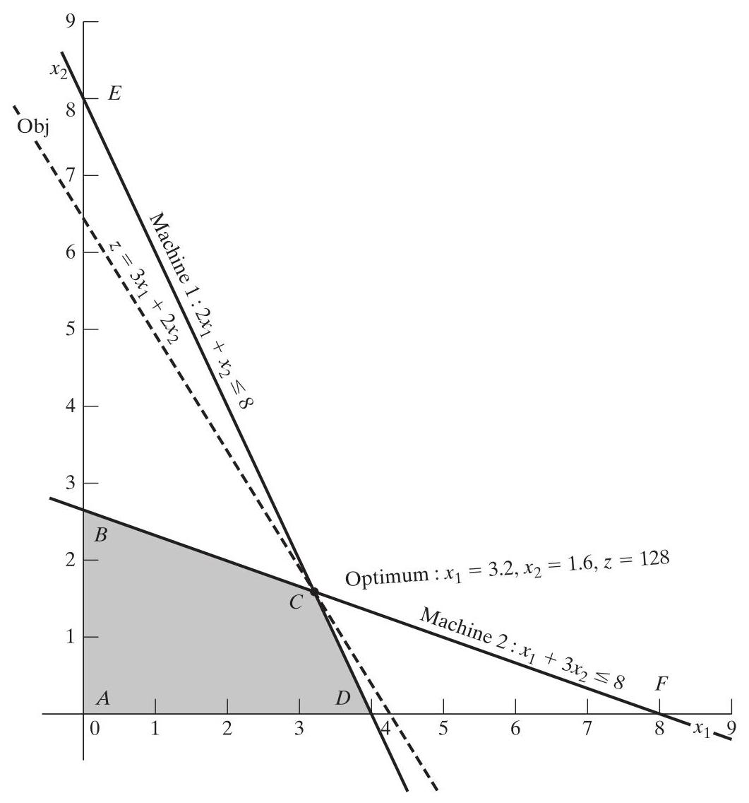

FIGURE 3.10

Graphical sensitivity of optimal solution to changes in the revenue units (coefficients of the objective function)

How can we determine ranges for the coefficients of the objective function that will keep the optimum solution unchanged at $C$ ? First, we write the objective function in the general format:

$$
\text{ Maximinze }z = {c}_{1}{x}_{1} + {c}_{2}{x}_{2}
$$

Imagine now that line $z$ is pivoted at $C$ and that it can rotate clockwise and counterclockwise. The optimum solution will remain at point $C$ so long as $z = {c}_{1}{x}_{1} + {c}_{2} + {x}_{2}$ lies between the two lines ${x}_{1} + 3{x}_{2} = 8$ and $2{x}_{1} + {x}_{2} = 8$ . This means that the ratio $\frac{{c}_{1}}{{c}_{2}}$ can vary between $\frac{1}{3}$ and $\frac{2}{1}$ , which yields the following optimality range: ${}^{10}$

$$
\frac{1}{3} \leq  \frac{{c}_{1}}{{c}_{2}} \leq  \frac{2}{1}\text{ or }{.333} \leq  \frac{{c}_{1}}{{c}_{2}} \leq  2
$$

---

${}^{10}$ The "ratio" condition works correctly in this situation because the slopes for the two lines passing through the optimum point $C$ have the same sign. Other situations are more complex.

---

This information can provide immediate answers regarding the optimum solution as the following questions demonstrate:

Question 1. Suppose that the unit revenues for products 1 and 2 are changed to \$35 and \$25, respectively. Will the current optimum remain the same?

The new objective function is

$$
\text{ Maximinze }z = {35}{x}_{1} + {25}{x}_{2}
$$

The solution at $C$ will remain optimal because $\frac{{c}_{1}}{{c}_{2}} = \frac{35}{25} = {1.4}$ remains within the optimality range (.333, 2). When the ratio falls outside this range, additional calculations are needed to find the new optimum (see Chapter 4). Notice that although the values of the variables at the optimum point $C$ remain unchanged, the optimum value of $z$ changes to ${35} \times  \left( {3.2}\right)  + \; {25} \times  \left( {1.6}\right)  = \$ {152}$ .

Question 2. Suppose that the unit revenue of product 2 is fixed at its current value ${c}_{2} = \$ {20}$ . What is the associated optimality range for the unit revenue for product $1,{c}_{1}$ , that will keep the optimum unchanged?

Substituting ${c}_{2} = {20}$ in the condition $\frac{1}{3} \leq  \frac{{c}_{1}}{{c}_{2}} \leq  2$ , we get

$$
\frac{1}{3} \times  {20} \leq  {c}_{1} \leq  2 \times  {20}\text{ or }{6.67} \leq  {c}_{1} \leq  {40}
$$

We can similarly determine the optimality range for ${c}_{2}$ by fixing the value of ${c}_{1}$ at $\$ {30.00}$ . Thus,

$$
\left( {{c}_{2} \leq  {30} \times  3\text{ and }{c}_{2} \geq  \frac{30}{2}}\right) \text{ or }{15} \leq  {c}_{2} \leq  {90}
$$

As in the case of the right-hand side, all software packages provide the optimality ranges for each objective function coefficient. Section 3.6.4 shows how AMPL, Solver, and TORA generate these results.

Remarks. Although the material in this section has dealt only with two variables, the results lay the foundation for the development of sensitivity analysis for the general LP problem in Sections 3.6.2 and 3.6.3.

#### 3.6.2 Algebraic Sensitivity Analysis—Changes in the Right-Hand Side ^algebraicrhs

In Section 3.6.1, we used the graphical solution to determine the dual price (unit worth of a resource) and its feasibility ranges. This section extends the analysis to the general LP model. A numeric example (the TOYCO model) will be used to facilitate the presentation.

## Example 3.6-3 (TOYCO Model) ^toyco

TOYCO uses three operations to assemble three types of toys - trains, trucks, and cars. The daily available times for the three operations are 430, 460, and 420 mins, respectively, and the revenues per unit of toy train, truck, and car are \$3, \$2, and \$5, respectively. The assembly times per train at the three operations are 1, 3, and 1 mins, respectively. The corresponding times per train and per car are $\left( {2,0,4}\right)$ and $\left( {1,2,0}\right)$ mins (a zero time indicates that the operation is not used).

Letting ${x}_{1},{x}_{2}$ , and ${x}_{3}$ represent the daily number of units assembled of trains, trucks, and cars, respectively, the associated LP model is given as:

$$
\text{ Maximinze }z = 3{x}_{1} + 2{x}_{2} + 5{x}_{3}
$$

subject to

$$
{x}_{1} + 2{x}_{2} + {x}_{3} \leq  {430}\text{ (Operation 1) }
$$

$$
3{x}_{1}\; + 2{x}_{3} \leq  {460}\text{ (Operation 2) }
$$

$$
{x}_{1} + 4{x}_{2}\; \leq  {420}\text{ (Operation 3) }
$$

$$
{x}_{1},{x}_{2},{x}_{3} \geq  0
$$

Using ${x}_{4},{x}_{5}$ , and ${x}_{6}$ as the slack variables for the constraints of operations 1,2, and 3, respectively, the optimum tableau is

| Basic | ${x}_{1}$ | ${x}_{2}$ | ${x}_{3}$ | ${x}_{4}$ | ${x}_{5}$ | ${x}_{6}$ | Solution |
| --- | --- | --- | --- | --- | --- | --- | --- |
| $z$ | 4 | 0 | 0 | 1 | 2 | 0 | 1350 |
| ${x}_{2}$ | $- \frac{1}{4}$ | 1 | 0 | $\frac{1}{2}$ | $- \frac{1}{4}$ | 0 | 100 |
| ${x}_{3}$ | $\frac{3}{2}$ | 0 | 1 | 0 | $\frac{1}{2}$ | 0 | 230 |
| ${x}_{6}$ | 2 | 0 | 0 | -2 | 1 | 1 | 20 |

The solution recommends manufacturing 100 trucks and 230 cars but no trains. The associated revenue is \$1350.

Determination of dual prices and feasibility ranges. We will use the TOYCO model to show how this information is obtained from the optimal simplex tableau. Recognizing that the dual prices and their feasibility ranges are rooted in making changes in the right-hand side of the constraints, suppose that ${D}_{1},{D}_{2}$ , and ${D}_{3}$ are the (positive or negative) changes made in the allotted daily manufacturing time of operations 1, 2, and 3, respectively. The original TOYCO model can then be changed to ^rhsperturb

$$
\text{ Maximinze }z = 3{x}_{1} + 2{x}_{2} + 5{x}_{3}
$$

subject to

$$
{x}_{1} + 2{x}_{2} + {x}_{3} \leq  {430} + {D}_{1}\;\text{ (Operation 1) }
$$

$$
3{x}_{1}\; + 2{x}_{3} \leq  {460} + {D}_{2}\;\text{ (Operation 2) }
$$

$$
{x}_{1} + 4{x}_{2}\; \leq  {420} + {D}_{3}\;\text{ (Operation 3) }
$$

$$
{x}_{1},{x}_{2},{x}_{3} \geq  0
$$

To express the optimum simplex tableau of the modified problem in terms of the changes ${D}_{1},{D}_{2}$ , and ${D}_{3}$ , we first rewrite the starting tableau using the new right-hand sides, ${430} + {D}_{1},{460} + {D}_{2}$ , and ${420} + {D}_{3}$ .

| Basic | ${x}_{1}$ | ${x}_{2}$ | ${x}_{3}$ | ${x}_{4}$ | ${x}_{5}$ | ${x}_{6}$ | RHS | ${D}_{1}$ | ${D}_{2}$ | ${D}_{3}$ |
| --- | --- | --- | --- | --- | --- | --- | --- | --- | --- | --- |
| $z$ | -3 | -2 | -5 | 0 | 0 | 0 | 0 | 0 | 0 | 0 |
| ${x}_{4}$ | 1 | 2 | 1 | 1 | 0 | 0 | 430 | 1 | 0 | 0 |
| ${x}_{5}$ | 3 | 0 | 2 | 0 | 1 | 0 | 460 | 0 | 1 | 0 |
| ${x}_{6}$ | 1 | 4 | 0 | 0 | 0 | 1 | 420 | 0 | 0 | 1 |

The two shaded areas are identical. Hence, if we repeat the same simplex iterations (with the same row operations) as in the original model, the columns in the two highlighted area will also be identical in the optimal tableau-that is,

| Basic | ${x}_{1}$ | ${x}_{2}$ | ${x}_{3}$ | ${x}_{4}$ | ${x}_{5}$ | ${x}_{6}$ | RHS | ${D}_{1}$ | ${D}_{2}$ | ${D}_{3}$ |
| --- | --- | --- | --- | --- | --- | --- | --- | --- | --- | --- |
| $z$ | 4 | 0 | 0 | 1 | 2 | 0 | 1350 | 1 | 2 | 0 |
| ${x}_{2}$ | $- \frac{1}{4}$ | 1 | 0 | $\frac{1}{2}$ | $- \frac{1}{4}$ | 0 | 100 | $\frac{1}{2}$ | $- \frac{1}{4}$ | 0 |
| ${x}_{3}$ | $\frac{3}{2}$ | 0 | 1 | 0 | 1 | 0 | 230 | 0 | $\frac{1}{2}$ | 0 |
| ${x}_{6}$ | 2 | 0 | 0 | -2 | 1 | 1 | 20 | -2 | 1 | 1 |

The new optimum tableau provides the following optimal solution:

$$
z = {1350} + {D}_{1} + 2{D}_{2}
$$

$$
{x}_{2} = {100} + \frac{1}{2}{D}_{1} - \frac{1}{4}{D}_{2}
$$

$$
{x}_{3} = {230} + \frac{1}{2}{D}_{2}
$$

$$
{x}_{6} = {20} - 2{D}_{1} + {D}_{2} + {D}_{3}
$$

We now use this solution to determine the dual prices and the feasibility ranges.

Dual prices: The value of the objective function can be written as

$$
z = {1350} + \mathbf{1}{D}_{1} + \mathbf{2}{D}_{2} + \mathbf{0}{D}_{3}
$$

The equation shows that

1. A unit change in operation 1 capacity $\left( {{D}_{1} =  \pm  1\mathrm{\;{min}}}\right)$ changes $z$ by $\$ 1$ .

2. A unit change in operation 2 capacity $\left( {{D}_{2} =  \pm  1\mathrm{\;{min}}}\right)$ changes $z$ by $\$ 2$ .

3. A unit change in operation 3 capacity $\left( {{D}_{3} =  \pm  1\mathrm{\;{min}}}\right)$ changes $z$ by $\$ 0$ .

This means that, by definition, the corresponding dual prices are1,2, and $0\left( {\$ /\mathrm{{min}}}\right)$ for operations 1, 2, and 3, respectively.

The coefficients of ${D}_{1},{D}_{2}$ , and ${D}_{3}$ in the optimal $z$ -row are exactly those of the slack variables ${x}_{4},{x}_{5}$ , and ${x}_{6}$ . This means that the dual prices equal the coefficients of the slack variables in the optimal $z$ -row. There is no ambiguity as to which coefficient applies to which resource because each slack variable is uniquely identified with a constraint.

Feasibility range: The current solution remains feasible if all the basic variables remain nonnegative - that is,

$$
{x}_{2} = {100} + \frac{1}{2}{D}_{1} - \frac{1}{4}{D}_{2} \geq  0
$$

$$
{x}_{3} = {230} + \frac{1}{2}{D}_{2} \geq  0
$$

$$
{x}_{6} = {20} - 2{D}_{1} + {D}_{2} + {D}_{3} \geq  0
$$

Simultaneous changes ${D}_{1},{D}_{2}$ , and ${D}_{3}$ that satisfy these inequalities will keep the solution feasible. The new optimum solution can be found by substituting out the values of ${D}_{1},{D}_{2}$ , and ${D}_{3}$ .

To illustrate the use of these conditions, suppose that the manufacturing time available for operations 1, 2, and 3 are 480, 440, and 400 mins, respectively. Then, ${D}_{1} = {480} - {430} = {50},{D}_{2} = {440} - {460} =  - {20}$ , and ${D}_{3} = {400} - {420} =  - {20}$ . Substituting in the feasibility conditions, we get

$$
{x}_{2} = {100} + \frac{1}{2}\left( {50}\right)  - \frac{1}{4}\left( {-{20}}\right)  = {130} > 0\;\text{ (feasible) }
$$

$$
{x}_{3} = {230} + \frac{1}{2}\left( {-{20}}\right)  = {220} > 0\;\text{ (feasible) }
$$

$$
{x}_{6} = {20} - 2\left( {50}\right)  + \left( {-{20}}\right)  + \left( {-{10}}\right)  =  - {110} < 0\;\text{ (infeasible) }
$$

The calculations show that ${x}_{6} < 0$ , hence the current solution does not remain feasible. Additional calculations will be needed to find the new solution (see Chapter 4).

Alternatively, if the changes in the resources are such that ${D}_{1} =  - {30},{D}_{2} =  - {12}$ , and ${D}_{3} = {10}$ , then

$$
{x}_{2} = {100} + \frac{1}{2}\left( {-{30}}\right)  - \frac{1}{4}\left( {-{12}}\right)  = {88} > 0
$$

$$
{x}_{3} = {230} + \frac{1}{2}\left( {-{12}}\right)  = {224} > 0\;\text{ (feasible) }
$$

$$
{x}_{6} = {20} - 2\left( {-{30}}\right)  + \left( {-{12}}\right)  + \left( {10}\right)  = {78} > 0\;\text{ (feasible) }
$$

The new (optimal) feasible solution is ${x}_{1} = {88},{x}_{3} = {224}$ , and ${x}_{6} = {68}$ with $z = 3\left( 0\right)  + \; 2\left( {88}\right)  + 5\left( {224}\right)  = \$ {1296}$ . Notice that the optimum objective value can also be computed using the dual prices as $z = {1350} + 1\left( {-{30}}\right)  + 2\left( {-{12}}\right)  + 0\left( {10}\right)  = \$ {1296}$ .

The given conditions can produce the individual feasibility ranges associated with changing the resources one at a time (as defined in Section 3.6.1). For example, a change in operation 1 time only means that ${D}_{2} = {D}_{3} = 0$ . The simultaneous conditions thus reduce to

$$
\left. \begin{array}{l} {x}_{2} = {100} + \frac{1}{2}{D}_{1} \geq  0 \Rightarrow  {D}_{1} \geq   - {200} \\  {x}_{3} = {230} > 0 \\  {x}_{6} = {20} - 2{D}_{1} \geq  0 \Rightarrow  {D}_{1} \leq  {10} \end{array}\right\}   \Rightarrow   - {200} \leq  {D}_{1} \leq  {10}
$$

This means that the dual price for operation 1 is valid in the feasibility range $- {200} \leq  {D}_{1} \leq  {10}$ .

We can show in a similar manner that the feasibility ranges for operations 2 and 3 are $- {20} \leq  {D}_{2} \leq  {400}$ and $- {20} \leq  {D}_{3} \leq  \infty$ . respectively (verify!).

We can now summarize the dual prices and their feasibility ranges for the TOYCO model as follows: ${}^{11}$

| Resource | Dual price (\$) | Feasibility range | Minimum (min) | Current (min) | Maximum (min) |
| --- | --- | --- | --- | --- | --- |
| Operation 1 | 1 | $- {200} \leq {D}_{1} \leq {10}$ | 230 | 430 | 440 |
| Operation 2 | 2 | $- {20} \leq {D}_{2} \leq {400}$ | 440 | 440 | 860 |
| Operation 3 | 0 | $- {20} \leq {D}_{3} < \infty$ | 400 | 420 | $\infty$ |

It is important to notice that the dual prices will remain applicable for any simultaneous changes that keep the solution feasible, even if the changes violate the individual ranges. For example, the changes ${D}_{1} = {30},{D}_{2} =  - {12}$ , and ${D}_{3} = {100}$ will keep the solution feasible even though ${D}_{1} = {30}$ violates the feasibility range $- {200} \leq  {D}_{1} \leq  {10}$ , as the following computations show:

$$
{x}_{2} = {100} + \frac{1}{2}\left( {30}\right)  - \frac{1}{4}\left( {-{12}}\right)  = {118} > 0\;\text{ (feasible) }
$$

$$
{x}_{3} = {230} + \frac{1}{2}\left( {-{12}}\right)  = {224} > 0\;\text{ (feasible) }
$$

$$
{x}_{6} = {20} - 2\left( {30}\right)  + \left( {-{12}}\right)  + \left( {100}\right)  = {48} > 0\text{ (feasible) }
$$

This means that the dual prices will remain applicable, and we can compute the new optimum objective value from the dual prices as $z = {1350} + 1\left( {30}\right)  + 2\left( {-{12}}\right)  + \; 0\left( {100}\right)  = \$ {1356}.$

#### 3.6.3 Algebraic Sensitivity Analysis—Objective Function ^algebraicobj

In Section 3.6.1, we used graphical sensitivity analysis to determine the conditions that will maintain the optimality of the solution of a two-variable LP. In this section, we extend these ideas to the general LP problem.

Definition of reduced cost. To facilitate the explanation of the objective function sensitivity analysis, first we need to define reduced costs. In the TOYCO model (Example 3.6-2), the objective $z$ -equation in the optimal tableau can be written as ^reducedcost

$$
z = {1350} - 4{x}_{1} - {x}_{4} - 2{x}_{5}
$$

The optimal solution does not produce toy trains $\left( {{x}_{1} = 0}\right)$ . The reason can be seen from the $z$ -equation, where a unit increase in ${x}_{1}$ (above its current zero value) decreases $z$ by $\$ 4 -$ namely, $z = {1350} - 4 \times  \left( 1\right)  - 1 \times  \left( 0\right)  - 2 \times  \left( 0\right)  = \$ {1346}$ .

---

${}^{11}$ Available LP packages usually present this information as standard output. Practically none provide the case of simultaneous conditions, presumably because its display is cumbersome for large LPs.

---

We can think of the coefficient of ${x}_{1}$ in the $z$ -equation (=4) as a unit cost because it causes a reduction in the revenue $z$ . But where does this "cost" come from? We know that the revenue per unit of ${x}_{1}$ is $\$ 3$ (per the original model). We also know that the production of toy train incurs cost because it consumes resources (operations time). Thus, from the standpoint of optimization, the "attractiveness" of ${x}_{1}$ depends on the cost of consumed resources relative to revenue. This relationship defines the so-called reduced cost and is formalized in the LP literature as

$$
\left( \begin{matrix} \text{ Reduced cost } \\  \text{ per unit } \end{matrix}\right)  = \left( \begin{matrix} \text{ Cost of consumed } \\  \text{ resources per unit } \end{matrix}\right)  - \left( \text{ Revenue per unit }\right)
$$

To appreciate the significance of this definition, in the original TOYCO model the revenue per unit for toy trucks (= \$2) is less than that for toy trains (= \$3). Yet the optimal solution recommends producing toy trucks $\left( {{x}_{2} = {100}}\right.$ units $)$ and no toy trains $\left( {{x}_{1} = 0}\right)$ . The reason is that the cost of the resources used by one toy truck (i.e., operations time) is smaller than its unit price. The opposite applies in the case of toy trains.

With the given definition of reduced cost, we can see that an unprofitable variable (such as ${x}_{1}$ ) can be made profitable in two ways:

1. By increasing the unit revenue.

2. By decreasing the unit cost of consumed resources.

In most situations, the price per unit is dictated by market conditions and may be difficult to increase at will. On the other hand, reducing the consumption of resources is a more viable option because the manufacturer may be able to reduce cost by making the production process more efficient.

Determination of the optimality ranges. We now turn our attention to determining the conditions that will keep a solution optimal. The development is based on the definition of reduced cost.

In the TOYCO model, let ${d}_{1},{d}_{2}$ , and ${d}_{3}$ represent the change in unit revenues for toy trucks, trains, and cars, respectively. The objective function then becomes

$$
\text{ Maximize }z = \left( {3 + {d}_{1}}\right) {x}_{1} + \left( {2 + {d}_{2}}\right) {x}_{2} + \left( {5 + {d}_{3}}\right) {x}_{3}
$$

We first consider the general situation in which all the objective coefficients are changed simultaneously.

With the simultaneous changes, the $z$ -row in the starting tableau appears as:

| Basic | ${x}_{1}$ | ${x}_{2}$ | ${x}_{3}$ | ${x}_{4}$ | ${x}_{5}$ | ${x}_{6}$ | Solution |
| --- | --- | --- | --- | --- | --- | --- | --- |
| $z$ | $- 3 - {d}_{1}$ | $- 2 - {d}_{2}$ | $- 5 - {d}_{3}$ | 0 | 0 | 0 | 0 |

When we generate the simplex tableaus with the same sequence of entering and leaving variables used in the original model (before the changes ${d}_{j}$ are made), the optimal iteration will appear as follows (convince yourself that this is indeed the case by carrying out the simplex row operations):

| Basic     | ${x}_{1}$                                               | ${x}_{2}$ | ${x}_{3}$ | ${x}_{4}$                | ${x}_{5}$                                     | ${x}_{6}$ | Solution                              |
| --------- | ------------------------------------------------------- | --------- | --------- | ------------------------ | --------------------------------------------- | --------- | ------------------------------------- |
| $z$       | $4 - \frac{1}{4}{d}_{2} + \frac{3}{2}{d}_{3} - {d}_{1}$ | 0         | 0         | $1 + \frac{1}{2}{d}_{2}$ | $2 - \frac{1}{4}{d}_{2} + \frac{1}{2}{d}_{3}$ | 0         | ${1350} + {100}{d}_{2} + {23}{d}_{3}$ |
| ${x}_{2}$ | $- \frac{1}{4}$                                         | 1         | 0         | $\frac{1}{2}$            | $- \frac{1}{4}$                               | 0         | 100                                   |
| ${x}_{3}$ | $\frac{3}{2}$                                           | 0         | 1         | 0                        | $\frac{1}{2}$                                 | 0         | 230                                   |
| ${x}_{6}$ | $- \frac{1}{4}$                                         | 0         | 0         | -2                       | 1                                             | 1         | 20                                    |

The new optimal tableau is the same as in the original optimal tableau, except for the reduced costs (z-equation coefficients). This means that changes in the objective-function coefficients can affect the optimality of the problem only. (Compare with Section 3.6.2, where changes in the right-hand side affect feasibility only.)

You really do not need to carry out the simplex row operation to compute the new reduced costs. An examination of the new $z$ -row shows that the coefficients of ${d}_{j}$ are taken directly from the constraint coefficients of the optimum tableau. A convenient way for computing the new reduced cost is to add a new top row and a new leftmost column to the optimum tableau, as shown by the shaded areas in the following illustration.

| Row | Basic | ${x}_{1}$ | ${x}_{2}$ | ${x}_{3}$ | ${x}_{4}$ | ${x}_{5}$ | ${x}_{6}$ | Solution |
| --- | --- | --- | --- | --- | --- | --- | --- | --- |
| 1 | $z$ | 4 | 0 | 0 | 1 | 2 | 0 | 1350 |
| ${d}_{2}$ | ${x}_{2}$ | $- \frac{1}{4}$ | 1 | 0 | $\frac{1}{2}$ | $- \frac{1}{4}$ | 0 | 100 |
| ${d}_{3}$ | ${x}_{3}$ | $\frac{3}{2}$ | 0 | 1 | 0 | $\frac{1}{2}$ | 0 | 230 |
| 0 | ${x}_{6}$ | 2 | 0 | 0 | -2 | 1 | 1 | 20 |

The entries in the top row are the change ${d}_{j}$ associated with variable ${x}_{j}$ . For the leftmost column, the top element is 1 in the $z$ -row followed by ${d}_{i}$ basic variable ${x}_{i}$ . Keep in mind that ${d}_{i} = 0$ for slack variable ${x}_{i}$ .

To compute the new reduced cost for any variable (or the value of $z$ ), multiply the elements of its column by the corresponding elements in the leftmost column, add them up, and subtract the top-row element from the sum. For example, for ${x}_{1}$ , we have

$$
\text{ Reduced cost for }{x}_{1} = \left\lbrack  {4 \times  1 + \left( {-\frac{1}{4}}\right)  \times  {d}_{2} + \frac{3}{2} \times  {d}_{3} + 2 \times  0}\right\rbrack   - {d}_{1}
$$

$$
= 4 - \frac{1}{4}{d}_{2} + \frac{3}{2}{d}_{3} - {d}_{1}
$$

The current solution remains optimal so long as the new reduced costs (z-equation coefficients) remain nonnegative (maximization case). We thus have the following simultaneous optimality conditions corresponding to nonbasic ${x}_{1},{x}_{4}$ , and ${x}_{5}$ :

$$
4 - \frac{1}{4}{d}_{2} + \frac{3}{2}{d}_{3} - {d}_{1} \geq  0
$$

$$
1 + \frac{1}{2}{d}_{2} \geq  0
$$

$$
2 - \frac{1}{4}{d}_{2} + \frac{1}{2}{d}_{3} \geq  0
$$

Remember that the reduced cost for a basic variable is always zero, as the modified optimal tableau shows.

To illustrate the use of these conditions, suppose that the objective function of TOYCO is changed from $z = 3{x}_{1} + 2{x}_{2} + 5{x}_{3}$ to $z = 2{x}_{1} + {x}_{2} + 6{x}_{3}$ . Then, ${d}_{1} = 2 - 3 =  - \$ 1,{d}_{2} = 1 - 2 =  - \$ 1$ , and ${d}_{3} = 6 - 5 = \$ 1$ . Substitution in the given conditions yields

$$
4 - \frac{1}{4}{d}_{2} + \frac{3}{2}{d}_{3} - {d}_{1} = 4 - \frac{1}{4}\left( {-1}\right)  + \frac{3}{2}\left( 1\right)  - \left( {-1}\right)  = {6.75} > 0\text{ (satisfied) }
$$

$$
1 + \frac{1}{2}{d}_{2} = 1 + \frac{1}{2}\left( {-1}\right)  = {.5} > 0
$$

$$
2 - \frac{1}{4}{d}_{2} + \frac{1}{2}{d}_{3} = 2 - \frac{1}{4}\left( {-1}\right)  + \frac{1}{2}\left( 1\right)  = {2.75} > 0
$$

The results show that the proposed changes will keep the current solution $\left( {{x}_{1} = 0}\right.$ , ${x}_{2} = {100},{x}_{3} = {230})$ optimal (with a new value of $z = {1350} + {100}{d}_{2} + {230}{d}_{3} = \; {1350} + {100} \times   - 1 + {230} \times  1 = \$ {1480}$ ). If any condition is not satisfied, a new solution must be determined (see Chapter 4).

The preceding discussion has dealt with the maximization case. The only difference in the minimization case is that the reduced costs ( $z$ -equations coefficients) must be $\leq  0$ to maintain optimality.

The optimality ranges dealing with changing ${d}_{i}$ one at a time can be developed from the simultaneous optimality conditions. ${}^{12}$ For example, suppose that the objective coefficient of ${x}_{2}$ only is changed to $2 + {d}_{2}$ -meaning that ${d}_{1} = {d}_{3} = 0$ . The simultaneous optimality conditions thus reduce to

$$
\left. \begin{array}{l} 4 - \frac{1}{4}{d}_{2} \geq  0 \Rightarrow  {d}_{2} \leq  {16} \\  1 + \frac{1}{2}{d}_{2} \geq  0 \Rightarrow  {d}_{2} \geq   - 2 \\  2 - \frac{1}{4}{d}_{2} \geq  0 \Rightarrow  {d}_{2} \leq  8 \end{array}\right\}   \Rightarrow   - 2 \leq  {d}_{2} \leq  8
$$

In a similar manner, you can verify that the individual changes $\left( {3 + {d}_{1}}\right)$ and $\left( {5 + {d}_{3}}\right)$ for ${x}_{1}$ and ${x}_{3}$ yield the optimality ranges ${d}_{1} \leq  4$ and ${d}_{3} \geq   - \frac{8}{3}$ , respectively.

---

${}^{12}$ The individual ranges are standard outputs in all LP software. Simultaneous conditions usually are not part of the output, presumably because they are cumbersome for large problems.

---

The given individual conditions can be translated to total unit revenue ranges. For example, for toy trucks (variable ${x}_{2}$ ), the total unit revenue is $2 + {d}_{2}$ , and its optimality range $- 2 \leq  {d}_{2} \leq  8$ translates to

$$
\$ 0 \leq  \text{ (Unit revenue of toy truck) } \leq  \$ {10}
$$

It assumes that the unit revenues for toy trains and toy cars remain fixed at \$3 and \$5, respectively.

It is important to notice that the changes ${d}_{1},{d}_{2}$ , and ${d}_{3}$ may be within their allowable individual ranges without satisfying the simultaneous conditions and vice versa. For example, consider $z = 6{x}_{1} + 8{x}_{2} + 3{x}_{3}$ . Here ${d}_{1} = 6 - 3 = \$ 3,{d}_{2} = 8 - 2 = \$ 6$ , and ${d}_{3} = 3 - 5 =  - \$ 2$ , which are all within the permissible individual ranges $\left( {-\infty  < {d}_{1} \leq  4, - 2 \leq  {d}_{2} \leq  8\text{ , and } - \frac{8}{3} \leq  {d}_{3} < \infty }\right)$ . However, the corresponding simultaneous conditions yield

$$
4 - \frac{1}{4}{d}_{2} + \frac{3}{2}{d}_{3} - {d}_{1} = 4 - \frac{1}{4}\left( 6\right)  + \frac{3}{2}\left( {-2}\right)  - 3 =  - {3.5} < 0\;\text{ (not satisfied) }
$$

$$
1 + \frac{1}{2}{d}_{2} = 1 + \frac{1}{2}\left( 6\right)  = 4 > 0
$$

$$
2 - \frac{1}{4}{d}_{2} + \frac{1}{2}{d}_{3} = 2 - \frac{1}{4}\left( 6\right)  + \frac{1}{2}\left( {-2}\right)  =  - {.5} < 0
$$

Remarks. The feasibility ranges presented in Section 3.6.2 and the optimality ranges developed in Section 3.6.3 work fine so long as the sensitivity analysis situation calls for changing the parameters of the problem one at a time, a rare occurrence in practice. The fact of the matter is that this limited usefulness is dictated by how far mathematics allows us to go before the results become too unwieldy. So, what should one do in practice to carry out meaningful sensitivity analyses that entail making simultaneous changes anywhere in the model? The good news is that advances in computing and in mathematical programming languages (e.g., AMPL) now make it possible to solve huge LPs rather quickly. Thus, a viable option is to solve complete LP scenarios completely, and then compare the answers. Of course, a great deal of thought must be given to constructing viable scenarios that will allow testing model changes in a systematic and logical manner.

#### 3.6.4 Sensitivity Analysis with TORA, Solver, and AMPL ^software

We now have all the tools to decipher the output provided by LP software, particularly with regard to sensitivity analysis. We will use the TOYCO example to demonstrate the TORA, Solver, and AMPL output.

TORA's LP output report provides the sensitivity analysis data automatically as shown in Figure 3.11 (file toraTOYCO.txt). The output includes the reduced costs and the dual prices as well as their allowable optimality and feasibility ranges.

Figure 3.12 provides the Solver TOYCO model (file solverTOYCO.xls) and its sensitivity analysis report. After you click Solve in the Solver Parameters dialogue box, you can request the sensitivity analysis report in the new dialogue box Solver Results.

***Sensitivity Analysis***

| Variable | CurrObjCoeff | MinObjCoeff | MaxObjCoeff | Reduced Cost |
| --- | --- | --- | --- | --- |
| x1 | 3.00 | -infinity | 7.00 | 4.00 |
| x2 | 2.00 | 0.00 | 10.00 | 0.00 |
| x3 | 5.00 | 2.33 | infinity | 0.00 |

| Constraint | Curr RHS | Min RHS | Max RHS | Dual Price |
| --- | --- | --- | --- | --- |
| 1 (<) | 430.00 | 230.00 | 440.00 | 1.00 |
| 2 (<) | 460.00 | 440.00 | 860.00 | 2.00 |
| 3 (<) | 420.00 | 400.00 | infinity | 0.00 |

FIGURE 3.11

TORA sensitivity analysis for the TOYCO model

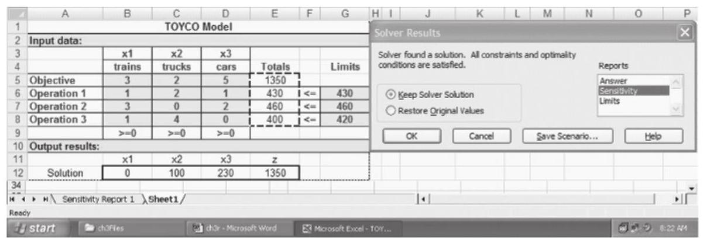

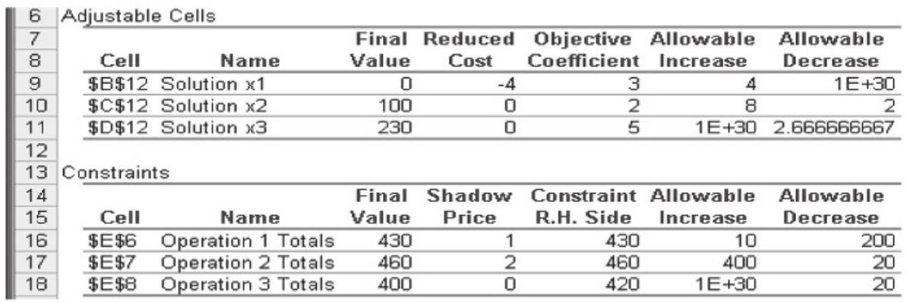

FIGURE 3.12

Excel Solver sensitivity analysis report for the TOYCO model

You can then click Sensitivity Report 1 to view the results. The report is similar to that of TORA's, with three exceptions: (1) the reduced cost carries an opposite sign, (2) it uses the name shadow price instead of dual price, and (3) the optimality ranges are for the changes ${d}_{j}$ and ${D}_{i}$ only, rather than for the original objective coefficients and constraint right-hand sides. The differences are minor, and the interpretation of the results remains the same.

138 Chapter 3 The Simplex Method and Sensitivity Analysis

---

| Operation | oper.down | oper.current | oper.up | oper.dual | Note |
| --- | --- | --- | --- | --- | --- |
| 1 | 230 | 430 | 440 | 1 | AMPL sensitivity analysis |
| 2 | 440 | 460 | 860 | 2 |  |
| 3 | 400 | 420 | 1e+20p | 0 | report for the TOYCO model |

																					x.down x.current x.up x.rc

															1 																			-1e+20 																																							3 																																																		7 																																																								-4

															2 																								0 																																						2 																																																	10 																																																									0

															3 																								2.33333 																																						5 																																														1e+20 																																																									0

---

In AMPL, the sensitivity analysis report is readily available. File amplTOYCO.txt provides the code necessary to determine the sensitivity analysis output. It requires the following additional statements (the report is sent to file a .out):

---

option solver cplex;

option cplex_options 'sensitivity';

solve;

	#-------------------------------sensitivity analysis

		display oper.down, oper.current, oper.up, oper.dual>a.out;

display x.down, x.current, x.up, x.rc>a.out;

---

The CPLEX option statements are needed to obtain the standard sensitivity analysis report. In the TOYCO model, the indexed variables and constraints use the root names x and oper, respectively. Using these names, the suggestive suffixes .down, . current, and . up in the display statements automatically generate the formatted sensitivity analysis report in Figure 3.13. The suffixes . dual and . rc provide the dual price and the reduced cost, respectively.

### 3.7 COMPUTATIONAL ISSUES IN LINEAR PROGRAMMING ${}^{13}$ ^computational

This chapter has presented the details of the simplex algorithm. Subsequent chapters present other algorithms: the dual simplex (Chapter 4), the revised simplex (Chapter 7), and the interior point (Chapter 22 on the website). Why the variety? The reason is that each algorithm has specific features that can be beneficial in the development of robust computer codes.

An LP code is deemed robust if it satisfies two fundamental requirements:

1. Speed.

2. Accuracy.

Both requirements present challenges even on the most advanced computers. The reasons stem from the nature of the algorithmic computations and the limitations of the computer. To be sure, the simplex tableau format presented in this chapter is not numerically stable; meaning that computer roundoff error and digit loss present serious computational problems, particularly when the coefficients of the LP model differ widely in magnitude. Despite these challenges, the different LP algorithms have in fact been integrated cleverly to produce highly efficient codes for solving extremely large LPs.

---

${}^{13}$ This section has benefited from R. Bixby,"Solving Real-World Linear Programs: A Decade and More of Progress," Operations Research, Vol. 50, No. 1, pp. 3-15, 2002.

---

This section explains the transition from basic textbook presentations to current state-of-the-art robust LP codes. It addresses the issues that affect speed and accuracy and presents remedies for alleviating the problems. It also presents a comprehensive framework regarding the roles of the different LP algorithms (simplex, dual simplex, revised simples, and interior point) in the development of numerically stable computer codes. The presentation is purposely kept math free to concentrate on the key concepts underlying successful LP codes.

1. Simplex entering variable (pivot) rule. A new simplex iteration determines the entering and leaving variables by using the optimality and feasibility criteria. Once the two variables are determined, pivot-row operations are used to generate the next simplex tableau.

Actually, the optimality criterion presented in Section 3.3.2 is but one of several used in the development of LP codes. The following table summarizes the three prominent criteria:

| Entering variable rule | Description |
| --- | --- |
| Classical (Section 3.3.2) | The entering variable is the one having the most favorable reduced cost among all nonbasic variables. |
| Most improvement | The entering variable is the one yielding the largest total improvement in the objective value among all nonbasic variables. |
| Steepest edge ${}^{14}$ | The entering variable is the one that yields the most favorable normalized reduced cost among all nonbasic variables. The algorithm moves along the steepest edge leading from the current to a neighboring extreme point. |

For the classical rule, the objective row of the simplex tableau readily provides the reduced costs of all the nonbasic variables with no additional computations. On the other hand, the most improvement rule requires considerable additional computing that first determines the value at which a nonbasic variable enters the solution and then the resulting total improvement in the objective value. The idea of the steepest edge rule, though in the "spirit" of the most improvement rule (in the sense that it indirectly takes into account the value of the entering variable), requires much less computational overhead.

The trade-off among the three rules is that the classical rule is the least costly computationally but, in all likelihood, requires the highest number of iterations to reach the optimum. On the other hand, the most improvement rule is the most costly computationally but, most likely, entails the smallest number of simplex iterations. The steepest edge rule seems to represent a happy medium in terms of the amount of additional computations and the number of simplex iterations. Interestingly, test results show that the payoff from the additional computations in the most improvement rule seems no better than for the steepest edge rule. For this reason, the most improvement rule is rarely implemented in LP codes.

Although the steepest edge rule is the most common default for the selection of the entering variable, successful LP codes tend to use hybrid pricing. Initially, the simplex iterations use (a variation of) the classical rule. As the number of iterations increases, a switch is made to (a variation of) the steepest edge rule. Extensive computational experience indicates that this strategy pays off in terms of the total computer time needed to solve an LP.

---

${}^{14}$ See D. Goldfarb and J. Reid,"A Practicable Steepest Edge Simplex Algorithm," Mathematical Programming, Vol. 12, No. 1, pp. 361-371, 1977.

---

2. Primal vs. dual simplex algorithm. This chapter has mainly concentrated on the details of what is sometimes referred to in the literature as the primal simplex method. In the primal algorithm, the starting basic solution is feasible but nonoptimal. Successive iterations remain feasible as they move toward the optimum. A subsequent algorithm, called the dual simplex, was developed for LPs that start infeasible but (better than) optimal and move toward feasibility, all the while maintaining optimality. The final iteration occurs when feasibility is restored. The details of the dual algorithm are given in Chapter 4 (Section 4.4.1).

Initially, the dual algorithm was used primarily in LP post-optimal analysis (Section 4.5) and integer linear programming (Chapter 9), but not as a standalone algorithm for solving the LPs. The main reason is that its rule for selecting the leaving variable was weak. This all changed, however, when the idea of the primal steepest edge rule was adapted to determine the leaving variable in the dual simplex algorithm. ${}^{15}$ Today, the dual simplex with the steepest-edge adaptation is proven in the majority of tests to be twice as fast as the primal simplex, and it is currently the dominant all-purpose simplex algorithm in the major commercial codes.

3. Revised simplex vs. tableau simplex. The simplex computations presented early in this chapter (and also in Chapter 4 for the dual simplex) generate the next simplex tableau from the immediately preceding one. The following reasons explain why the tableau simplex is not used in any commercial LP codes:

(a) Most practical LP models are highly sparse (i.e., contain a high percentage of zero coefficients in the starting iteration). Available numerical methods can reduce the amount of local computations by economizing (even eliminating) arithmetic operations involving zero coefficients, which in turn can substantially speed up computations. This is a serious missed opportunity in tableau computations because successive tableaus can quickly populate the tableau with nonzero elements.

(b) The machine roundoff error and digit loss, inherent in all computers, can propagate quickly as the number of iterations increases, possibly leading to serious loss of accuracy, particularly in large LPs.

(c) Simplex row operations carry out more computations than needed to generate the next tableau (recall that all that is needed in an iteration is the entering and leaving variables). These extra computations represent wasted computer time.

The revised simplex algorithm presented in Section 7.2 improves on these drawbacks. Though the method uses the exact pivoting rules as in the tableau method, the main difference is that it carries out the computations using matrix algebra. More details on this point are in Section 7.2.3 following the presentation of the revised simplex algorithm.

---

${}^{15}$ See J. Forrest and D. Goldfarb,"Steepest-Edge Simplex Algorithm for Linear Programming," Mathematical Programming, Vol. 57, No. 3, pp. 341-374, 1992.

---

4. Barrier (interior point) algorithm vs. simplex algorithm. The interior point algorithm (see Section 22.3 on the website) is totally different from the simplex algorithm in that it cuts across the feasible space and gradually moves (in the limit) to the optimum. Computationally, the algorithm is polynomial in problem size. The simplex algorithm, on the other hand, is exponential in problem size (hypothetical examples have been constructed where the simplex algorithm visits every corner point of the solution space before reaching the optimum).

The interior point algorithm was initially introduced in 1984 and, surprisingly, was patented by AT&T and sold on a specialized computer (apparently for an exuberant fee) without releasing its computational details. Eventually, the scientific community "got busy" and discovered that the interior point method had roots in earlier nonlinear programming algorithms of the 1960s (see, e.g., the SUMT algorithm in Section 21.2.5). The result is the so-called barrier method with several algorithmic variations.

For extremely large problems, the barrier method has proven to be considerably faster than the fastest dual simplex algorithm. The disadvantage is that the barrier algorithm does not produce corner-point solutions, a restriction that limits its application in post-optimal analysis (Chapter 4) and also in integer programming (Chapter 9). Although methods to convert a barrier optimum interior point to a corner-point solution have been developed, the associated computational overhead is enormous, limiting its use in such applications as integer programming, where the frequent need for locating corner-point solutions is fundamental to the algorithm. Nevertheless, all commercial codes include the barrier algorithm as a tool for solving large LPs.

5. Degeneracy. As explained in Section 3.5.1, degenerate basic solutions can result in cycling, which can cause the simplex iterations to stall indefinitely at a degenerate corner point without ever reaching termination. In early versions of the simplex algorithm, degeneracy and cycling were not incorporated in most codes because of the assumption that their occurrence in practice was rare. As instances of more difficult and larger problems (particularly in the area of integer programming) were tested, computer roundoff error gave rise to degeneracy/cycling-like behavior that caused the computations to "stall" at the same objective value. The problem was circumvented by interjecting conditional random perturbation and shifting in the values of the basic variables. ${}^{16}$

6. Input model conditioning (pre-solving). All commercial LP modeling languages and solvers attempt to condition the input data prior to actually solving it. The goal is to "simplify" the model in two key ways: ${}^{17}$

(a) Reducing the model size (rows and columns) by identifying and removing redundant constraints and by possibly fixing and substituting out variables.

(b) Scaling the coefficients of the model that are widely different in magnitude to mitigate the adverse effect of digit loss when manipulating real numbers of widely different magnitudes.

---

${}^{16}$ See P. Harris,"Pivot Selection Methods of the devex LP Code," Mathematical Programming, Vol. 5, pp. 1-28, 1974.

${}^{17}$ See L. Bearley, L., Mitra, and H. Williams,"Analysis of Mathematical Programming Problems Prior to Applying the Simplex Algorith," Mathematical Programming, Vol. 8, pp. 54-83, 1975.

---

142 Chapter 3 The Simplex Method and Sensitivity Analysis

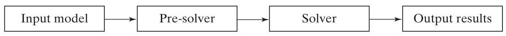

FIGURE 3.14

Components of an LP numerical algorithm

Figure 3.14 summarizes the stages of solving an LP problem. The input model can be fed via a pre-solver to a solver, such as CPLEX or XPRESS. Alternatively, a convenient modeling language, such as AMPL, GAMS, LINDO, MOSEL, or MPL, can be used to model the LP algebraically and then internally pre-solve and translate its input data to fit the format of the solver. The solver then produces the output results in terms of the variables and constraints of the original LP model.

7. Advances in computers. It is not surprising that in the last quarter of a century, computer speed has increased by more than one-thousand fold. Today, a desktop computer has more power and speed than the supercomputers of yesteryears. These hardware advances (together with the algorithmic advances cited earlier) have made it possible to solve huge LPs in a matter of seconds as opposed to days (yes, days!) in the past.

## BIBLIOGRAPHY ^bibliography

Bazaraa, M., J. Jarvis, and H. Sherali, Linear Programming and Network Flows, 4th ed., Wiley, New York, 2009.

Chvátal, V., Linear Programming, Freeman, New York, 1983.

Dantzig, G., Linear Programming and Extensions, Princeton University Press, Princeton, NJ, 1963.

Dantzig, G., and M. Thapa, Linear Programming 1: Introduction, Springer, New York, 1997.

Nering, E., and A. Tucker, Linear Programming and Related Problems, Academic Press, Boston, 1992.

Taha, H., "Linear Programming," Chapter II-1 in Handbook of Operations Research, J. Moder and S. Elmaghraby (eds.), Van Nostrand Reinhold, New York, 1987.

## Case Study: Optimization of Heart Valves Production ${}^{18}$ ^casestudy

Tool: LP

Area of application: Bioprostheses (production planning)

## Description of the situation: ^situation

Biological heart valves are bioprostheses manufactured from porcine hearts for human implantation. Replacement valves needed by the human population come in different sizes. On the supply side, porcine hearts cannot be "produced" to specific sizes. Moreover, the exact size of a manufactured valve cannot be determined until the biological component of the pig heart has been processed. As a result, some needed sizes may be overstocked and others may be understocked.

---

${}^{18}$ Source: S. S. Hilal and W. Erikson,"Matching Supplies to Save Lives: Linear Programming the Production of Heart Valves," Interfaces, Vol. 11, No. 6, pp. 48-55, 1981.

---

Raw hearts are provided by several suppliers in six to eight sizes, usually in different proportions depending on how the animals are raised. The distribution of sizes in each shipment is expressed in the form of a histogram. Porcine specialists work with suppliers to ensure distribution stability as much as possible. In this manner, the manufacturer can have a reasonably reliable estimate of the number of units of each size in each shipment. The selection of the mix of suppliers and the size of their shipments is thus crucial in reducing mismatches between supply and demand.

## LP model: ^lpmodel

Let

$m =$ Number of valve sizes

$n =$ Number of suppliers

${p}_{ij} =$ Proportion of raw valves of size $i$ supplied by vendor $j,0 < {p}_{ij} < 1, i = 1,2,\ldots , m$ , $j = 1,2,\ldots , n,\mathop{\sum }\limits_{{i = 1}}^{m}{p}_{ij} = 1, j = 1,2,\ldots , n$

${c}_{i} =$ Purchasing and processing cost of a raw heart of size $i, i = 1,2,\ldots , m$

${\bar{c}}_{j} =$ Average cost from supplier $j$

$= \mathop{\sum }\limits_{{i = 1}}^{m}{c}_{i}{p}_{ij}, j = 1,2,\ldots , n$

${D}_{i} =$ Average monthly demand for valves of size $i$

${H}_{j} =$ Maximum monthly supply vendor $j$ can provide, $j = 1,2,\ldots , n$

${L}_{j} =$ Minimum monthly supply vendor $j$ is willing to provide, $j = 1,2,\ldots , n$

The variables of the problem can be defined as

${x}_{j} =$ Monthly supply amount (number of raw hearts) by vendor $j, j = 1,2,\ldots , n$

The LP model seeks to determine the amount from each supplier that will minimize the total cost of purchasing and processing subject to demand and supply restrictions.

$$
\text{ Minimize }z = \mathop{\sum }\limits_{{j = 1}}^{n}{\bar{c}}_{j}{x}_{j}
$$

subject to

$$
\mathop{\sum }\limits_{{j = 1}}^{n}{p}_{ij}{x}_{j} \geq  {D}_{i}, i = 1,2,\ldots , m
$$

$$
{L}_{j} \leq  {x}_{j} \leq  {H}_{j}, j = 1,2,\ldots , n
$$

To be completely correct, the variables ${x}_{j}$ must be restricted to integer values. However, the parameters ${p}_{ij}$ and ${D}_{i}$ are mere estimates and, hence, rounding the continuous solution to the closest integer may not be a bad approximation in this case.

## AMPL Implementation: ^amplimpl

Although the LP is quite simple as an AMPL application, the nature of the input data is somewhat cumbersome. A convenient way to supply the data to this model is through a spreadsheet. File excelCase2.xls gives all the tables for the model and AMPL file amplCase2.txt shows how the data involving 8 valve sizes and 12 suppliers are read from Excel tables. ${}^{19}$

## Analysis of the results: ^analysisresults

The output of the AMPL model for the data in excelCase2.xls is given in Figure 3.15. In the strict sense, the solution results cannot be used for scheduling purposes because the demand ${D}_{i}$ for heart valve $i$ is based on expected value calculations. Thus, the solution ${x}_{j}, j = 1,2,\ldots , n$ , will result in some months showing surplus and others exhibiting shortage.

How useful then is the model? Actually, the results can be used effectively for planning purposes. Specifically, the solution suggests grouping the vendors into three categories:

1. Vendors 1,2, and 3 must be deleted from the list of suppliers because ${x}_{1} = {x}_{2} = {x}_{3} = 0$ .

2. Vendors 5, 6, 8, and 9 are crucial for satisfying demand because the solution requires these vendors to supply all the hearts they can produce.

3. The remaining vendors $\left( {4,7,{10},{11}\text{ , and 12 }}\right)$ exhibit "moderate" importance from the standpoint of satisfying demand because their maximum production capacity is not fully utilized.

FIGURE 3.15

Output of the valve production model

---

	Cost = \$ 42210.82

	solution:

| j | L[j] | x[j] | H[j] | reduced cost | Av. unit price |
| --- | --- | --- | --- | --- | --- |
| 1 | 0 | 0.0 | 500 | 2.39 | 14.22 |
| 2 | 0 | 0.0 | 500 | 0.12 | 15.88 |
| 3 | 0 | 0.0 | 400 | 5.22 | 15.12 |
| 4 | 0 | 116.4 | 500 | 0.00 | 14.70 |
| 5 | 0 | 300.0 | 300 | -0.49 | 16.68 |
| 6 | 0 | 500.0 | 500 | -2.13 | 14.89 |
| 7 | 0 | 250.5 | 600 | 0.00 | 18.12 |
| 8 | 0 | 400.0 | 400 | -6.22 | 16.61 |
| 9 | 0 | 300.0 | 300 | -4.20 | 17.19 |
| 10 | 0 | 357.4 | 500 | -0.00 | 14.47 |
| 11 | 0 | 112.9 | 400 | 0.00 | 15.62 |
| 12 | 0 | 293.1 | 500 | 0.00 | 16.31 |

| i | D[i] | Surplus [i] | Dual value |
| --- | --- | --- | --- |
| 1 | 275 | 0.0 | 29.28 |
| 2 | 310 | 28.9 | 0.00 |
| 3 | 400 | 0.0 | 19.18 |
| 4 | 320 | 88.1 | 0.00 |
| 5 | 400 | 0.0 | 24.33 |
| 6 | 350 | 0.0 | 8.55 |
| 7 | 300 | 0.0 | 62.41 |
| 8 | 130 | 28.2 | 0.00 |

---

---

${}^{19}$ There is one requirement about reading the data in array format from spreadsheet excelCase2.xls as used in file amplCase2.txt. The ODBC handler requires column headings in an Excel read table to be strings, which means that a pure numeric heading is not acceptable. To get around this restriction, all column headings are converted to strings using the Excel TEXT function. Thus, the heading 1 can be replaced with the formula =TEXT(COLUMN(A1), "0"). Copying this formula into succeeding columns will automatically convert the numeric code into the desired strings.

---

The given recommendations are further supported by the values of the reduced costs in Figure 3.15. Vendor 9 can raise its average unit prices by as much as \$4.00 and still remain viable in the optimum solution, whereas vendor 3 will continue to be unattractive even if it reduces the average unit cost by as much as \$5.00. This result is true despite the fact that the average unit prices for excluded vendor 9 are among the lowest $\left( { = \$ {15.12}}\right)$ and that for "star" vendor 9 are among the highest $\left( { = \$ {17.19}}\right)$ . The reason for this apparently unintuitive conclusion is that the model is primarily demand driven, in the sense that vendors5,6,8, and 9 provide relatively more of the sizes needed than the remaining vendors. The opposite is true for vendors 1, 2, and 3 . This means that a change in levels of demand could result in a different mix of vendors. This is the reason that, under reasonably steady projected demand, the manufacturer works closely with its "star" vendors, providing them with nutrition and animal care recommendations that ensure their distributions of valve sizes will remain reasonably stable.

Valve size 7 appears to be the most critical among all sizes because it has the highest dual price (= \$62.41), which is more than twice the dual prices of other sizes. This means that size 7 stock should be monitored closely to keep its surplus inventory at the lowest level possible. On the other hand, sizes 2, 4, and 8 exhibit surplus, and efforts must be made to reduce their inventory.

## Comments on the implementation of the model: ^implementationcomments

The proposed LP model is "rudimentary," in the sense that its results produce general planning guidelines rather than definitive production schedules. Yet, the monetary savings from the proposed plan, as reported in the original article, are impressive. The elimination of a number of vendors from the pool of suppliers and the identification of "star" vendors have resulted in reduction in inventory with significant cost savings. The same plan is responsible for reducing chances of shortage that were prevalent before the model results were used. Also, by identifying the most favored vendors, it was possible for porcine specialists in the production facility to train the workers in the slaughterhouses of these vendors to provide well-isolated and well-trimmed hearts. This, in turn, has led to streamlining production at the production facility.

## PROBLEMS ^problems

| Section | Assigned Problems | Section | Assigned Problems |
| --- | --- | --- | --- |
| 3.1 | 3-1 to 3-10 | 3.5.2 | 3-55 to 3-57 |
| 3.2 | 3-11 to 3-15 | 3.5.3 | 3-58 to 3-60 |
| 3.3.1 | 3-16 to 3-20 | 3.5.4 | 3-61 to 3-62 |
| 3.3.2 | 3-21 to 3-33 | 3.6.1 | 3-63 to 3-67 |
| 3.4.1 | 3-34 to 3-42 | 3.6.2 | 3-68 to 3-80 |
| 3.4.2 | 3-43 to 3-50 | 3.6.3 | 3-81 to 3-88 |
| 3.5.1 | 3-51 to 3-54 | 3.6.4 | 3-89 to 3-98 |

*3-1. In the Reddy Mikks model (Example 2.2-1), consider the feasible solution ${x}_{1} = 2$ tons and ${x}_{2} = 2$ tons. Determine the value of the associated slacks for raw materials ${M1}$ and ${M2}$ .

3-2. In the diet model (Example 2.2-2), determine the surplus amount of feed consisting of 525 lb of corn and 425 lb of soybean meal.

3-3. Consider the following inequality

$$
{22}{x}_{1} - 4{x}_{2} \geq   - 7
$$

Show that multiplying both sides of the inequality by -1 and then converting the resulting inequality into an equation is the same as converting it first to an equation and then multiplying both sides by -1 .

*3-4. Two different products, ${P1}$ and ${P2}$ , can be manufactured by one or both of two different machines, ${M1}$ and ${M2}$ . The unit processing time of either product on either machine is the same. The daily capacity of machine ${M1}$ is 200 units (of either ${P1}$ or ${P2}$ , or a mix of both), and the daily capacity of machine ${M2}$ is 250 units. The shop supervisor wants to balance the production schedule of the two machines such that the total number of units produced on one machine is within 5 units of the number produced on the other. The profit per unit of ${P1}$ is $\$ {10}$ and that of ${P2}$ is $\$ {15}$ . Set up the problem as an LP in equation form.

3-5. Show how the following objective function can be presented in equation form:

$$
\text{ Minimize }z = \max \left\{  {\left| {{x}_{1} - {x}_{2} + 3{x}_{3}}\right| ,\left| {-{x}_{1} + 3{x}_{2} - {x}_{3}}\right| }\right\}
$$

$$
{x}_{1},{x}_{2},{x}_{3} \geq  0
$$

(Hint: $\left| a\right|  \leq  b$ is equivalent to $a \leq  b$ and $a \geq   - b$ .)

3-6. Show that the $m$ equations

$$
\mathop{\sum }\limits_{{j = 1}}^{n}{a}_{ij}{x}_{j} = {b}_{i}, i = 1,2,\ldots , m
$$

are equivalent to the following $m + 1$ inequalities:

$$
\mathop{\sum }\limits_{{j = 1}}^{n}{a}_{ij}{x}_{j} \leq  {b}_{i}, i = 1,2,\ldots , m
$$

$$
\mathop{\sum }\limits_{{j = 1}}^{n}\left( {\mathop{\sum }\limits_{{i = 1}}^{m}{a}_{ij}}\right) {x}_{j} \geq  \mathop{\sum }\limits_{{i = 1}}^{m}{b}_{i}
$$

3-7. McBurger fast-food restaurant sells quarter-pounders and cheeseburgers. A quarter-pounder uses a quarter of a pound of meat, and a cheeseburger uses only .2 lb. The restaurant starts the day with 250 lb of meat but may order more at an additional cost of 28 cents per pound to cover the delivery cost. Any surplus meat at the end of the day is donated to charity. McBurger's profits are 22 cents for a quarter-pounder and 18 cents for a cheeseburger. McBurger does not expect to sell more than 950 sandwiches per day. How many of each type sandwich should McBurger plan for the day? Solve the problem using TORA, Solver, or AMPL.

3-8. Two products are manufactured in a machining center. The production times per unit of products 1 and 2 are 10 and 12 minutes, respectively. The total regular machine time is 2400 minutes per day. The daily production is between 150 and 200 units of product 1 and no more than 45 units of product 2. Overtime may be used to meet the demand at an additional cost of \$1 per minute. Assuming that the unit profits for products 1 and 2 are \$12 and \$15, respectively, formulate the problem as an LP model, and then solve with TORA, Solver, or AMPL to determine the optimum production level for each product as well as any overtime needed in the center.

*3-9. JoShop manufactures three products whose unit profits are \$2, \$5, and \$3, respectively. The company has budgeted 80 hrs of labor time and 65 hrs of machine time for the production of the three products. The labor requirements per unit of products 1, 2, and 3 are 2, 1, and 2 hrs, respectively. The corresponding machine-time requirements per unit are 1, 1, and 2 hrs. JoShop regards the budgeted labor and machine hours as goals that may be exceeded, if necessary, but at the additional cost of \$15 per labor hour and \$10 per machine hour.

Formulate the problem as an LP, and determine its optimum solution using TORA, Solver, or AMPL.

3-10. In an LP in which there are several unrestricted variables, a transformation of the type ${x}_{j} = {x}_{j}^{ - } - {x}_{j}^{ + },{x}_{j}^{ - },{x}_{j}^{ + } \geq  0$ will double the corresponding number of nonnegative variables. We can, instead, replace $k$ unrestricted variables with exactly $k + 1$ nonnegative variables by using the substitution ${x}_{j} = {x}_{j}^{\prime } - w,{x}_{j}^{\prime }, w \geq  0$ . Use TORA, Solver, or AMPL to show that the two methods produce the same solution for the following LP:

$$
\text{ Maximize }z =  - 2{x}_{1} + 3{x}_{2} - 2{x}_{3}
$$

subject to

$$
4{x}_{1} - {x}_{2} - 5{x}_{3} = {10}
$$

$$
2{x}_{1} + 3{x}_{2} + 2{x}_{3} = {12}
$$

$$
{x}_{1} \geq  0,{x}_{2},{x}_{3}\text{ unrestricted }
$$

3-11. Consider the following LP:

$$
\text{ Maximize }z = 2{x}_{1} + 3{x}_{2}
$$

subject to

$$
{x}_{1} + 3{x}_{2} \leq  {12}
$$

$$
3{x}_{1} + 2{x}_{2} \leq  {12}
$$

$$
{x}_{1},{x}_{2} \geq  0
$$

(a) Express the problem in equation form.

(b) Determine all the basic solutions of the problem, and classify them as feasible and infeasible.

*(c) Use direct substitution in the objective function to determine the optimum basic feasible solution.

(d) Verify graphically that the solution obtained in (c) is the optimum LP solution-hence, conclude that the optimum solution can be determined algebraically by considering the basic feasible solutions only.

*(e) Show how the infeasible basic solutions are represented on the graphical solution space.

3-12. Determine the optimum solution for each of the following LPs by enumerating all the basic solutions.

(a) Maximize $z = 2{x}_{1} - 4{x}_{2} + 5{x}_{3} - 6{x}_{4}$ subject to

$$
{x}_{1} + 4{x}_{2} - 2{x}_{3} + 8{x}_{4} \leq  2
$$

$$
- {x}_{1} + 2{x}_{2} + 3{x}_{3} + 4{x}_{4} \leq  1
$$

$$
{x}_{1},{x}_{2},{x}_{3},{x}_{4} \geq  0
$$

(b) Minimize $z = {x}_{1} + 2{x}_{2} - 3{x}_{3} - 2{x}_{4}$

subject to

$$
{x}_{1} + 2{x}_{2} - 3{x}_{3} + {x}_{4} = 4
$$

$$
{x}_{1} + 2{x}_{2} + {x}_{3} + 2{x}_{4} = 4
$$

$$
{x}_{1},{x}_{2},{x}_{3},{x}_{4} \geq  0
$$

*3-13. Show algebraically that all the basic solutions of the following LP are infeasible.

$$
\text{ Maximize }z = {x}_{1} + {x}_{2}
$$

subject to

$$
{x}_{1} + 2{x}_{2} \leq  3
$$

$$
2{x}_{1} + {x}_{2} \geq  8
$$

$$
{x}_{1},{x}_{2} \geq  0
$$

3-14. Consider the following LP:

$$
\text{ Maximize }z = 2{x}_{1} + 3{x}_{2} + 5{x}_{3}
$$

subject to

$$
- 6{x}_{1} + 7{x}_{2} - 9{x}_{3} \geq  4
$$

$$
{x}_{1} + {x}_{2} + 4{x}_{3} = {10}
$$

$$
{x}_{1},{x}_{3} \geq  0
$$

$$
{x}_{2}\text{ unrestricted }
$$

Conversion to the equation form involves using the substitution ${x}_{2} = {x}_{2}^{ - } - {x}_{2}^{ + }$ . Show that a basic solution cannot include both ${x}_{2}^{ - }$ and ${x}_{2}^{ + }$ simultaneously.

3-15. Consider the following LP:

$$
\text{ Maximize }z = {x}_{1} + 3{x}_{2}
$$

subject to

$$
{x}_{1} + {x}_{2} \leq  2
$$

$$
- {x}_{1} + {x}_{2} \leq  4
$$

$$
{x}_{1}\text{ unrestricted }
$$

$$
{x}_{2} \geq  0
$$

(a) Determine all the basic feasible solutions of the problem.

(b) Use direct substitution in the objective function to determine the best basic solution.

(c) Solve the problem graphically, and verify that the solution obtained in (c) is the optimum.

3-16. In Figure 3.3, suppose that the objective function is changed to

$$
\text{ Maximize }z = 4{x}_{1} + 7{x}_{2}
$$

Identify the path of the simplex method and the basic and nonbasic variables that define this path.

3-17. Consider the graphical solution of the Reddy Mikks model given in Figure 2.2. Identify the path of the simplex method and the basic and nonbasic variables that define this path.


FIGURE 3.16

Solution space of Problem 3-18

*3-18. Consider the three-dimensional LP solution space in Figure 3.16, whose feasible extreme points are $A, B,\ldots$ , and $J$ .

(a) Which of the following pairs of corner points cannot represent successive simplex iterations: $\left( {A, B}\right) ,\left( {H, I}\right) ,\left( {E, H}\right)$ , and $\left( {A, I}\right)$ ? Explain why.

(b) Suppose that the simplex iterations start at $A$ and that the optimum occurs at $H$ . Indicate whether any of the following paths are not legitimate for the simplex algorithm, and state the reason.

(i) $A \rightarrow  B \rightarrow  G \rightarrow  H$ .

(ii) $A \rightarrow  D \rightarrow  F \rightarrow  C \rightarrow  A \rightarrow  B \rightarrow  G \rightarrow  H$ .

(iii) $A \rightarrow  C \rightarrow  I \rightarrow  H$ .

3-19. For the solution space in Figure 3.16, all the constraints are of the type $\leq$ and all the variables ${x}_{1},{x}_{2}$ , and ${x}_{3}$ are nonnegative. Suppose that ${s}_{1},{s}_{2},{s}_{3}$ , and ${s}_{4}\left( { \geq  0}\right)$ are the slacks associated with constraints represented by the planes CEIJF, BEIHG, DFJHG, and IJH, respectively. Identify the basic and nonbasic variables associated with each feasible corner point of the solution space.

3-20. For each of the given objective functions and the solution space in Figure 3.16, select the nonbasic variable that leads to the next simplex corner point, and determine the associated improvement in $z$ .

*(a) Maximize $z = {x}_{1} - 2{x}_{2} + 3{x}_{3}$

(b) Maximize $z = 5{x}_{1} + 2{x}_{2} + 4{x}_{3}$

(c) Maximize $z =  - 2{x}_{1} + 7{x}_{2} + 2{x}_{3}$

(d) Maximize $z = {x}_{1} + {x}_{2} + {x}_{3}$

3-21. This problem is designed to reinforce your understanding of the simplex feasibility condition. In the first tableau in Example 3.3-1, we used the minimum (nonnegative) ratio test to determine the leaving variable. The condition guarantees feasibility (all the new values of the basic variables remain nonnegative as stipulated by the definition of the LP). To demonstrate this point, force ${s}_{2}$ , instead of ${s}_{1}$ , to leave the basic solution, and carry out the Gauss-Jordan computations. In the resulting simplex tableau, ${s}_{1}$ is infeasible $\left( { =  - {12}}\right)$ .

3-22. Consider the following set of constraints:

$$
{x}_{1} + 2{x}_{2} + 2{x}_{3} + 4{x}_{4} \leq  {40}
$$

$$
2{x}_{1} - {x}_{2} + {x}_{3} + 2{x}_{4} \leq  8
$$

$$
4{x}_{1} - 2{x}_{2} + {x}_{3} - {x}_{4} \leq  {10}
$$

$$
{x}_{1},{x}_{2},{x}_{3},{x}_{4} \geq  0
$$

Solve the problem for each of the following objective functions.

(a) Maximize $z = 2{x}_{1} + {x}_{2} - 3{x}_{3} + 5{x}_{4}$ .

(b) Maximize $z = 8{x}_{1} + 6{x}_{2} + 3{x}_{3} - 2{x}_{4}$ .

(c) Maximize $z = 3{x}_{1} - {x}_{2} + 3{x}_{3} + 4{x}_{4}$ .

(d) Minimize $z = 5{x}_{1} - 4{x}_{2} + 6{x}_{3} - 8{x}_{4}$ .

*3-23. Consider the following system of equations:

$$
{x}_{1} + 2{x}_{2} - 3{x}_{3} + 5{x}_{4} + {x}_{5}\; = 8
$$

$$
5{x}_{1} - 2{x}_{2}\; + 6{x}_{4}\; + {x}_{6}\; = {16}
$$

$$
2{x}_{1} + 3{x}_{2} - 2{x}_{3} + 3{x}_{4}\; + {x}_{7}\; = 6
$$

$$
\begin{array}{l}  - {x}_{1}\; + {x}_{3} - 2{x}_{4}\; + {x}_{8} = 0 \\  \end{array}
$$

$$
{x}_{1},{x}_{2},\ldots ,{x}_{8} \geq  0
$$

Let ${x}_{5},{x}_{6},\ldots$ , and ${x}_{8}$ be a given initial basic feasible solution. Suppose that ${x}_{1}$ becomes basic. Which of the given basic variables must become nonbasic at zero level to guarantee that all the variables remain nonnegative, and what is the value of ${x}_{1}$ in the new solution? Repeat this procedure for ${x}_{2},{x}_{3}$ , and ${x}_{4}$ .

3-24. Consider the following LP:

$$
\text{ Maximize }z = {x}_{1}
$$

subject to

$$
5{x}_{1} + {x}_{2}\; = 4
$$

$$
6{x}_{1}\; + {x}_{3}\; = 8
$$

$$
3{x}_{1}\; + {x}_{4} = 3
$$

$$
{x}_{1},{x}_{2},{x}_{3},{x}_{4} \geq  0
$$

(a) Solve the problem by inspection (do not use the Gauss-Jordan row operations), and justify the answer in terms of the basic solutions of the simplex method.

(b) Repeat (a) assuming that the objective function calls for minimizing $z = {x}_{1}$ .

3-25. Solve the following problem by inspection, and justify the method of solution in terms of the basic solutions of the simplex method.

$$
\text{ Maximize }z = 5{x}_{1} - 6{x}_{2} + 3{x}_{3} - 5{x}_{4} + {12}{x}_{5}
$$

subject to

$$
{x}_{1} + 3{x}_{2} + 5{x}_{3} + 6{x}_{4} + 3{x}_{5} \leq  {30}
$$

$$
{x}_{1},{x}_{2},{x}_{3},{x}_{4},{x}_{5} \geq  0
$$

(Hint: A basic solution consists of one variable only.)

3-26. The following tableau represents a specific simplex iteration. All variables are nonnegative. The tableau is not optimal for either maximization or minimization. Thus, when a nonbasic variable enters the solution, it can either increase or decrease $z$ or leave it unchanged, depending on the parameters of the entering nonbasic variable.

| Basic | ${x}_{1}$ | ${x}_{2}$ | ${x}_{3}$ | ${x}_{4}$ | ${x}_{5}$ | ${x}_{6}$ | ${x}_{7}$ | ${x}_{8}$ | Solution |
| --- | --- | --- | --- | --- | --- | --- | --- | --- | --- |
| $z$ | 0 | -5 | 0 | 4 | -1 | -10 | 0 | 0 | 620 |
| ${x}_{8}$ | 0 | 3 | 0 | -2 | -3 | -1 | 5 | 1 | 12 |
| ${x}_{3}$ | 0 | 1 | 1 | 3 | 1 | 0 | 3 | 0 | 6 |
| ${x}_{1}$ | 1 | -1 | 0 | 0 | 6 | -4 | 0 | 0 | 0 |

(a) Categorize the variables as basic and nonbasic, and provide the current values of all the variables.

*(b) Assuming that the problem is of the maximization type, identify the nonbasic variables that have the potential to improve the value of $z$ . If each such variable enters the basic solution, determine the associated leaving variable, if any, and the associated change in $z$ . Do not use the Gauss-Jordan row operations.

(c) Repeat part (b) assuming that the problem is of the minimization type.

(d) Which nonbasic variable(s) will not cause a change in the value of $z$ when selected to enter the solution?

3-27. Consider the two-dimensional solution space in Figure 3.17.

(a) Suppose that the objective function is given as

$$
\text{ Maximize }z = 6{x}_{1} + 3{x}_{2}
$$

If the simplex iterations start at point $A$ , identify the path to the optimum point $D$ .

(b) Determine the entering variable, the corresponding ratios of the feasibility condition, and the change in the value of $z$ , assuming that the starting iteration occurs at point $A$ and that the objective function is given as

$$
\text{ Maximize }z = {x}_{1} + 4{x}_{2}
$$

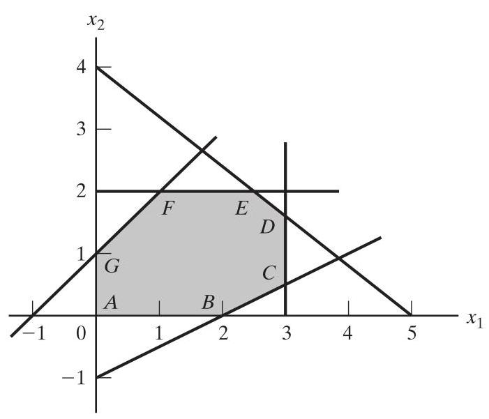

FIGURE 3.17

Solution Space for Problem 3-27

(c) Repeat (b), assuming that the objective function is

$$
\text{ Maximize }z = 8{x}_{1} + 2{x}_{2}
$$

3-28. Consider the following LP:

$$
\text{ Maximize }z = {16}{x}_{1} + {15}{x}_{2}
$$

subject to

$$
{40}{x}_{1} + {31}{x}_{2} \leq  {124}
$$

$$
- {x}_{1} + \;{x}_{2} \leq  1
$$

$$
{x}_{1}\; \leq  3
$$

$$
{x}_{1},{x}_{2} \geq  0
$$

(a) Solve the problem by the simplex method, where the entering variable is the nonbasic variable with the most negative $z$ -row coefficient.

(b) Resolve the problem by the simplex algorithm, always selecting the entering variable as the nonbasic variable with the least negative $z$ -row coefficient.

(c) Compare the number of iterations in (a) and (b). Does the selection of the entering variable as the nonbasic variable with the most negative $z$ -row coefficient lead to a smaller number of iterations? What conclusion can be made regarding the optimality condition?

(d) Suppose that the sense of optimization is changed to minimization by multiplying $z$ by -1 . How does this change affect the simplex iterations?

*3-29. In Example 3.3-1, show how the second-best optimal value of $z$ can be determined from the optimal tableau.

3-30. Can you extend the procedure in Problem 3-9 to determine the third-best optimal value of $z$ ?

3-31. The Gutchi Company manufactures purses, shaving bags, and backpacks. The construction includes leather and synthetics, leather being the scarce raw material. The production process requires two types of skilled labor: sewing and finishing. The following table gives the availability of the resources, their usage by the three products, and the profits per unit.

| Resource | Purse | Bag | Backpack | Daily availability |
| --- | --- | --- | --- | --- |
| Leather $\left( {\mathrm{{ft}}}^{2}\right)$ | 2 | 1 | 3 | ${42}{\mathrm{{ft}}}^{2}$ |
| Sewing (hr) | 2 | 1 | 2 | 40 hr |
| Finishing (hr) | 1 | .5 | 1 | 45 hr |
| Selling price (\$) | 24 | 22 | 45 |  |

(a) Formulate the problem as a linear program, and find the optimum solution (using TORA, Excel Solver, or AMPL).

(b) From the optimum solution, determine the status of each resource.

3-32. TORA experiment. Consider the following LP:

$$
\text{ Maximize }z = {x}_{1} + {x}_{2} + 3{x}_{3} + 2{x}_{4}
$$

subject to

$$
{x}_{1} + 2{x}_{2} - 3{x}_{3} + 5{x}_{4} \leq  4
$$

$$
5{x}_{1} - 2{x}_{2}\; + 6{x}_{4} \leq  8
$$

$$
2{x}_{1} + 3{x}_{2} - 2{x}_{3} + 3{x}_{4} \leq  3
$$

$$
\begin{array}{l}  - {x}_{1}\; + {x}_{3} + 2{x}_{4} \leq  0 \\  \end{array}
$$

$$
{x}_{1},{x}_{2},{x}_{3},{x}_{4} \geq  0
$$

(a) Use TORA's iterations option to determine the optimum tableau.

(b) Select any nonbasic variable to "enter" the basic solution, and click Next Iteration to produce the associated iteration. How does the new objective value compare with the optimum in (a)? The idea is to show that the tableau in (a) is optimum because none of the nonbasic variables can improve the objective value.

3-33. TORA experiment. In Problem 3-32, use TORA to find the next-best optimal solution.

3-34. Use hand computations to complete the simplex iteration of Example 3.4-1 and obtain the optimum solution.

3-35. TORA experiment. Generate the simplex iterations of Example 3.4-1 using TORA's Iterations $\Rightarrow$ M-method module (file toraEx3.4-1.txt). Compare the effect of using $M = 1, M = {10}$ , and $M = {1000}$ on the solution. What conclusion can be drawn from this experiment?

3-36. In Example 3.4-1, identify the starting tableau for each of the following (independent) cases, and develop the associated $z$ -row after substituting out all the artificial variables:

*(a) The third constraint is ${x}_{1} + 2{x}_{2} \geq  4$ .

*(b) The second constraint is $4{x}_{1} + 3{x}_{2} \leq  6$ .

(c) The second constraint is $4{x}_{1} + 3{x}_{2} = 8$ .

(d) The objective function is to maximize $z = 5{x}_{1} + 2{x}_{2}$ .

3-37. Consider the following set of constraints:

$$
- 2{x}_{1} + 3{x}_{2} = 3\;\left( 1\right)
$$

$$
4{x}_{1} + 5{x}_{2} \geq  {10}\;\left( 2\right)
$$

$$
{x}_{1} + 2{x}_{2} \leq  5\;\left( 3\right)
$$

$$
6{x}_{1} + 7{x}_{2} \leq  3\;\left( 4\right)
$$

$$
4{x}_{1} + 8{x}_{2} \geq  5\;\left( 5\right)
$$

$$
{x}_{1},{x}_{2} \geq  0
$$

For each of the following problems, develop the $z$ -row after substituting out the artificial variables:

(a) Maximize $z = 5{x}_{1} + 6{x}_{2}$ subject to $\left( 1\right) ,\left( 3\right)$ , and (4).

(b) Maximize $z = 2{x}_{1} - 7{x}_{2}$ subject to $\left( 1\right) ,\left( 2\right) ,\left( 4\right)$ , and (5).

(c) Minimize $z = 3{x}_{1} + 6{x}_{2}$ subject to $\left( 3\right) ,\left( 4\right)$ , and (5).

(d) Minimize $z = 4{x}_{1} + 6{x}_{2}$ subject to (1),(2), and (5).

(e) Minimize $z = 3{x}_{1} + 2{x}_{2}$ subject to (1) and (5).

3-38. Consider the following set of constraints:

$$
{x}_{1} + {x}_{2} + {x}_{3} = 7
$$

$$
2{x}_{1} - 5{x}_{2} + {x}_{3} \geq  {10}
$$

$$
{x}_{1},{x}_{2},{x}_{3} \geq  0
$$

Solve the problem for each of the following objective functions:

(a) Maximize $z = 2{x}_{1} + 3{x}_{2} - 5{x}_{3}$ .

(b) Minimize $z = 2{x}_{1} + 3{x}_{2} - 5{x}_{3}$ .

(c) Maximize $z = {x}_{1} + 2{x}_{2} + {x}_{3}$ .

(d) Minimize $z = 4{x}_{1} - 8{x}_{2} + 3{x}_{3}$ .

*3-39. Consider the problem

$$
\text{ Maximize }z = 2{x}_{1} + 4{x}_{2} + 4{x}_{3} - 3{x}_{4}
$$

subject to

$$
{x}_{1} + {x}_{2} + {x}_{3} = 4
$$

$$
{x}_{1} + 4{x}_{2}\; + {x}_{4} = 8
$$

$$
{x}_{1},{x}_{2},{x}_{3},{x}_{4} \geq  0
$$

Solve the problem with ${x}_{3}$ and ${x}_{4}$ as the starting basic variables and without using any artificial variables. (Hint: ${x}_{3}$ and ${x}_{4}$ play the role of slack variables. The main difference is that they have nonzero objective coefficients.)

*3-40. Solve the following problem using ${x}_{3}$ and ${x}_{4}$ as starting basic feasible variables. As in Problem 3-39, do not use any artificial variables.

$$
\text{ Minimize }z = 3{x}_{1} + 2{x}_{2} + 3{x}_{3}
$$

subject to

$$
{x}_{1} + 4{x}_{2} + {x}_{3}\; \geq  {14}
$$

$$
2{x}_{1} + {x}_{2}\; + {x}_{4} \geq  {20}
$$

$$
{x}_{1},{x}_{2},{x}_{3},{x}_{4} \geq  0
$$

*3-41. Consider the problem

$$
\text{ Maximize }z = {x}_{1} + 5{x}_{2} + 3{x}_{3}
$$

subject to

$$
{x}_{1} + 2{x}_{2} + {x}_{3} = 6
$$

$$
2{x}_{1} - {x}_{2}\; = 8
$$

$$
{x}_{1},{x}_{2},{x}_{3} \geq  0
$$

The variable ${x}_{3}$ plays the role of a slack. Thus, no artificial variable is needed in the first constraint. In the second constraint, an artificial variable, $R$ , is needed. Solve the problem using ${x}_{3}$ and $R$ as the starting variables.

3-42. Show that the $M$ -method will conclude that the following problem has no feasible solution.

$$
\text{ Maximize }z = 2{x}_{1} + 5{x}_{2}
$$

subject to

$$
3{x}_{1} + 2{x}_{2} \geq  6
$$

$$
2{x}_{1} + {x}_{2} \leq  2
$$

$$
{x}_{1},{x}_{2} \geq  0
$$

*3-43. In Phase I, if the LP is of the maximization type, explain why we do not maximize the sum of the artificial variables in Phase I.

3-44. For each case in Problem 3-37, write the corresponding Phase I objective function.

3-45. Solve Problem 3-38, by the two-phase method.

3-46. Write Phase I for the following problem, and then solve (with TORA for convenience) to show that the problem has no feasible solution.

$$
\text{ Minimize }z = 2{x}_{1} + 5{x}_{2}
$$

subject to

$$
3{x}_{1} + 2{x}_{2} \geq  {12}
$$

$$
2{x}_{1} + {x}_{2} \leq  4
$$

$$
{x}_{1},{x}_{2} \geq  0
$$

3-47. Consider the following problem:

$$
\text{ Maximize }z = 2{x}_{1} + 2{x}_{2} + 4{x}_{3}
$$

subject to

$$
2{x}_{1} + {x}_{2} + {x}_{3} \leq  2
$$

$$
3{x}_{1} + 4{x}_{2} + 2{x}_{3} \geq  8
$$

$$
{x}_{1},{x}_{2},{x}_{3} \geq  0
$$

(a) Show that Phase I will terminate with an artificial basic variable at zero level (you may use TORA for convenience).

(b) Remove the zero artificial variable prior to the start of Phase II, then carry out Phase II iterations.

3-48. Consider the following problem:

$$
\text{ Maximize }z = 3{x}_{1} + 2{x}_{2} + 3{x}_{3}
$$

subject to

$$
2{x}_{1} + {x}_{2} + {x}_{3} = 4
$$

$$
{x}_{1} + 3{x}_{2} + {x}_{3} = {12}
$$

$$
3{x}_{1} + 4{x}_{2} + 2{x}_{3} = {16}
$$

$$
{x}_{1},{x}_{2},{x}_{3} \geq  0
$$

(a) Show that Phase I terminates with two zero artificial variables in the basic solution (use TORA for convenience).

(b) Show that when the procedure of Problem 3-47(b) is applied at the end of Phase I, only one of the two zero artificial variables can be made nonbasic.

(c) Show that the original constraint associated with the zero artificial variable that cannot be made nonbasic in (b) must be redundant-hence, its row and its column can be removed at the start of Phase II.

*3-49. Consider the following LP:

$$
\text{ Maximize }z = 3{x}_{1} + 2{x}_{2} + 3{x}_{3}
$$

subject to

$$
2{x}_{1} + {x}_{2} + {x}_{3} \leq  2
$$

$$
3{x}_{1} + 4{x}_{2} + 2{x}_{3} \geq  8
$$

$$
{x}_{1},{x}_{2},{x}_{3} \geq  0
$$

The optimal simplex tableau at the end of Phase I is

| Basic | ${x}_{1}$ | ${x}_{2}$ | ${x}_{3}$ | ${x}_{4}$ | ${x}_{5}$ | $R$ | Solution |
| --- | --- | --- | --- | --- | --- | --- | --- |
| $r$ | -5 | 0 | -2 | -1 | -4 | 0 | 0 |
| ${x}_{2}$ | 2 | 1 | 1 | 0 | 1 | 0 | 2 |
| $R$ | -5 | 0 | -2 | -1 | -4 | 1 | 0 |

Explain why the nonbasic variables ${x}_{1},{x}_{3},{x}_{4}$ , and ${x}_{5}$ can never assume positive values at the end of Phase II. Hence, conclude that their columns can be dropped before we start Phase II. In essence, the removal of these variables reduces the constraint equations of the problem to ${x}_{2} = 2$ -meaning that it is not necessary to carry out Phase II in this problem.

3-50. Consider the LP model

$$
\text{ Minimize }z = 2{x}_{1} - 4{x}_{2} + 3{x}_{3}
$$

subject to

$$
5{x}_{1} - 6{x}_{2} + 2{x}_{3} \geq  5
$$

$$
- {x}_{1} + 3{x}_{2} + 5{x}_{3} \geq  8
$$

$$
2{x}_{1} + 5{x}_{2} - 4{x}_{3} \leq  4
$$

$$
{x}_{1},{x}_{2},{x}_{3} \geq  0
$$

Show how the inequalities can be modified to a set of equations that requires the use of single artificial variable only (instead of two).

*3-51. Consider the graphical solution space in Figure 3.18. Suppose that the simplex iterations start at $A$ and that the optimum solution occurs at $D$ . Further, assume that the objective function is defined such that at $A,{x}_{1}$ enters the solution first.

(a) Identify (on the graph) the corner points that define the simplex method path to the optimum point.

(b) Determine the maximum possible number of simplex iterations needed to reach the optimum solution, assuming no cycling.

3-52. Consider the following LP:

$$
\text{ Maximize }z = 3{x}_{1} + 2{x}_{2}
$$

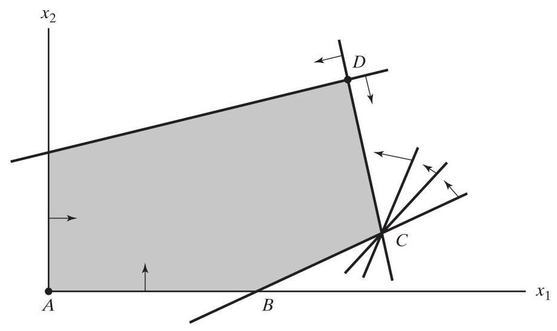

FIGURE 3.18

Solution space of Problem 3-51

subject to

$$
4{x}_{1} - {x}_{2} \leq  4
$$

$$
4{x}_{1} + 3{x}_{2} \leq  6
$$

$$
4{x}_{1} + {x}_{2} \leq  4
$$

$$
{x}_{1},{x}_{2} \geq  0
$$

(a) Show that the associated simplex iterations are temporarily degenerate (you may use TORA for convenience).

(b) Verify the result by solving the problem graphically (TORA's Graphic module can be used here).

3-53. TORA experiment. Consider the LP in Problem 3-52.

(a) Use TORA to generate the simplex iterations. How many iterations are needed to reach the optimum?

(b) Interchange constraints (1) and (3) and re-solve the problem with TORA. How many iterations are needed to solve the problem?

(c) Explain why the numbers of iterations in (a) and (b) are different.

3-54. TORA Experiment. Consider the following LP (authored by E.M. Beale to demonstrate cycling):

$$
\text{ Maximize }z = \frac{3}{4}{x}_{1} - {20}{x}_{2} + \frac{1}{2}{x}_{3} - 6{x}_{4}
$$

subject to

$$
\frac{1}{4}{x}_{1} - 8{x}_{2} - {x}_{3} + 9{x}_{4} \leq  0
$$

$$
\frac{1}{2}{x}_{1} - {12}{x}_{2} - \frac{1}{2}{x}_{3} + 3{x}_{4} \leq  0
$$

$$
{x}_{3} \leq  1
$$

$$
{x}_{1},{x}_{2},{x}_{3},{x}_{4} \geq  0
$$

From TORA's SOLVE/MODIFY menu, select Solve $\Rightarrow$ Algebraic $\Rightarrow$ Iterations $\Rightarrow$ All-slack . Next, "thumb" through the successive simplex iterations using the command Next iteration (do not use All iterations, because the simplex method will then cycle indefinitely). You will notice that the starting all-slack basic feasible solution at iteration 0 will reappear identically in iteration 6. This example illustrates the occurrence of cycling in the simplex iterations and the possibility that the algorithm may never converge to the optimum solution. (It is interesting that cycling will not occur in this example if all the coefficients in this LP are converted to integer-try it!)

*3-55. For the following LP, identify three alternative optimal basic solutions, and then write a general expression for all the nonbasic alternative optima comprising these three basic solutions.

$$
\text{ Maximize }z = {x}_{1} + 2{x}_{2} + 3{x}_{3}
$$

subject to

$$
{x}_{1} + 2{x}_{2} + 3{x}_{3} \leq  {10}
$$

$$
{x}_{1} + {x}_{2} \leq  5
$$

$$
{x}_{1}\; \leq  1
$$

$$
{x}_{1},{x}_{2},{x}_{3} \geq  0
$$

Note: Although the problem has more than three alternative basic solution optima, you are only required to identify three of them. You may use TORA for convenience.

3-56. Solve the following LP:

$$
\text{ Maximize }z = 2{x}_{1} - {x}_{2} + 3{x}_{3}
$$

subject to

$$
{x}_{1} - {x}_{2} + 5{x}_{3} \leq  5
$$

$$
2{x}_{1} - {x}_{2} + 3{x}_{3} \leq  {20}
$$

$$
{x}_{1},{x}_{2},{x}_{3} \geq  0
$$

From the optimal tableau, show that all the alternative optima are not corner points (i.e., nonbasic). Give a two-dimensional graphical demonstration of the type of solution space and objective function that will produce this result. (You may use TORA for convenience.)

3-57. For the following LP, show that the optimal solution is degenerate and that none of the alternative solutions are corner points. You may use TORA for convenience.

$$
\text{ Maximize }z = 3{x}_{1} + {x}_{2}
$$

subject to

$$
{x}_{1} + 2{x}_{2}\; \leq  \;5
$$

$$
{x}_{1} + {x}_{2} - {x}_{3} \leq  2
$$

$$
7{x}_{1} + 3{x}_{2} - 5{x}_{3} \leq  {20}
$$

$$
{x}_{1},{x}_{2},{x}_{3} \geq  0
$$

3-58. TORA Experiment. Solve Example 3.5-3 using TORA's Iterations option and show that even though the solution starts with ${x}_{1}$ as the entering variable (per the optimality condition), the simplex algorithm will point eventually to an unbounded solution.

$$
\text{ Maximize }z = {20}{x}_{1} + 5{x}_{2} + {x}_{3}
$$

$$
3{x}_{1} + 5{x}_{2} - 5{x}_{3} \leq  {50}
$$

$$
{x}_{1} \leq  {10}
$$

$$
{x}_{1} + 3{x}_{2} - 4{x}_{3} \leq  {20}
$$

$$
{x}_{1},{x}_{2},{x}_{3} \geq  0
$$

---

subject to

---

(a) By inspecting the constraints, determine the direction $\left( {{x}_{1},{x}_{2}\text{ , or }{x}_{3}}\right)$ in which the solution space is unbounded.

(b) Without further computations, what can you conclude regarding the optimum objective value?

3-60. In some ill-constructed LP models, the solution space may be unbounded even though the problem may have a bounded objective value. Such an occurrence points to possible irregularities in the construction of the model. In large problems, it may be difficult to detect "unboundedness" by inspection. Devise an analytic procedure for determining whether or not a solution space is unbounded.

*3-61. Toolco produces three types of tools, ${T1},{T2}$ , and ${T3}$ . The tools use two raw materials, ${M1}$ and ${M2}$ , according to the data in the following table:

| Raw material | T1 | ${T2}$ | T3 |
| --- | --- | --- | --- |
| ${M1}$ | 3 | 5 | 6 |
| ${M2}$ | 5 | 3 | 4 |

The available daily quantities of raw materials ${M1}$ and ${M2}$ are 2000 units and 2400 units, respectively. Marketing research shows that the daily demand for all three tools must be at least 1000 units. Can the manufacturing department satisfy the demand? If not, what is the most Toolco can produce?

3-62. Consider the LP model

$$
\text{ Maximize }z = 3{x}_{1} + 2{x}_{1} + 3{x}_{3}
$$

subject to

$$
2{x}_{1} + {x}_{2} + {x}_{3} \leq  4
$$

$$
3{x}_{1} + 4{x}_{2} + 2{x}_{3} \geq  {16}
$$

$$
{x}_{1},{x}_{2},{x}_{3} \geq  0
$$

Use hand computations to show that the optimal solution can include an artificial basic variable at zero level. Does the problem have a feasible optimal solution?

3-63. A company produces two products, $A$ and $B$ . The unit revenues are \$2 and \$3, respectively. Two raw materials, ${M1}$ and ${M2}$ , used in the manufacture of the two products have daily availabilities of 8 and 18 units, respectively. One unit of $A$ uses 2 units of ${M1}$ and 2 units of ${M2}$ , and 1 unit of $B$ uses 3 units of ${M1}$ and 6 units of ${M2}$ .

(a) Determine the dual prices of ${M1}$ and ${M2}$ and their feasibility ranges.

(b) Suppose that 2 additional units of ${M1}$ can be acquired at the cost of 25 cents per unit. Would you recommend the additional purchase?

(c) What is the most the company should pay per unit of ${M2}$ ?

(d) If ${M2}$ availability is increased by 3 units, determine the associated optimum revenue.

*3-64. Wild West produces two types of cowboy hats. A Type 1 hat requires twice as much labor time as a Type 2. If all the available labor time is dedicated to Type 2 alone, the company can produce a total of 400 Type 2 hats a day. The respective market limits for the two types are 150 and 200 hats per day. The revenue is \$8 per Type 1 hat and \$5 per Type 2 hat.

(a) Use the graphical solution to determine the number of hats of each type that maximizes revenue.

(b) Determine the dual price of the production capacity (in terms of the Type 2 hat) and the range for which it is applicable.

(c) If the daily demand limit on the Type 1 hat is decreased to 120 , use the dual price to determine the corresponding effect on the optimal revenue.

(d) What is the dual price of the market share of the Type 2 hat? By how much can the market share be increased while yielding the computed worth per unit?

3-65. Consider Problem 3-63.

(a) Determine the optimality condition for $\frac{{c}_{A}}{{c}_{B}}$ that will keep the optimum unchanged.

(b) Determine the optimality ranges for ${c}_{A}$ and ${c}_{B}$ , assuming that the other coefficient is kept constant at its present value.

(c) If the unit revenues ${c}_{A}$ and ${c}_{B}$ are changed simultaneously to $\$ 5$ and $\$ 4$ , respectively, determine the new optimum solution.

(d) If the changes in (c) are made one at a time, what can be said about the optimum solution?

3-66. In the Reddy Mikks model of Example 2.2-1:

(a) Determine the range for the ratio of the unit revenue of exterior paint to the unit revenue of interior paint.

(b) If the revenue per ton of exterior paint remains constant at \$6000 per ton, determine the maximum unit revenue of interior paint that will keep the present optimum solution unchanged.

(c) If for marketing reasons the unit revenue of interior paint must be reduced to \$2500, will the current optimum production mix change?

*3-67. In Problem 3-64:

(a) Determine the optimality range for the unit revenue ratio of the two types of hats that will keep the current optimum unchanged.

(b) Using the information in (a), will the optimal solution change if the revenue per unit is the same for both types?

3-68. In the TOYCO model, suppose that the changes ${D}_{1},{D}_{2}$ , and ${D}_{3}$ are made simultaneously in the three operations. ${}^{20}$

(a) If the availabilities of operations 1, 2, and 3 are changed to 440, 490, and 400 minutes, respectively, use the simultaneous conditions to show that the current basic solution remains feasible, and determine the change in the optimal revenue by using the optimal dual prices.

---

${}^{20}$ In Problems 3-68 to 3-80, you may find it convenient to generate the optimal simplex tableau with TORA.

---

(b) If the availabilities of the three operations are changed to 460,440, and 370 minutes, respectively, use the simultaneous conditions to show that the current basic solution is infeasible.

*3-69. Consider the TOYCO model.

(a) Suppose that any additional time for operation 1 beyond its current capacity of 430 mins per day must be done on an overtime basis at \$50 an hour. The hourly cost includes both labor and the operation of the machine. Is it economically advantageous to use overtime with operation 1?

(b) Suppose that the operator of operation 2 has agreed to work 2 hrs of overtime daily at \$45 an hour. Additionally, the cost of the operation itself is \$10 an hour. What is the net effect of this activity on the daily revenue?

(c) Is overtime needed for operation 3?

(d) Suppose that the daily availability of operation 1 is increased to 440 mins. Any overtime used beyond the current maximum capacity will cost \$40 an hour. Determine the new optimum solution, including the associated net revenue.

(e) Suppose that the availability of operation 2 is decreased by 15 mins a day and that the hourly cost of the operation during regular time is \$30. Is it advantageous to decrease the availability of operation 2?

3-70. A company produces three products, $A, B$ , and $C$ . The sales volume for $A$ is at least 50% of the total sales of all three products. However, the company cannot sell more than 80 units of $A$ per day. The three products use one raw material, of which the maximum daily availability is 240 lb. The usage rates of the raw material are 2 lb per unit of $A$ , 4 lb per unit of $B$ , and 3 lb per unit of $C$ . The unit prices for $A, B$ , and $C$ are $\$ {20},\$ {50}$ , and \$35, respectively.

(a) Determine the optimal product mix for the company.

(b) Determine the dual price of the raw material resource and its allowable range. If available raw material is increased by 120 lb, determine the optimal solution and the change in total revenue using the dual price.

(c) Use the dual price to determine the effect of changing the maximum demand for product $A$ by $\pm  {10}$ units.

3-71. A company that operates 10 hrs a day manufactures three products on three processes. The following table summarizes the data of the problem:

| Product | Process 1 | Process 2 | Process 3 | Unit price |
| --- | --- | --- | --- | --- |
| 1 | 10 | 6 | 8 | \$4.50 |
| 2 | 5 | 8 | 10 | \$5.00 |
| 3 | 6 | 9 | 12 | \$4.00 |

(a) Determine the optimal product mix.

(b) Use the dual prices to prioritize the three processes for possible expansion.

(c) If additional production hours can be allocated, what would be a fair cost per additional hour for each process?

3-72. The Continuing Education Division at the Ozark Community College offers a total of 30 courses each semester. The courses offered are usually of two types: practical, such as woodworking, word processing, and car maintenance, and humanistic, such as history, music, and fine arts. To satisfy the demands of the community, at least 10 courses of each type must be offered each semester. The division estimates that the revenues of offering practical and humanistic courses are approximately \$1500 and \$1000 per course, respectively.

(a) Devise an optimal course offering for the college.

(b) Show that the dual price of an additional course is \$1500, which is the same as the revenue per practical course. What does this result mean in terms of offering additional courses?

(c) How many more courses can be offered while guaranteeing that each will contribute \$1500 to the total revenue?

(d) Determine the change in revenue resulting from increasing the minimum requirement of humanistics by one course.

*3-73. Show & Sell can advertise its products on local radio and television (TV), or in newspapers. The advertising budget is limited to \$10,000 a month. Each minute of advertising on radio costs \$15 and each minute on TV costs \$300. A newspaper ad costs \$50. Show & Sell likes to advertise on radio at least twice as much as on TV. In the meantime, the use of at least 5 newspaper ads and no more than 400 mins of radio advertising a month is recommended. Past experience shows that advertising on TV is 50 times more effective than on radio and 10 times more effective than in newspapers.

(a) Determine the optimum allocation of the budget to the three media.

(b) Are the limits set on radio and newspaper advertising justifiable economically?

(c) If the monthly budget is increased by ${50}\%$ , would this result in a proportionate increase in the overall effectiveness of advertising?

3-74. The Burroughs Garment Company manufactures men's shirts and women's blouses for Walmark Discount Stores. Walmark will accept all the production supplied by Burroughs. The production process includes cutting, sewing, and packaging. Burroughs employs 25 workers in the cutting department, 35 in the sewing department, and 5 in the packaging department. The factory works one 8-hr shift, 5 days a week. The following table gives the time requirements and prices per unit for the two garments:

| Garment | Cutting | Sewing | Packaging | Unit price (\$) |
| --- | --- | --- | --- | --- |
| Shirts | 20 | 70 | 12 | 8.00 |
| Blouses | 60 | 60 | 4 | 12.00 |

(a) Determine the optimal weekly production schedule for Burroughs.

(b) Determine the worth of $1\mathrm{{hr}}$ of cutting, sewing, and packaging in terms of the total revenue.

(c) If overtime can be used in cutting and sewing, what is the maximum hourly rate Burroughs should pay for overtime?

3-75. ChemLabs uses raw materials $I$ and ${II}$ to produce two domestic cleaning solutions, $A$ and $B$ . The daily availabilities of raw materials $I$ and ${II}$ are 150 and 145 units, respectively. One unit of solution $A$ consumes .5 unit of raw material $I$ and .6 unit of raw material ${II}$ , and one unit of solution $B$ uses .5 unit of raw material $I$ and .4 unit of raw material ${II}$ .

The prices per unit of solutions $A$ and $B$ are $\$ 8$ and $\$ {10}$ , respectively. The daily demand for solution $A$ lies between 30 and 150 units and that for solution $B$ between 40 and 200 units.

(a) Find the optimal amounts of $A$ and $B$ that ChemLabs should produce.

(b) Use the dual prices to determine which demand limits on products $A$ and $B$ should be relaxed to improve profitability.

(c) If additional units of raw material can be acquired at \$20 per unit, is this advisable? Explain.

(d) A suggestion is made to increase raw material ${II}$ by 25% to remove a bottleneck in production. Is this advisable? Explain.

3-76. An assembly line consisting of three consecutive workstations produces two radio models: DiGi-1 and DiGi-2. The following table provides the assembly times for the three workstations.

| Workstation | DiGi-1 | DiGi-2 |
| --- | --- | --- |
| 1 | 6 | 4 |
| 2 | 5 | 4 |
| 3 | 4 | 6 |

The daily maintenance for workstations 1, 2, and 3 consumes 10%, 14%, and 12%, respectively, of the maximum 480 minutes available for each workstation each day.

(a) The company wishes to determine the optimal product mix that will minimize the idle (or unused) times in the three workstations. Determine the optimum utilization of the workstations. [Hint: Express the sum of the idle times (slacks) for the three operations in terms of the original variables.]

(b) Determine the worth of decreasing the daily maintenance time for each workstation by 1.5 percentage point.

(c) It is proposed that the operation time for all three workstations be increased to 600 minutes per day at the additional cost of \$1.50 per minute. Can this proposal be improved?

3-77. The Gutchi Company manufactures purses, shaving bags, and backpacks. The construction of the three products requires leather and synthetics, with leather being the limiting raw material. The production process uses two types of skilled labor: sewing and finishing. The following table gives the availability of the resources, their usage by the three products, and the prices per unit.

| Resource | Purse | Bag | Backpack | Daily availability |
| --- | --- | --- | --- | --- |
| Leather $\left( {\mathrm{{ft}}}^{2}\right)$ | 2 | 1 | 3 | 42 |
| Sewing (hr) | 2 | 1 | 2 | 40 |
| Finishing (hr) | 1 | .5 | 1 | 45 |
| Price (\$) | 24 | 22 | 45 |  |

Formulate the problem as a linear program, and find the optimum solution. Next, indicate whether the following changes in the resources will keep the current solution feasible.

For the cases where feasibility is maintained, determine the new optimum solution (values of the variables and the objective function).

(a) Available leather is increased to ${45}{\mathrm{{ft}}}^{2}$ .

(b) Available leather is decreased by $1{\mathrm{{ft}}}^{2}$ .

(c) Available sewing hours are changed to ${38}\mathrm{{hrs}}$ .

(d) Available sewing hours are changed to ${46}\mathrm{{hrs}}$ .

(e) Available finishing hours are decreased to 15 hrs.

(f) Available finishing hours are increased to 50 hrs.

(g) Would you recommend hiring an additional sewing worker at \$15 an hour?

3-78. HiDec produces two models of electronic gadgets that use resistors, capacitors, and chips. The following table summarizes the data of the situation:

| Resource | Model 1 (units) | Model 2 (units) | Maximum availability (units) |
| --- | --- | --- | --- |
| Resistor | 2 | 3 | 1200 |
| Capacitor | 2 | 1 | 1000 |
| Chips | 0 | 4 | 800 |
| Unit price (\$) | 3 | 4 |  |

Let ${x}_{1}$ and ${x}_{2}$ be the amounts produced of Models 1 and 2, respectively. Following are the LP model and its associated optimal simplex tableau.

$$
\text{ Maximize }z = 3{x}_{1} + 4{x}_{2}
$$

subject to

$$
2{x}_{1} + 3{x}_{2} \leq  {1200}\;\text{ (Resistors) }
$$

$$
2{x}_{1} + {x}_{2} \leq  {1000}\;\text{ (Capacitors) }
$$

$$
4{x}_{2} \leq  {800}\;\text{ (Chips) }
$$

$$
{x}_{1},{x}_{2} \geq  0
$$

| Basic | ${x}_{1}$ | ${x}_{2}$ | ${s}_{1}$ | ${s}_{2}$ | ${s}_{3}$ | Solution |
| --- | --- | --- | --- | --- | --- | --- |
| $z$ | 0 | 0 | 5 | $\frac{1}{4}$ | 0 | 1750 |
| ${x}_{1}$ | 1 | 0 | $- \frac{1}{4}$ | $\frac{3}{4}$ | 0 | 450 |
| ${s}_{3}$ | 0 | 0 | -2 | 2 | 1 | 400 |
| ${x}_{2}$ | 0 | 1 | $\frac{1}{2}$ | $- \frac{1}{2}$ | 0 | 100 |

*(a) Determine the status of each resource.

*(b) In terms of the optimal revenue, determine the dual prices for the resistors, capacitors, and chips.

(c) Determine the feasibility ranges for the dual prices obtained in (b).

(d) If the available number of resistors is increased to 1300 units, find the new optimum solution.

*(e) If the available number of chips is reduced to 350 units, will you be able to determine the new optimum solution directly from the given information? Explain.

(f) If the availability of capacitors is limited by the feasibility range computed in (c), determine the corresponding range of the optimal revenue and the corresponding ranges for the numbers of units to be produced of Models 1 and 2.

(g) A new contractor is offering to sell HiDec additional resistors at 40 cents each, but only if HiDec would purchase at least 500 units. Should HiDec accept the offer?

3-79. The 100% feasibility rule. A simplified rule based on the individual changes ${D}_{1},{D}_{2},\ldots$ , and ${D}_{m}$ in the right-hand side of the constraints can be used to test whether or not simultaneous changes will maintain the feasibility of the current solution. Assume that the right-hand side ${b}_{i}$ of constraint $i$ is changed to ${b}_{i} + {D}_{i}$ one at a time, and that ${p}_{i} \leq  {D}_{i} \leq  {q}_{i}$ is the corresponding feasibility range obtained by using the procedure in Section 3.6.2. By definition, we have ${p}_{i} \leq  0\left( {{q}_{i} \geq  0}\right)$ because it represents the maximum allowable decrease (increase) in ${b}_{i}$ . Next, define ${r}_{i}$ to equal $\frac{{D}_{i}}{{p}_{i}}$ if ${D}_{i}$ is negative and $\frac{{D}_{i}}{{q}_{i}}$ if ${D}_{i}$ is positive. By definition, we have $0 \leq  {r}_{i} \leq  1$ . The ${100}\%$ rule thus says that, given the changes ${D}_{1}$ , ${D}_{2},\ldots$ , and ${D}_{m}$ , a sufficient (but not necessary) condition for the current solution to remain feasible is that ${r}_{1} + {r}_{2} + \ldots  + {r}_{m} \leq  1$ . If the condition is not satisfied, then the current solution may or may not remain feasible. The rule is not applicable if ${D}_{i}$ falls outside the range $\left( {{p}_{i},{q}_{i}}\right)$ .

In reality, the 100% rule is too weak to be consistently useful. Even in the cases where feasibility can be confirmed, we still need to obtain the new solution using the regular simplex feasibility conditions. Besides, the direct calculations associated with simultaneous changes given in Section 3.6.2 are straightforward and manageable.

To demonstrate the weakness of the rule, apply it to parts (a) and (b) of Problem 3-68 based on the TOYCO model of Example 3.6-2. The rule fails to confirm the feasibility of the solution in (a) and does not apply in (b) because the changes in ${D}_{i}$ are outside the admissible ranges. Problem 3-80 further demonstrates this point.

3-80. Consider the problem

$$
\text{ Maximize }z = {x}_{1} + {x}_{2}
$$

subject to

$$
2{x}_{1} + {x}_{2} \leq  6
$$

$$
{x}_{1} + 2{x}_{2} \leq  6
$$

$$
{x}_{1} + {x}_{2} \geq  0
$$

(a) Show that the optimal basic solution includes both ${x}_{1}$ and ${x}_{2}$ and that the feasibility ranges for the two constraints, considered one at a time, are $- 3 \leq  {D}_{1} \leq  6$ and $- 3 \leq  {D}_{2} \leq  6$ .

*(b) Suppose that the two resources are increased simultaneously by $\Delta  > 0$ each. First, show that the basic solution remains feasible for all $\Delta  > 0$ . Next, show that the 100% rule will confirm feasibility only if the increase is in the range $0 < \Delta  \leq  3$ units. Otherwise, the rule fails for $3 < \Delta  \leq  6$ and does not apply for $\Delta  > 6$ .

3-81. In the TOYCO model, determine if the current solution will change in each of the following cases: ${}^{21}$

(i) $z = {x}_{1} + {x}_{2} + 4{x}_{3}$

(ii) $z = 4{x}_{1} + 6{x}_{2} + {x}_{3}$

(iii) $z = 6{x}_{1} + 3{x}_{2} + 9{x}_{3}$

---

${}^{21}$ In Problems 3-80 to 3-87, you may find it convenient to generate the optimal simplex tableau with TORA.

---

*3-82. B&K grocery store sells three types of soft drinks: the brand names A1 Cola, A2 Cola, and the cheaper store brand BK Cola. The price per can for A1, A2, and BK are 80, 70, and 60 cents, respectively. On the average, the store sells no more than 500 cans of all colas a day. Although A1 is a recognized brand name, customers tend to buy more A2 and BK because they are cheaper. It is estimated that at least 100 cans of A1 are sold daily and that A2 and BK combined outsell A1 by a margin of at least 4:2.

(a) Show that the optimum solution does not call for selling the A3 brand.

(b) By how much should the price per can of A3 be increased to be sold by the store?

(c) To be competitive with other stores, the store decided to lower the price on all three types of cola by 5 cents per can. Recompute the reduced costs to determine if this promotion will change the current optimum solution.

3-83. Baba Furniture Company employs four carpenters for 10 days to assemble tables and chairs. It takes 2 person-hours to assemble a table and half a person-hour to assemble a chair. Customers usually buy one table and four to six chairs. The prices are \$135 per table and \$50 per chair. The company operates one 8-hr shift a day.

(a) Determine the 10-day optimal production mix.

(b) If the present unit prices per table and chair are each reduced by 10%, use sensitivity analysis to determine if the optimum solution obtained in (a) will change.

(c) If the present unit prices per table and chair are changed to \$120 and \$25, respectively, will the solution in (a) change?

3-84. The Bank of Elkins is allocating a maximum of \$200,000 for personal and car loans during the next month. The bank charges 14% for personal loans and 12% for car loans. Both types of loans are repaid at the end of a 1-year period. Experience shows that about 3% of personal loans and 2% of car loans are not repaid. The bank usually allocates at least twice as much money to car loans as to personal loans.

(a) Determine the optimal allocation of funds between the two loans and the net rate of return on all the loans.

(b) If the percentages of personal and car loans are changed to 4% and 3%, respectively, use sensitivity analysis to determine if the optimum solution in (a) will change.

*3-85. Electra produces four types of electric motors, each on a separate assembly line. The respective capacities of the lines are 500, 500, 800, and 750 motors per day. Type 1 motor uses 8 units of a certain electronic component, type 2 motor uses 5 units, type 3 motor uses 4 units, and type 4 motor uses 6 units. The supplier of the component can provide 8000 units a day. The prices per motor for the respective types are \$60, \$40, \$25, and \$30.

(a) Determine the optimum daily production mix.

(b) The present production schedule meets Electra's needs. However, because of competition, Electra may need to lower the price of type 2 motor. What is the largest reduction that can be implemented without changing the present production schedule?

(c) Electra has decided to slash the price of all motor types by 25%. Use sensitivity analysis to determine if the optimum solution remains unchanged.

(d) Currently, type 4 motor is not produced. By how much should its price be increased to be included in the production schedule?

3-86. Popeye Canning is contracted to receive daily 50,000 lb of ripe tomatoes at 7 cents per pound, from which it produces canned tomato juice, tomato sauce, and tomato paste. The canned products are packaged in 24-can cases. A can of juice uses 1 lb of fresh tomatoes, a can of sauce uses $\frac{1}{2}\mathrm{{lb}}$ , and a can of paste uses $\frac{3}{4}\mathrm{{lb}}$ . The company’s daily share of the market is limited to 1500 cases of juice, 1500 cases of sauce, and 1000 cases of paste. The wholesale prices per case of juice and paste are \$21, \$9, and \$12, respectively.

(a) Develop an optimum daily production program for Popeye.

(b) If the price per case for juice and paste remains fixed as given in the problem, use sensitivity analysis to determine the unit price range Popeye should charge for a case of sauce to keep the optimum product mix unchanged.

3-87. Dean's Furniture Company assembles regular and deluxe kitchen cabinets from precut lumber. The regular cabinets are painted white, and the deluxe are varnished. Both painting and varnishing are carried out in one department. The daily capacity of the assembly department is 400 regular cabinets and 300 deluxe. Varnishing a deluxe unit takes twice as much time as painting a regular one. If the painting/varnishing department is dedicated to the deluxe units only, it can complete 360 units daily. The company estimates that the revenues per unit for the regular and deluxe cabinets are \$100 and \$140, respectively.

(a) Formulate the problem as a linear program, and find the optimal production schedule per day.

(b) Suppose that competition dictates that the price per unit of each of regular and deluxe cabinets be reduced to \$90. Use sensitivity analysis to determine whether or not the optimum solution in (a) remains unchanged.

3-88. The 100% Optimality Rule. A rule similar to the 100% feasibility rule outlined in Problem 3-79, can also be developed for testing the effect of simultaneously changing all ${c}_{j}$ to ${c}_{j} + {d}_{j}, j = 1,2,\ldots , n$ , on the optimality of the current solution. Suppose that ${u}_{j} \leq  {d}_{j} \leq  {v}_{j}$ is the optimality range obtained as a result of changing each ${c}_{j}$ to ${c}_{j} + {d}_{j}$ one at a time, using the procedure in Section 3.6.3. In this case, ${u}_{j} \leq  0\left( {{v}_{j} \geq  0}\right)$ , because it represents the maximum allowable decrease (increase) in ${c}_{j}$ that will keep the current solution optimal. For the cases where ${u}_{j} \leq  {d}_{j} \leq  {v}_{j}$ , define ${r}_{j}$ equal to $\frac{{d}_{j}}{{v}_{j}}$ if ${d}_{j}$ is positive and $\frac{{a}_{j}}{{u}_{j}}$ if ${d}_{j}$ is negative. By definition, $0 \leq  {r}_{j} \leq  1$ . The 100% rule says that a sufficient (but not necessary) condition for the current solution to remain optimal is that ${r}_{1} + {r}_{2} + \ldots  + {r}_{n} \leq  1$ . If the condition is not satisfied, the current solution may or may not remain optimal. The rule does not apply if ${d}_{j}$ falls outside the specified ranges.

Demonstrate that the 100% optimality rule is too weak to be consistently reliable as a decision-making tool by applying it to the following cases:

(a) Parts (ii) and (iii) of Problem 3-81

(b) Part (b) of Problem 3-87.

3-89. Consider Problem 2-40 (Chapter 2). Use the dual price to decide if it is worthwhile to increase the funding for year 4. ${}^{22}$

3-90. Consider Problem 2-41 (Chapter 2).

(a) Use the dual prices to determine the overall return on investment.

(b) If you wish to spend \$2000 on pleasure at the end of year 1, how would this affect the accumulated amount at the start of year 5?

3-91. Consider Problem 2-42 (Chapter 2).

(a) Give an economic interpretation of the dual prices of the model.

---

${}^{22}$ Before answering the Problems 3-89 to 3-98, you are expected to generate the sensitivity analysis report using AMPL, Solver, or TORA.

---

(b) Show how the dual price associated with the upper bound on borrowed money at the beginning of the third quarter can be derived from the dual prices associated with the balance equations representing the in-out cash flow at the five designated dates of the year.

3-92. Consider Problem 2-43, (Chapter 2). Use the dual prices to determine the rate of return associated with each year.

*3-93. Consider Problem 2-44, (Chapter 2). Use the dual price to determine if it is worthwhile for the executive to invest more money in the plans.

3-94. Consider Problem 2-45 (Chapter 2). Use the dual price to decide if it is advisable for the gambler to bet an additional \$400.

3-95. Consider Problem 2-47, (Chapter 2). Relate the dual prices to the unit production costs of the model.

3-96. Consider Problem 2-48, (Chapter 2). Suppose that any additional capacity of machines 1 and 2 can be acquired only by using overtime. What is the maximum cost per hour the company should be willing to incur for either machine?

*3-97. Consider Problem 2-49, (Chapter 2).

(a) Suppose that the manufacturer can purchase additional units of raw material $A$ at \$12 per unit. Would it be advisable to do so?

(b) Would you recommend that the manufacturer purchase additional units of raw material $B$ at \$5 per unit?

3-98. Consider Problem 2-76 (Chapter 2).

(a) Which of the specification constraints impacts the optimum solution adversely?

(b) Is it economical for the company to purchase ore 1 at \$100/ton. Explain in terms of dual prices.
